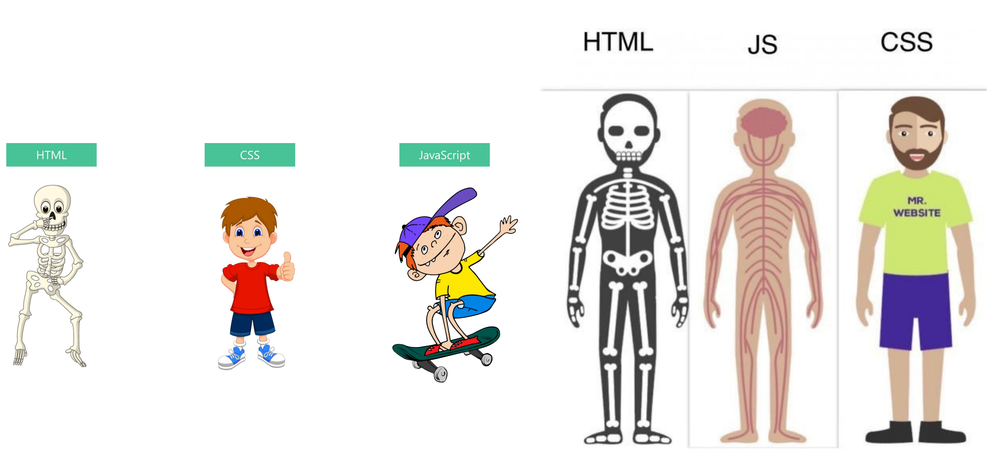

## 认识网页和网站

### 什么是网页

- 网页的专业术语叫做*Web Page*
- 打开浏览器查看到的页面，是网络中的'一页'
- 网页的内容可以非常丰富，包括文字，链接，图片，音乐，视频等等

### 网站是什么

- 网站是由多个网页组成的
- 通常一个网站是由N个网页组成的(n>=1)

### 网页的显示过程 - 用户角度

1. 用户在浏览器输入一个网站
2. 浏览器会找到对应的服务器地址，请求静态资源（可以存放在世界上任何一个地方）
3. 服务器返回静态资源给浏览器
4. 浏览器对静态资源进行解析和展示

### 网页的显示过程 - 前端工程师

1. 开发项目（HTML/CSS/JAVASCRIPT/VUE/REACT)

2. 打包、部署项目到服务器里面

   

### 服务器是什么

我们日常生活接触到的基本都属于客户端、前端内容

- 比如浏览器、微信、QQ、小程序

我们自己的手机并不可能存放哪些多的数据和资源

- 比如你用网易云听音乐，音乐数据大多数都是存在服务器中的

那么服务器到底是什么呢？

- 服务器本质上也是一台类似于你电脑一样的主机
- 但是这个主机有几个特点
  - 24小时不关机的（稳定运行）
  - 没有显示器
  - 一般装的都是Linux系统

### 那么服务器什么样呢

目前公司大部分用的是云服务器（比如阿里云、腾讯云、华为云）；

### 世界上第一个网页

 上世纪90年代，Berners-Lee上线了世界上第一个网站：

- http://info.cern.ch/hypertext/WWW/TheProject.html

虽然目前我们会认为这个网页简单到不值一提，但是在当时它的发明是“天才之作”。

### 现代的网页已经非常复杂

### 网页的组成

那么网页是由什么开发出来的呢？

- 阶段一：HTML元素；
- 阶段二：HTML元素 + CSS样式；
- 阶段三：HTML元素 + CSS样式 + JavaScript语言；

HTML

- 网页的内容结构

CSS

- 网页的视觉体验

JavaScript

- 网页的交互处理

### 网页源代码的角度

### 网页开发的角度

### 浏览器的作用

我们已经明确知道了网页的组成部分：HTML + CSS + JavaScript。

那么这些看起来枯燥的代码，是如何被渲染成多彩的网页呢？

- 我们知道是通过浏览器来完成；

浏览器最核心的部分其实是 “浏览器内核”；

### 浏览器的渲染引擎

浏览器最核心的部分是渲染引擎（Rendering Engine），一般也称为“浏览器内核”

- 负责解析网页语法，并渲染（显示）网页

常见的浏览器有很多：

### 不同浏览器的内核

常见的浏览器内核有

- Trident （ 三叉戟）：IE、360安全浏览器、搜狗高速浏览器、百度浏览器、UC浏览器；
- Gecko（ 壁虎） ：Mozilla Firefox；
- Presto（急板乐曲）-> Blink （眨眼）：Opera
- Webkit ：Safari、360极速浏览器、搜狗高速浏览器、移动端浏览器（Android、iOS）
- Webkit -> Blink ：Google Chrome

不同的浏览器内核有不同的解析、渲染规则，所以同一网页在不同内核的浏览器中的渲染效果也可能不同。

如果我们现在有一条新闻需要显示，那么可以通过某些“元素”来告知浏览器这部分内容如何显示。 

而我们编写的就是HTML元素； 

