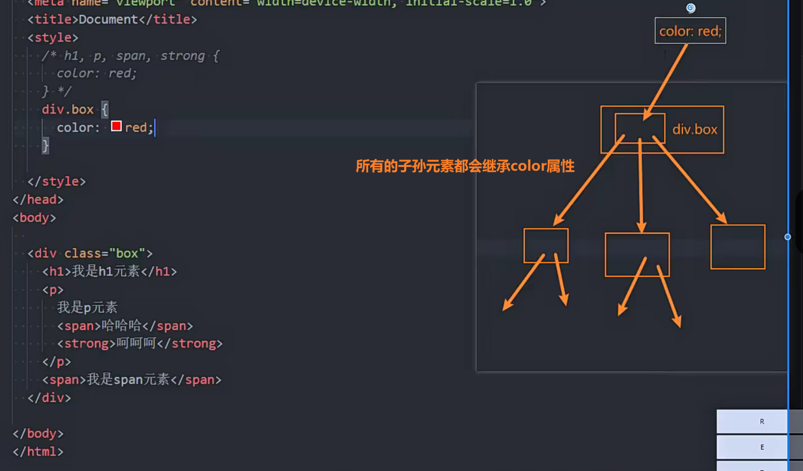
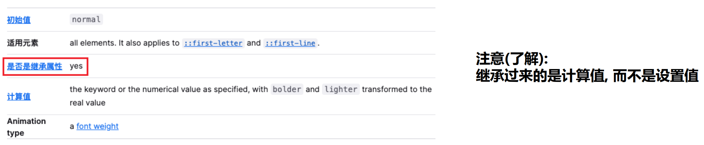
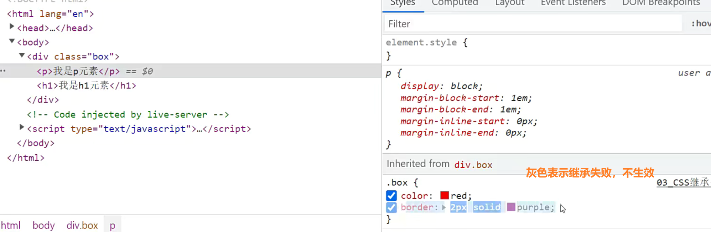
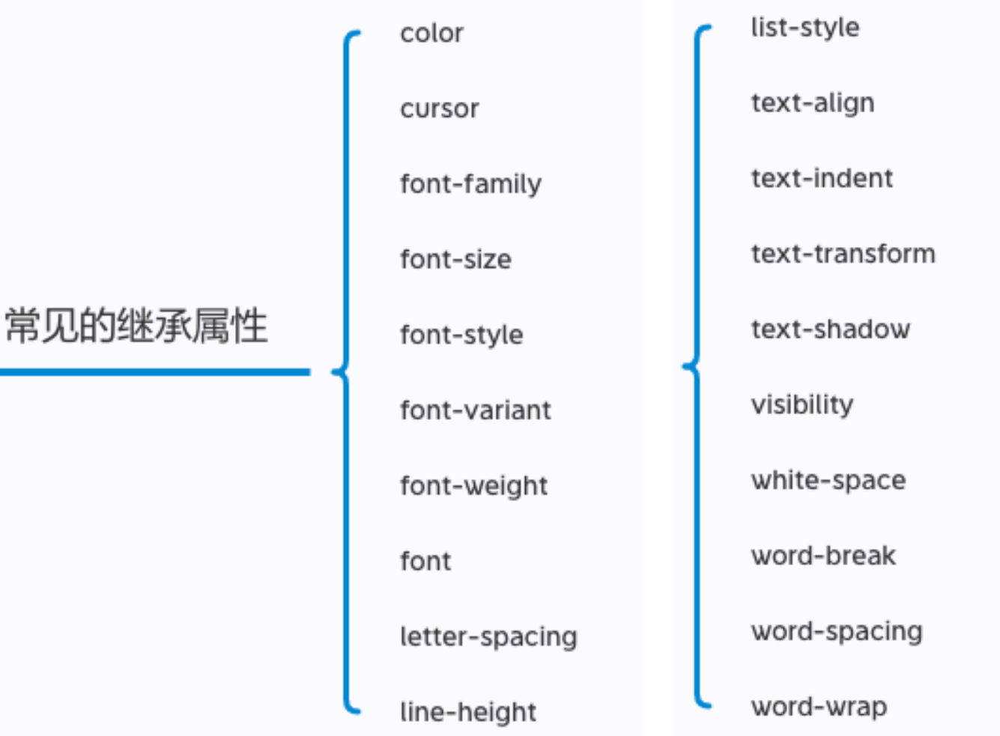
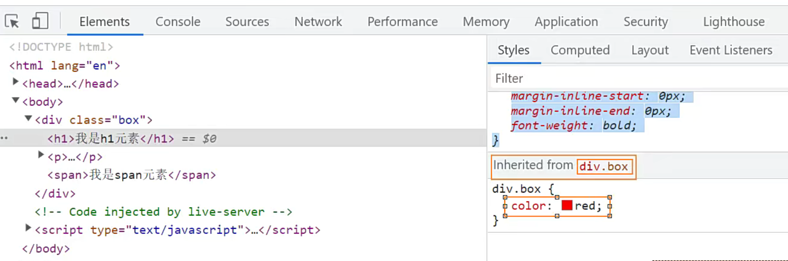
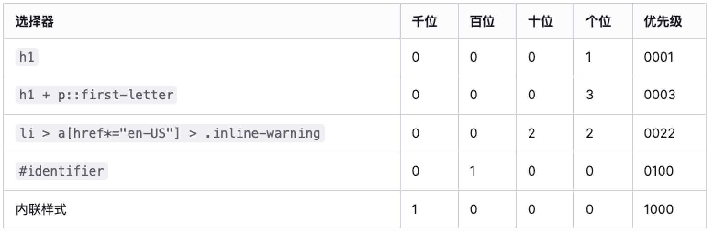
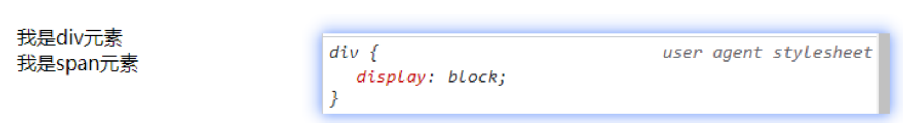
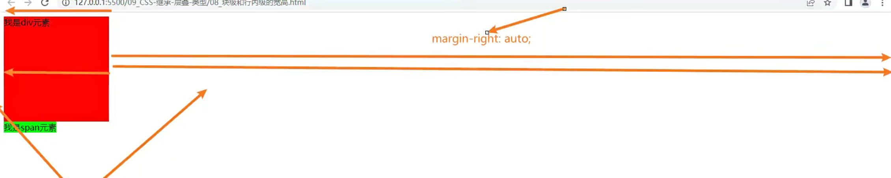
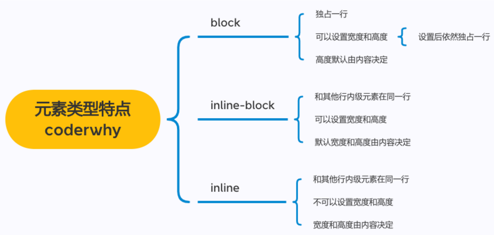
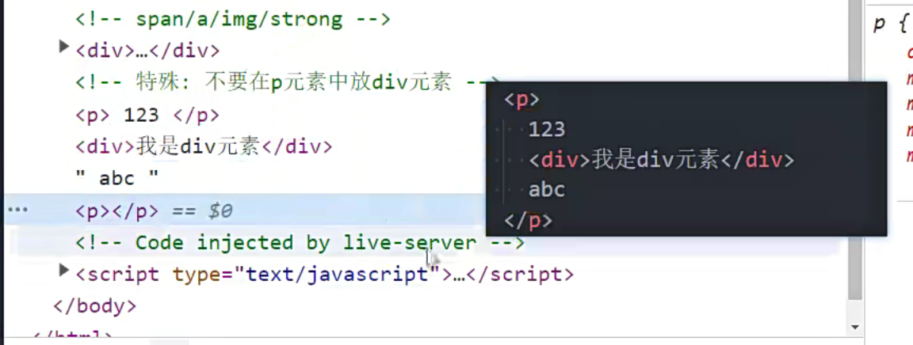

## CSS的属性继承


> **P元素**内不要放**div元素**


CSS的某些属性具有**继承性(Inherited)**: 

- 如果一个属性具备继承性, 那么在该元素上设置后, 它的后代元素都可以继承这个属性; 

  

  

- 当然, 如果**后代元素**自己有设置该属性, 那么**优先使用后代元素自己的属性**(**不管继承过来的属性权重多高**);

如何知道一个属性是否具有继承性呢? 

- 常见的font-size/font-family/font-weight/line-height/color/text-align都具有继承性; 
- **一般情况下和文本有关的属性具有继承性**；
- 这些不用刻意去记, 用的多自然就记住了;

另外要多学会查阅文档, 文档中每个属性都有标明其继承性的:



**什么叫继承过来的是计算值**，而不是设置值呢

- 父元素设置的font-size: 2em;
- 如果在父元素中，1em表示16px的话，
- 那么子元素继承过来的是16px，并不是2em

CSS强制继承

- border没有继承

  

- 但是p元素就是想强制继承过来.box的元素的border属性

  ```css
  p {border: inherit;}
  ```

  这样p元素虽然没有设置边框，但是通过这样设置以后，就能强制继承到border属性


### 常见的继承属性有哪些呢?(不用记)




浏览器也可以看到继承它继承的属性，来自div.box元素的继承属性



继承过来的属性放在了最下面，因为继承的优先级是最低的


## CSS属性的层叠

CSS的翻译是**层叠样式表**, 什么是层叠呢? 

- 对于一个元素来说, 相同一个属性我们可以通过**不同的选择器**给它进行多次设置; 
- 那么属性会被一层层覆盖上去; 
- 但是**最终只有一个会生效**;

那么**多个样式属性**覆盖上去, 哪一个会生效呢? 

- 判断一: **选择器的权重**, 权重大的生效, 根据权重可以判断出优先级; 
- 判断二: **先后顺序**, 权重相同时, 后面设置的生效;


那么如何知道元素的权重呢?


## 选择器的权重

按照经验，为了方便比较**CSS属性的优先级**，可以给CSS属性所处的环境定义一个**权值（权重）** 

- !important：10000 
- 内联样式：1000 
- id选择器：100 
- 类选择器、属性选择器、伪类：10 
- 元素选择器、伪元素：1 
- 通配符：0




选择器的权重是可以累加的，这个图就是将选择器的权重进行了累加


## HTML元素的类型

在前面我们会经常提到`div`是**块级元素**会独占一行, `span`是**行内级元素**会在同一行显示. 

- 到底什么是**块级元素**, 什么是**行内级元素**呢?

HTML定义元素类型的思路:

- HTML元素有很多, 比如h元素/p元素/div元素/span元素/img元素/a元素等等;
- 当我们把这个元素放到页面上时, 这个元素到底占据页面中**一行**多大的**空间**呢? 
  - 为什么我们这里只说一行呢? 因为**垂直方向**的高度通常是**内容决定**的;
- 比如一个h1元素的标题, 我们必然是希望它独占一行的, 其他的内容不应该和标题放在一起; 
- 比如一个p元素的段落, 必然也应该独占一行, 其他的内容不应该和段落放在一起; 
- 而类似于img/span/a元素, 通常是对内容的某一个细节的特殊描述, **没有必要独占一行**;

所以, 为了区分哪些元素需要**独占一行**, 哪些元素不需要独占一行, HTML将元素区分(本质是通过CSS的)成了两类: 

- **块级元素（block-level elements）**: 独占父元素的一行 
- **行内级元素（inline-level elements）**:多个行内级元素可以在父元素的同一行中显示


```txt
HTML的制定者会想，每个元素占据多大的空间？

垂直方向：和内容有关系

水平方向：

- 块级元素
  - 由内容决定，如果继续从左网友跟着排列其他元素，有些不合理
  - 因为如果这个元素是h1作为标题，它非常重要
  - 这个时候，这个标题必须独占一行的（参考报纸的标题）
  - 所以HTML的制定者考虑到这个以后，定义了一类元素为块级元素(block level)
  - 这类元素是独占一行的
  - 常见的块级元素h元素，p元素（报纸中的段落也很重要）、div元素
  - 这些元素都非常重要，所以让他们独占一行的
  - 它占的是父元素的整行，例如div可能占据的就是body的整行
- 行内级元素
  - 某些元素没那么重要（参考文章中的超链接，或者图片），或者说他们需要和文字结合在一起
  - 这些东西没那么重要，它属于内容(段落)的一部分，所以没必要让他们独占一行的
  - 这类元素被称为行内级元素(inline level)
  - 常见的元素有span元素，img元素，strong元素，i元素
```


## 通过CSS修改元素类型

前面我们说过, 事实上元素没有本质的区别:

- **div是块级元素, span是行内级元素;** 
- div之所以是块级元素仅仅是因为**浏览器默认设置了display属性**而已;



那么我们是否可以通过display来改变元素的特性呢?

当然可以!

```css
div {
    display: inline;
}
```

上面图中是浏览器设置的，这个是我设置的，我的会生效，因为我的在后面，会层叠掉浏览器设置的block（这个就是层叠性）


块级元素的特点

- 独占一行
- 可以设置宽高

行内级元素的特点

- 和其他行内级元素在同一行
- 不可设置宽高


块级元素如果设置了宽度，比如20px，因为它**独占一行**，那么这一行如果有剩下部分，那么剩下的部分就是这个**块级元素的margin部分**，**块级元素的margin默认是auto**，**auto默认会填满这一行的剩余部分**




**行内级元素设置宽高不生效**，这个说法是不严谨的

因为img是**行内级元素**，他是可以设置宽高的。

img元素是**行内级元素**，它还是一个**可替换元素**，也就是说它是一个**行内级可替换元素**

行内级可替换元素的特点

- 和其他行内级元素在同一行显示
- 可以设置宽度和高度

官方文档说他是行内替换级元素，并没有说它是一个行内块级元素

所以严谨一点来说，**行内可替换级元素可以设置宽高**，例如input、vedio元素等，这些都是**行内级可替换元素**，他们都是可以设置宽高的，但是像span他是行**内不可替换级元素**是不可以设置宽高的，例如span,i


## CSS属性 - display

CSS中有个display属性，能修改元素的显示类型，有4个常用值

-  block：让元素显示为**块级元素**
- inline：让元素显示为**行内级元素** 
- inline-block：让元素同时具备行**内级、块级元素**的特征 
  - inline: 可以和其他元素在同一行显示
  - block：可以设置宽高
- none：隐藏元素

事实上display还有其他的值, 比如flex, 后续会专门学习;


## display值的特性(非常重要)

block元素: 

- **独占父元素的一行** 
- 可以**随意设置宽高** 
- 高度默认**由内容决定**

inline-block元素: 

- **跟其他行内级元素在同一行显示** 
- 可以**随意设置宽高** 
- 可以这样理解
  - **对外来说，它是一个行内级元素 （可以和其他元素在同一行）**
  - **对内来说，它是一个块级元素（可以设置自己的宽高）**

inline: 

- 跟其他行内级元素在**同一行显示**; 
- **不可以随意设置宽高;** 
- 宽高都**由内容决定;**




默认` ::after`这个**伪元素默认是行内级元素**，如果想给它设置宽高，需要设置成`display: inline-block`


## 编写HTML时的注意事项

**块级元素、inline-block元素** 

- 一般情况下，**可以包含其他任何元素**（比如块级元素、行内级元素、inline-block元素） 

- 特殊情况，**p元素不能包含其他块级元素**，它会乱七八糟

  

 行内级元素（比如a、span、strong等） 

- 一般情况下，**只能包含行内级元素**
- **a元素**在某些情况下，可以包含**块级元素**


## 元素隐藏方法


### 方法一: display设置为none

元素**不显示**出来, 并且也**不占据位置**, **不占据任何空间**(和不存在一样);


### 方法二: visibility设置为hidden 

- 设置为hidden, 虽然元素不可见, 但是会占据元素应该占据的空间; 
- 默认为visible, 元素是可见的;


### 方法三: rgba设置颜色, 将a的值设置为0 

- `rgba`的`a`设置的是**alpha值**, 可以设置**透明度**, 不影响**子元素**(推荐);

- 比较新的module中颜色可以这样写（因为比较新，部分浏览器不支持）

  ```css
  color: rgb(0, 0, 0, 0);
  color: #ff000000;	// 新
  color: #ff0000ff;	// 新
  ```

- **background-color: rgb(0, 0, 0, 0)**,实际上和**background-color: transparent;**一样

  - transparent： 透明的


### 方法四: opacity设置透明度, 设置为0 

- 设置**整个元素**的透明度, 会影响**所有的子元素;**
  - 包括元素的**文字，背景**
    - color**只能设置前景色透明**
    - background-color**只能设置背景色透明**
    - opacity可以前景色，背景色都**设置为透明**


## CSS属性 - overflow

overflow用于控制内容溢出时的行为 

- visible：溢出的内容**照样可见** （默认值）
- hidden：溢出的内容**直接裁剪** 
- scroll：溢出的内容被裁剪，但可以通过**滚动机制查看** 
  - 会一直显示滚动条区域，**滚动条区域占用的空间属于width、height** 
- auto：**自动根据内容是否溢出来决定是否提供滚动机制**


## CSS样式不生效技巧

为何有时候编写的CSS属性不好使，有可能是因为 

- 选择器的优先级太低 
- 选择器没选中对应的元素 
- CSS属性的使用形式不对
  - 元素不支持此CSS属性，比如span默认是不支持width和height的 
  - 浏览器不支持此CSS属性，比如旧版本的浏览器不支持一些css module3的某些属性 
  - 被同类型的CSS属性覆盖，比如font覆盖font-size