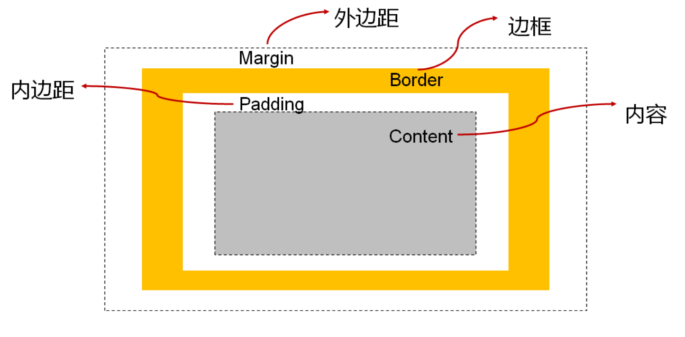
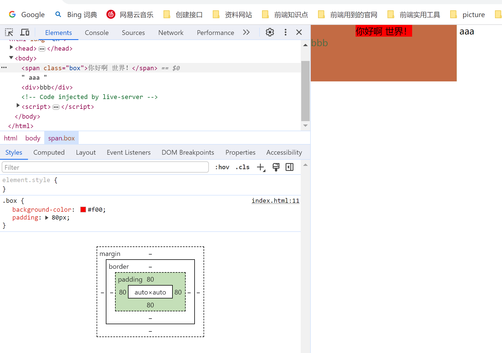

## CSS盒子模型

生活中, 我们经常会看到各种各样的盒子:


### HTML每个元素都是盒子

事实上, 我们可以把HTML每一个元素看出一个个的盒子:


## 盒子模型(Box Model)

HTML中的每一个元素都可以看做是**一个盒子**，如右下图所示，可以具备这4个属性

**内容（content）** 

- 元素的内容width/height


**内边距（padding）** 

- 元素和内容之间的间距


 **边框（border）** 

- 元素自己的边框


**外边距（margin）** 

- 元素和其他元素之间的间距





### 盒子模型的四边

因为盒子有四边, 所以**margin/padding/border**都包括**top/right/bottom/left**四个边:


### 在浏览器的开发工具中


### 内容 – 宽度和高度

设置内容是通过**宽度**和**高度**设置的: 

- 宽度设置: **width** 
- 高度设置: **height**

注意: 对于**行内级非替换元素**来说, 设置宽高是**无效的**!

> [`min-width`](https://developer.mozilla.org/zh-CN/docs/Web/CSS/min-width) 和 [`max-width`](https://developer.mozilla.org/zh-CN/docs/Web/CSS/max-width) 属性的优先级高于 [`width`](https://developer.mozilla.org/zh-CN/docs/Web/CSS/width)。


#### 块级元素

宽度在不设置的时候，默认为：`width: auto`

- 自动的，就表示当前没有强制性告诉浏览器具体的值是多少
- 浏览器将会为指定的元素计算并选择一个宽度。
- 所以这个宽度就交给**浏览器来显示**的，**浏览器默认宽度是窗口的宽度**


#### display： inline-block

- width: auto
- 但是inline-block的时候，它的宽度就是**自己的内容的宽度**
- 也就是说**不会和块级元素一样独占一行**


#### 行内级可替换元素的宽度

- width: auto
- 但是它的宽度是自己的内容的宽度
- 也就是说**不会和块级元素一样独占一行**


#### 行内级非替换元素

- width: auto
- 它的宽度是自己的内容的宽度


另外我们还可以设置如下属性: 

- min-width：**最小宽度**，无论内容多少，宽度都大于或等于min-width 
- max-width：**最大宽度**，无论内容多少，宽度都小于或等于max-width 
- 移动端适配时, 可以设置最大宽度和最小宽度;

下面两个属性不常用: 

- min-height：**最小高度**，无论内容多少，高度都大于或等于min-height 
- max-height：**最大高度**，无论内容多少，高度都小于或等于max-height

min-width和min-height，max-width和max-width，这两个的优先级大于width和height


### 内边距 - padding

padding属性用于设置**盒子的内边距**, 通常用于设置**边框和内容之间的间距**;

**padding包括四个方向**, 所以有如下的取值:

- padding-top：上内边距 
- padding-right：右内边距 
- padding-bottom：下内边距 
- padding-left：左内边距

padding单独编写是一个**缩写属性**： 

- padding-top、padding-right、padding-bottom、padding-left的简写属性 
- padding缩写属性是从零点钟方向开始, 沿着顺时针转动的, 也就是上右下左;

padding并非必须是四个值, 也可以有其他值;


### 边框 - border

border用于设置**盒子的边框**:


边框相对于content/padding/margin来说特殊一些: 

- 边框具备**宽度width**; 
- 边框具备**样式style**; 
- 边框具备**颜色color**;


#### 设置边框的方式

边框宽度 

- border-top-width、border-right-width、border-bottom-width、border-left-width 
- **border-width是上面4个属性的简写属性**


边框颜色 

- border-top-color、border-right-color、border-bottom-color、border-left-color 
- **border-color是上面4个属性的简写属性**


边框样式 

- border-top-style、border-right-style、border-bottom-style、border-left-style 
- **border-style是上面4个属性的简写属性**


#### 边框的样式设置值

边框的样式有很多, 我们可以了解如下的几个:

- groove：凹槽, 沟槽, 边框看上去好象是雕刻在画布之内 
- ridge：山脊, 和grove相反，边框看上去好象是从画布中凸出来


#### 同时设置的方式

如果我们相对某一边同时设置 **宽度** **样式** **颜色**，可以进行如下设置:  

- border-top: 1px solid #fff;
- border-right 
- border-bottom 
- border-left 
- border：统一设置4个方向的边框

边框颜色、宽度、样式的**编写顺序任意**


### 圆角 – border-radius

**border-radius**用于设置**盒子的圆角**


border-radius常见的值: 

- **数值**: 通常用来**设置小的圆角**, 比如6px; 
- **百分比**: 通常用来**设置一定的弧度或者圆形**;


#### border-radius补充

border-radius事实上**是一个缩写属性**: 

- 将这四个属性 border-top-left-radius、border-top-right-radius、border-bottom-right-radius，和 border-bottom-left-radius 简写为一个属性。 
- 开发中比较少一个一个的设置圆角;

如果一个元素是正方形, 设置border-radius大于或等于50%时，就会变成一个**圆**.


这个百分比相对于的是


也就是说百分比的值相对于的是盒子内容的值加上padding的值加上边框的值

例如一个200*100的盒子有10px的边框，那么如果设置border-radius = 10%.那么

上下角的圆角是：

```txt
200 * 10% = 20px
```

左右角的圆角是

```txt
100 * 10% = 10px
```

这个的时候的盒子的四个角可能有些怪异...


注意：盒子有四个角，每个角由两部分组成，所以会有上下左右之分。

一般情况下，如果宽和高不一样，那么不会使用百分比，如果宽和高一致可以使用百分比。


### 外边距 - margin

margin属性**用于设置盒子的外边距**,，**通常用于元素和元素之间的间距**; 

margin包括四个方向, 所以有如下的取值:

- margin-top：上外边距 
- margin-right：右外边距 
- margin-bottom：下外边距 
- margin-left：左外边距

margin单独编写是一个缩写属性： 

- margin-top、margin-right、margin-bottom、margin-left的简写属性 
- margin缩写属性是从零点钟方向开始, 沿着顺时针转动的, 也就是上右下左;

margin也并非必须是四个值, 也可以有其他值;


#### margin的其他值


 


#### 上margin的传递

margin-top传递 

- 如果块级元素的顶部线和父元素的顶部线重叠，那么这个块级元素的margin-top值会传递给父元素


两个盒子嵌套，问题：内部盒子距离外部盒子的上方10px，距离外部盒子的左边10px

方法一：

```css
设置内部盒子
.container: {
  margin-left: 10px;   
  margin-top: 10px;
}
```


可以发现会把父元素（外层盒子）拉下来，

这个就称为margin-top的传递，因为修改子元素传递到父元素上，让父元素的margin-top设置成了10px


所以需要触发父元素的bfc

```css
.box{
    overflow: auto;
}
```


方法二：

```css
.box{
    padding-left: 10px;
    padding-top: 10px;
}
```

这样设置会把父元素撑起来，所以我们还需要给父元素设置

```css
.box {
    ...
    box-sizing: border-box;
}
```


那么这两种方式哪一种更好呢

如果我们希望里面的子元素距离左边和上边有一定的间距

首先要知道，margin强调的是元素与元素之间的距离，也就是兄弟之间的距离，而padding强调的是父元素与子元素之间的距离

所以上面两种方式虽然都能实现，但是都不完美，但是从上面那个角度来看，用padding来实现会更合适。


#### 下margin的传递

- 如果块级元素的底部线和父元素的底部线重写，并且父元素的高度是auto，那么这个块级元素的margin-bottom值会传递给父元素

```html
    <style>
      body {
        margin: 0;
      }
      .box {
        width: 200px;
        height: auto;	// 注意，这里设置的是auto
        background-color: red;
      }
      .content {
        width: 100px;
        height: 100px;
        background-color: blue;
        margin-bottom: 50px;
      }	
    </style>
  	<body>
      <div class="box">
      	<div class="content"></div>
      </div>
      <div>我是下方的div</div>
     </body>
```


1. 父元素的高度设置的是auto，所以父元素的高度就是内容的高度
2. 子元素设置了下margin，但是它没有撑起来父元素，而是将下margin传递给了父元素，让父元素具备下margin
3. 此刻如果设置上margin，那么依然会传递给父元素


#### 如何防止出现传递问题？ 

- 给父元素设置padding-top\padding-bottom ，用他们来替代margin
- 给父元素设置border
  - border: 1px solid transparent;
  - 虽然可以设置成透明，但是还是多一个1px的边框
  - 如果设置成0，就不生效了
- 触发BFC（块级格式化上下文）: 外层盒子设置overflow为auto

建议 

- margin一般是用来设置兄弟元素之间的间距 
- padding一般是用来设置父子元素之间的间距


#### 上下margin的折叠

垂直方向上相邻的2个margin（margin-top、margin-bottom）有可能会**合并为1个margin**，这种现象叫做**collapse（折叠）** 

两个兄弟块级元素之间上下margin的折叠 ，会使用较大的margin

父子块级元素之间margin的折叠，子元素会产生margin传递，父元素会使用较大的margin

**水平方向上的margin（margin-left、margin-right）永远不会collapse** 

折叠后最终值的计算规则 

- 两个值进行比较，**取较大的值**

如何防止margin collapse？ 

- 只设置其中一个元素的margin

  


> TIP：默认情况下，浏览器会给body增加8px的margin
>
> 
>
> 
>
> 也有一些浏览器会加padding，所以一般开发项目会做一些初始化
>
> ```txt
> body {
>     margin: 0;
>     padding: 0;
> }
> ```


#### 外轮廓 - outline

outline表示**元素的外轮廓** 

- 不占用空间
- 默认显示在border的外面

outline相关属性有 

- outline-width: 外轮廓的宽度 
- outline-style：取值跟border的样式一样，比如solid、dotted等 
- outline-color: 外轮廓的颜色 
- outline：outline-width、outline-style、outline-color的简写属性，跟border用法类似

应用实例 

- 去除a元素、input元素的focus轮廓效果


> 行内级元素设置margin-top和margin-bottom无效


#### outline的使用场景

有一个a标签，在按`tab`键将焦点移动到**a标签**的时候，默认情况下浏览器会给他增加一个**外轮廓**

实际上是给`a:focus`加的**外边框**


这种外轮廓是比较丑的，所以很多时候，我们会去掉这个外轮廓

```css
a {
    outline: none;
}
```

这样再通过tab去选中的时候，就不会出现外边框了，因为我们给a设置，默认也会给 **hover、active、vizibility、focus**等都设置了这个属性


### 盒子阴影 – box-shadow

box-shadow属性可以**设置一个或者多个阴影** 

- 每个阴影用`<shadow>`表示 
- 多个阴影之间用逗号 `,` 隔开，从前到后叠加

`<shadow>`的常见格式如下


- 参数1：offset-x, 水平方向的偏移，正数往右偏移 
- 参数2：offset-y, 垂直方向的偏移，正数往下偏移 
- 参数3：blur-radius, 模糊半径 
- 参数4：spread-radius, 延伸半径 
- 参数5：`<color>`，阴影的颜色，如果没有设置，就跟随color属性的颜色 
- 参数6：inset，外框阴影变成内框阴影

`inset`是可选的，`color`是可选的，其他的是必填的，但是最少要2个

```css
      .box {
        width: 200px;
        height: 200px;
        background-color: #f00;
        box-shadow: 5px 5px 15px 10px #0f0;
      }
```


#### 盒子阴影 – 在线查看

我们可以通过一个网站测试盒子的阴影:

- https://html-css-js.com/css/generator/box-shadow/


### 文字阴影 - text-shadow

text-shadow用法类似于box-shadow，用于**给文字添加阴影效果** 

`<shadow>`的常见格式如下

- 
- 参数1：offset-x, 水平方向的偏移，正数往右偏移 
- 参数2：offset-y, 垂直方向的偏移，正数往下偏移 
- 参数3：blur-radius, 模糊半径 
- 参数4：`<color>`，阴影的颜色，如果没有设置，就跟随color属性的颜色 

相当于box-shadow, 它没有spread-radius的值，也没有inset;

```css
      .box {
        font-size: 40px;
        text-shadow: 5px 5px 3px #0f0;
      }
```


#### 盒子阴影 – 在线查看

我们可以通过一个网站测试文字的阴影:

- https://html-css-js.com/css/generator/box-shadow/


### 行内非替换元素的注意事项

以下属性对行内级非替换元素不起作用 

- width、height、margin-top、margin-bottom

以下属性对行内级非替换元素的效果比较特殊 

- padding-top、padding-bottom、上下方向的border


#### 行内级非替换元素：上下padding



- 可以发现给行内级非替换元素设置了padding，但是显示是异常的
- 这里主要异常的是padding-top、padding-bottom，
- 它们都不占空间，因为bbb是块级元素，它跑到了padding中就证明了这部分没有占空间，让bbb跑上去了


#### 行内级非替换元素：上下border


#### 行内级非替换元素：上下margin


- 行内非替换元素在设置padding、border、margin，上下设置的时候不生效。
- 因为行内级元素往往是和其他行内级元素在一行显示
- 如果针对某一个元素设置padding, border, margin会破坏整个段落的美感和结构的


> 背景色有没有设置到border后面（有）
>
> 这里的border是透明色，所以可以下面的背景色是蓝色
>
> ```css
>       .box {
>         background-color: #f00;
>         color: blue;
>         border: 30px solid transparent;
>       }
> ```
>
> 
>
> 背景色会在border没有设置颜色的情况下，会使用color设置的颜色
>
> 


### 综合案例练习


### CSS属性 - box-sizing

box-sizing用来**设置盒子模型中宽高的行为** 


#### content-box

- padding、border都布置在width、height外边 
- width = content.width + padding + border

```css
      .box {
        width: 100px;
        height: 100px;
        background-color: #f00;
        box-sizing: content-box;
        border: 5px solid #0f0;
        padding: 10px;
        margin: 10px;
      }
```

这个时候`.box`这个盒子的宽度： padding(10) * 2 + border(5) * 2 + width(100) =  130

所以这个盒子的总宽度是`130px`，但是可能和我们想的不一样，因为我们设置的宽度为100


元素的实际占用宽度 = border + padding + width

元素的实际占用高度 = border + padding + height


#### border-box

- padding、border都布置在width、height里边

这个时候`.box`这个盒子的宽度： padding(10) * 2 + border(5) * 2 + width(70) =  100

所以这个盒子的总宽度是`100px`


设置为`border-box`后，width设置的值就是整个盒子的值，它会**自动压缩content的宽度**


元素的实际占用宽度 = width

元素的实际占用高度 = height


### IE盒子模型

W3C标准盒子模型


IE盒子模型（IE8以下浏览器）


### 元素的水平居中

方案一： text-align: center

- 不可行，因为它是让inline level（**行内级非替换元素：span**，**行内级替换元素：img**）元素居中的，并不是让块级元素居中

- **默认没有任何元素是inline-block**，它比较特殊，只是能给元素的类型赋予为`inline-block`，让它具有行内级和块级元素的特性的，并不是元素与生俱来就具有这种类型

- 如果想让它起作用，需要给它转成`inline-block`，然后再使用`text-align: center;`


方案二：margin: 0 auto;

- 块级元素的宽度 = **content.width** + **content.padding** + **content.border** + **content.margin**
- 如果一个块级元素设置了宽度，margin-right的默认值是auto，会填满一行（父元素的一行）
- 有一个100*100的盒子，给margin设置具体值的时候，它没办法占据整行了
- 比如： `margin: 0`，那么margin-left是0，margin-right也是0，这个时候就没办法占据整行
- 那么这个时候浏览器会怎么做呢
- 浏览器会忽略设置的margin-right，将剩下的宽度给margin-right
- 但是如果设置成`margin: 0 auto`; 也就是说给left和right都设置成auto；
- 这个时候浏览器就会自动给左右等分设置宽度。


所以对于块级元素来说，让他水平居中，可以使用 `margin: 0 auto`,它会自动在父元素中进行居中

注意：`text-align： center`是给父元素加的，让行内级子元素进行居中的，`margin: 0 auto;`是给子元素的，是让块级子元素在父元素中居中的


> 前面说行内级元素只能包含行内级元素，这个是标准，但是
>
> 
>
> 这里是有给a元素设置`display: inline-block`，因为我们一般都会给a元素设置宽高的


> 一般来说，img标签外面最好套一个div，这样样式会好调一些（经验之谈）


> 现在很多网站都拿不到图片了，可以给img标签设置一个这个属性(mdn介绍)
>
> ```css
> 
> ```
>


### 省略号

#### 单行文字

```css
p {
    white-space: nowrap;	// 禁止换行
    overflow: hidden;	// 超出隐藏
    text-overflow: ellipsis;	// 超出显示省略号
}
```


#### 多行文字

```css
p {
    overflow: hidden;
    text-overflow: ellipsis;
    display: -webkit-box;
    -webkit-line-clamp: 2;	// 保留两行
    -webkit-box-orient: vertical;
}
```


