## 认识列表元素

在开发一个网页的过程中, 很多数据都是以列表的形式存在的

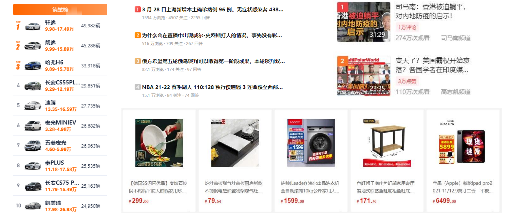


### 列表的实现方式

事实上现在很多的列表功能采用了不同的方案来实现: 

- 方案一: 使用div元素来实现(比如汽车之家, 知乎上的很多列表) 
- 方案二: 使用列表元素, 使用元素语义化的方式实现; 

事实上现在很多的网站对于列表元素没有很强烈的偏好, 更加不拘一格, 按照自己的风格来布局: 

- 原因我认为是列表元素默认的CSS样式, 让它用起来不是非常方便; 
- 比如列表元素往往有很多的限制, ul/ol中只能存放li, li再存放其他元素; 
- 虽然我们可以通过重置来解决, 但是我们更喜欢自由的div;

HTML提供了3组常用的用来展示列表的元素 

- 有序列表：ol、li 

- 无序列表：ul、li 
- 定义列表：dl、dt、dd


### 有序列表 – ol – li

ol（ordered list） 

- 有序列表，**直接子元素只能是li** 

li（list item） 

- 列表中的每一项

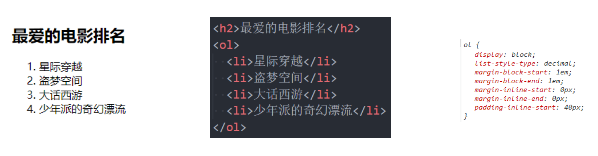

> 默认情况下，浏览器会给ol、li加上样式


### 无序列表 – ul - li

ul（unordered list） 

- 无序列表，直接子元素只能是li 

li（list item） 

- 列表中的每一项

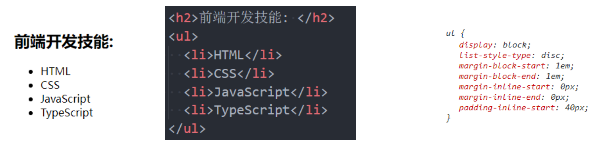


### 定义列表 – dl – dt - dd

dl（definition list） 

- 定义列表，直接子元素只能是dt、dd 

dt（definition term） 

- 列表中每一项的项目名 

dd（definition description） 

- 列表中每一项的具体描述，是对 dt 的描述、解释、补充 
- 一个dt后面一般紧跟着1个或者多个dd

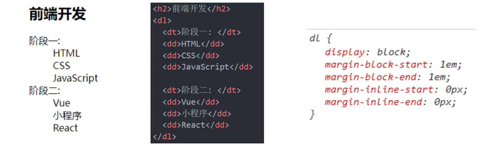


### 列表的练习

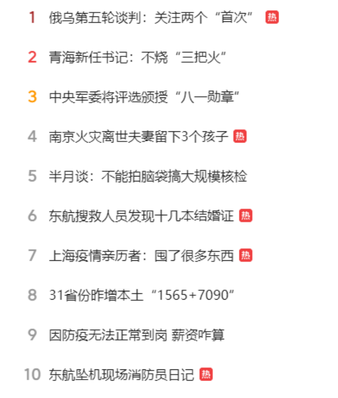

开发思路：

1. 先完成结构
2. 重置样式
3. 先整体后局部
   1. 按照从外里，从上往下
4. 去除重复的代码
   1. 将重复的代码放到一个单独的class中(.icon)
   2. 不同的代码不放不同的class中（.new, .old）


## 认识表格元素

在网页中, 对于某些内容的展示使用表格元素更为合适和方便

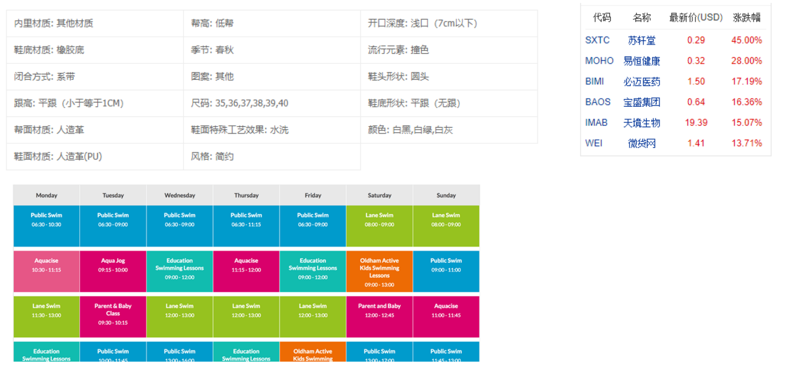


### 表格常见的元素

编写表格最常见的是下面的元素:

table 

- 表格

tr(table row) 

- 表格中的行

td(table data) 

- 行中的单元格

另外表格有很多相关的属性可以设置表格的样式, 但是已经不推荐使用了

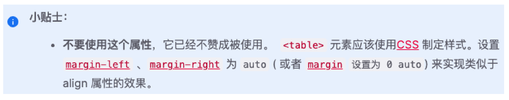


### 表格的练习

通过表格元素和CSS完成下面的表格: 

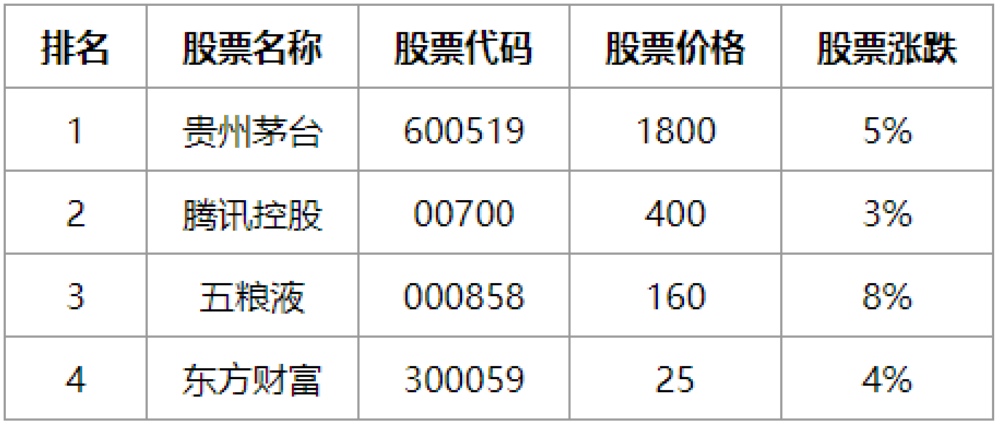

这里我们需要用到一个非常重要的属性:

- border-collapse CSS 属性是用来决定表格的边框是分开的还是合并的。 

  - ```css
    table { border-collapse: collapse; } 
    ```
- 合并单元格的边框

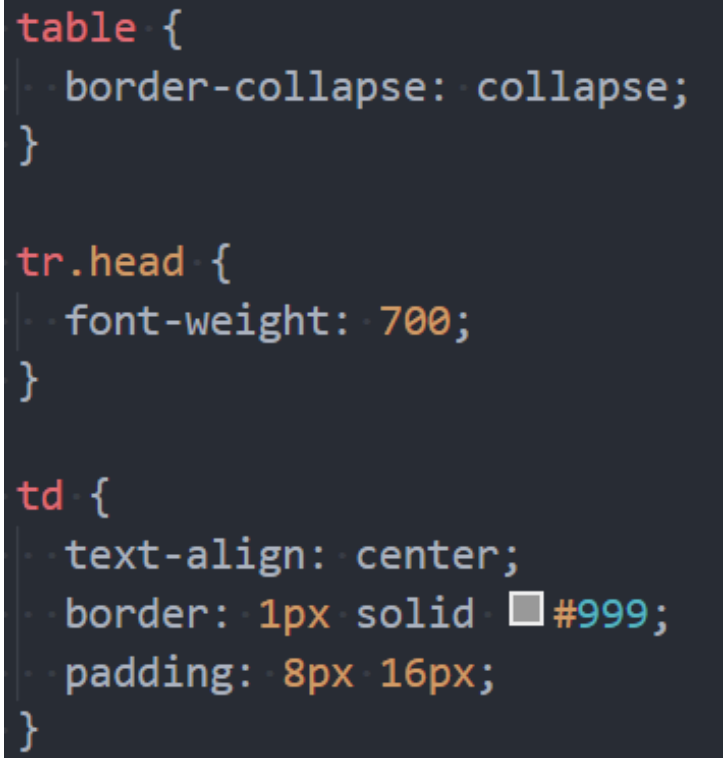


### 表格的其他元素

thead 

- 表格的表头

tbody 

- 表格的主体

tfoot 

- 表格的页脚

caption

- 表格的标题

th

- 表格的表头单元格

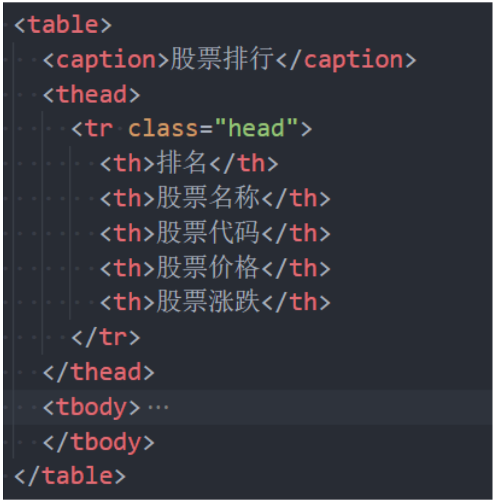


### 单元格合并

在某些特殊的情况下, 每个单元格占据的大小可能并不是固定的 

- 一个单元格可能会跨多行或者多列来使用;

比如下面的表格

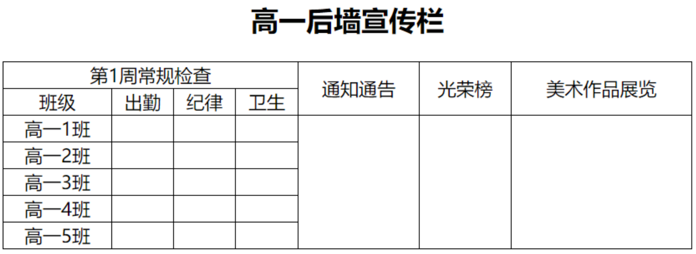

这个时候我们就要使用单元格合并来完成;


### 如何使用单元格合并呢?

单元格合并分成两种情况:

- 跨列合并: 使用**colspan**
  - 在最左边的单元格写上colspan属性, 并且省略掉合并的td;
- 跨行合并: 使用**rowspan**
  - 在最上面的单元格协商rowspan属性, 并且省略掉后面tr中的td;

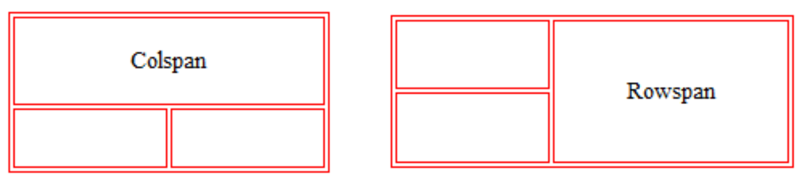

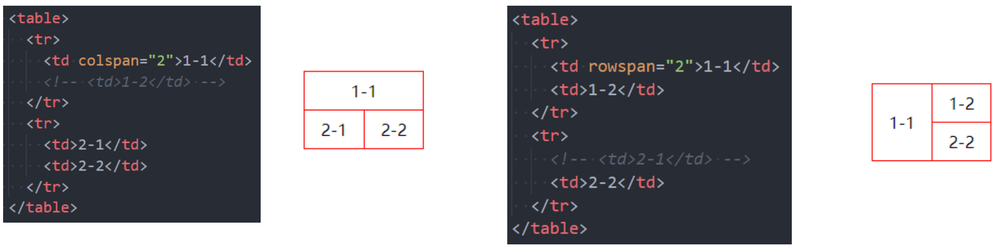


### 单元格合并练习

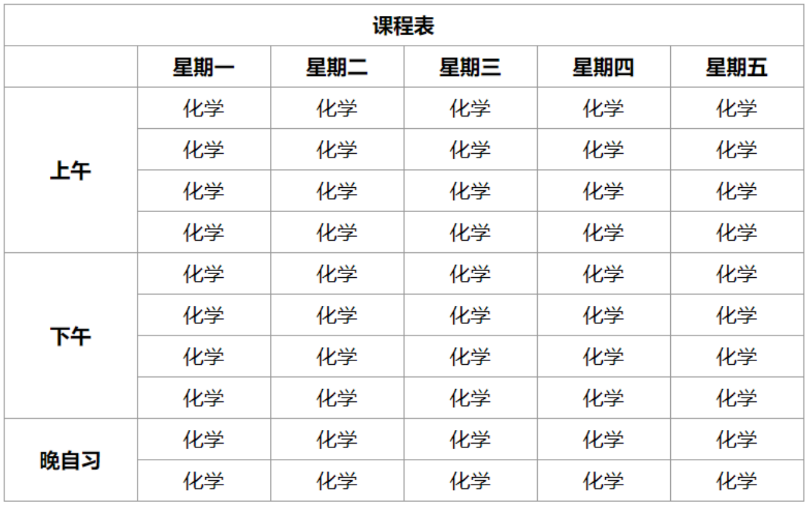


> 如果要选择父元素的前两个子元素可以通过结构伪类`.box:nth-child(-n+2)`这样选择的就是前两个


### 作业布置

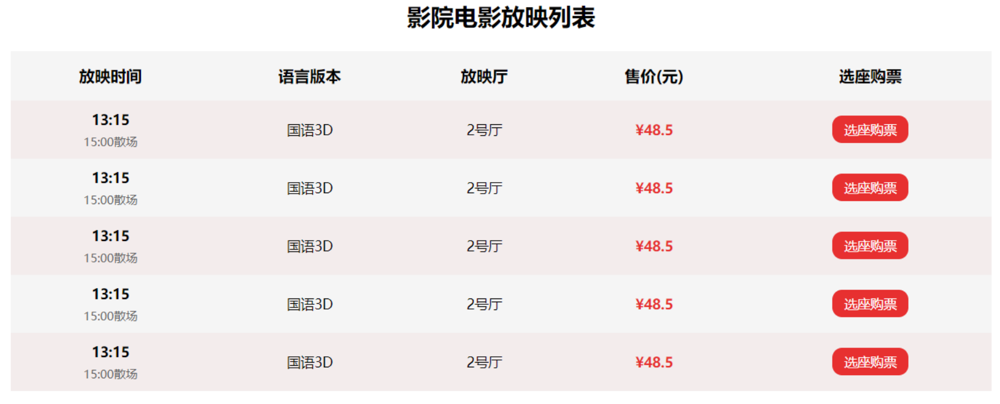


## 认识表单

HTML表单元素是和用户交互的重要方式之一, 在很多网站都需要使用**表单**:

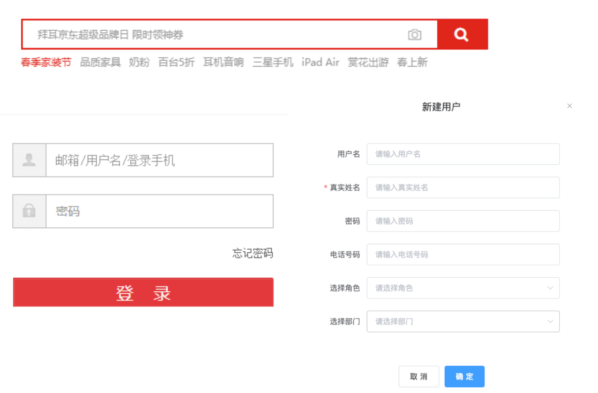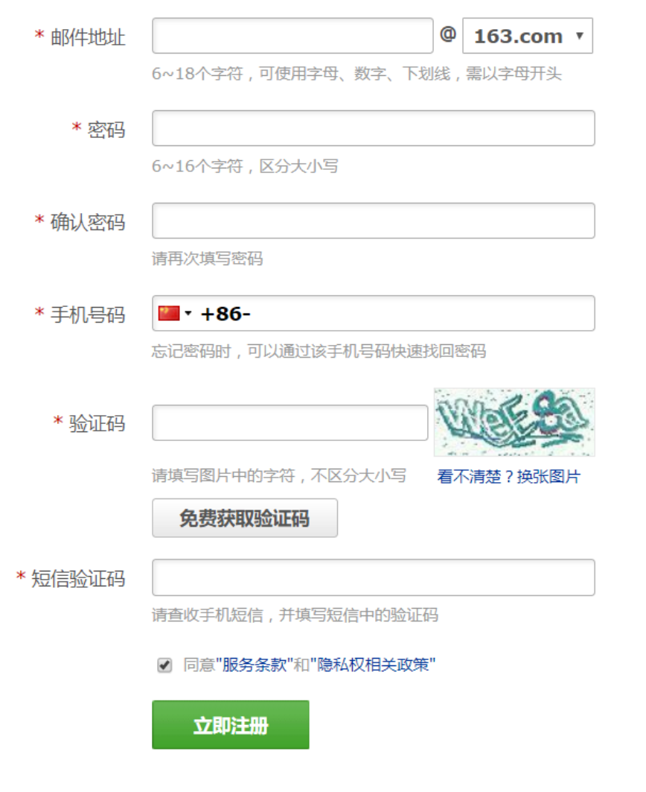


### 常见的表单元素

form 

- 表单, 一般情况下，其他表单相关元素都是它的后代元素

input 

- 单行文本输入框、单选框、复选框、按钮等元素

textarea 

- 多行文本框 

select、option 

- 下拉选择框 

button 

- 按钮 

label 

- 表单元素的标题


### input元素的使用

表单元素使用最多的是input元素 

input元素有如下常见的属性:

type：input的类型 

- text：文本输入框（明文输入） 
- password：文本输入框（密文输入） 
- radio：单选框 
- checkbox：复选框 
- button：按钮 
- reset：重置 
- submit：提交表单数据给服务器 
- file：文件上传


> input是行内级可替换元素，一般需要input在一行显示的话，可以用div包裹起来


readonly：只读

> <input type ='text' readonly>
>
> 等同于
>
> <input type = 'text' readonly = 'readonly'>
>
> 日常中会直接使用`readonly`，一般会省略赋值操作而是直接写

disabled：禁用 

checked：默认被选中 

- 只有当type为radio或checkbox时可用

autofocus：当页面加载时，自动聚焦 

name：名字 

- 在提交数据给服务器时，可用于区分数据类型

value：取值


type类型的其他取值和input的其他属性, 查看文档: 

- https://developer.mozilla.org/zhCN/docs/Web/HTML/Element/Input


> input是不是行内级可替换元素呢？
>
> 
>
> w3c说它是可替换元素，但是又标注了它是非可替换元素
>
> 所以很难说它是可替换还是不可替换
>
> input是否是可替换元素，应该是根据它的type的值来确定的
>
> 这个是自己的理解，所以不好确切的说它是否为可替换元素


### 布尔属性（boolean attributes）

常见的布尔属性有disabled、checked、readonly、multiple、autofocus、selected

布尔属性可以没有属性值，写上属性名就代表使用这个属性

- 如果要给布尔属性设值，值就是属性名本身

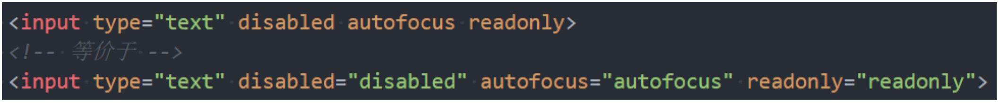


### 表单按钮

表单可以实现按钮效果: 

- 普通按钮（type=button）：使用value属性设置按钮文字 
- 重置按钮（type=reset）：重置它所属form的所有表单元素（包括input、textarea、select） 
- 提交按钮（type=submit）：提交它所属form的表单数据给服务器（包括input、textarea、select）

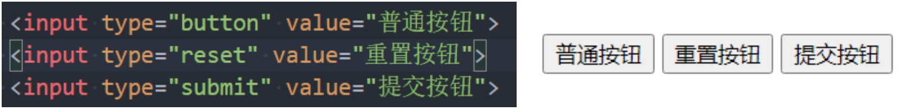


我们也可以通过按钮来实现: 

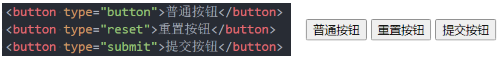


### input和label的关系

label元素一般跟input配合使用，用来表示input的标题 

labe可以跟某个input绑定，点击label就可以激活对应的input变成选中

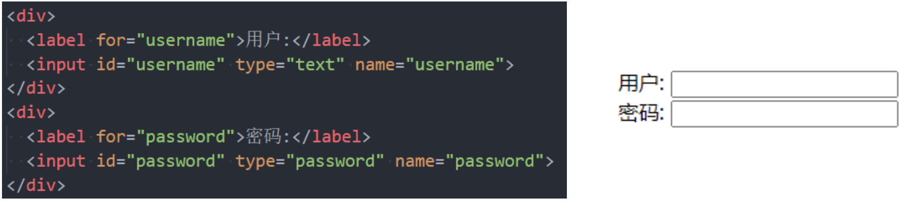


### radio的使用

我们可以将type类型设置为radio变成单选框: 

- name值相同的radio才具备单选功能

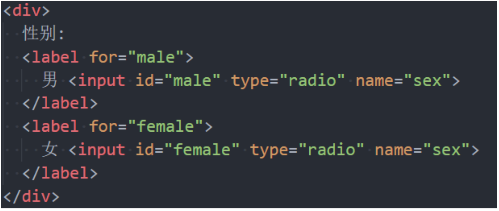


### checkbox的使用

我们可以将type类型设置为checkbox变成多选框: 

- 属于同一种类型的checkbox，name值要保持一致

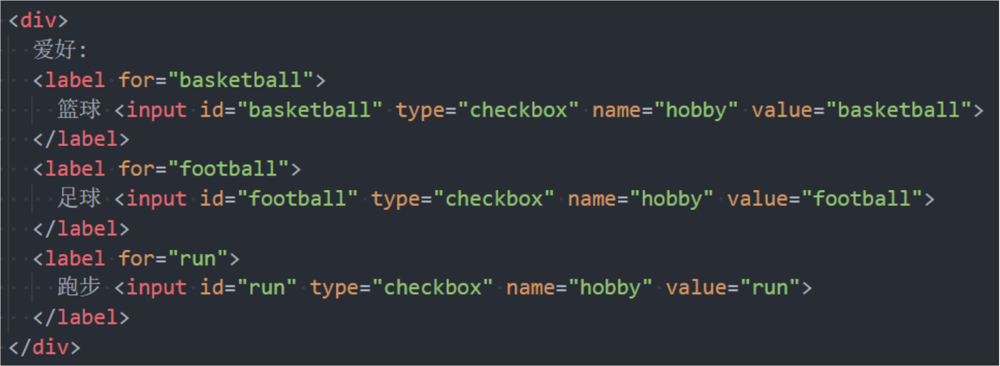


### textarea的使用

textarea的常用属性: 

- cols：列数 
- rows：行数

缩放的CSS设置 

- 禁止缩放：resize: none; 
- 水平缩放：resize: horizontal; 
- 垂直缩放：resize: vertical; 
- 水平垂直缩放：resize: both;


### select和option的使用

option是select的子元素，一个option代表一个选项 

select常用属性

- multiple：可以多选 
- size：显示多少项

option常用属性 

- selected：默认被选中


### form常见的属性

form通常作为表单元素的父元素: 

- form可以将整个表单作为一个整体来进行操作; 
- 比如对整个表单进行重置; 
- 比如对整个表单的数据进行提交;

form常见的属性如下: 

- action 
  - 用于提交表单数据的请求URL
- method 
  - 请求方法（get和post），默认是get
- target
  - 在什么地方打开URL（参考a元素的target）


### 请求方式的对比

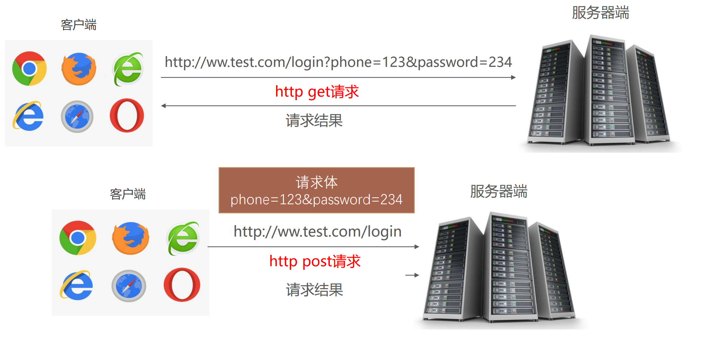