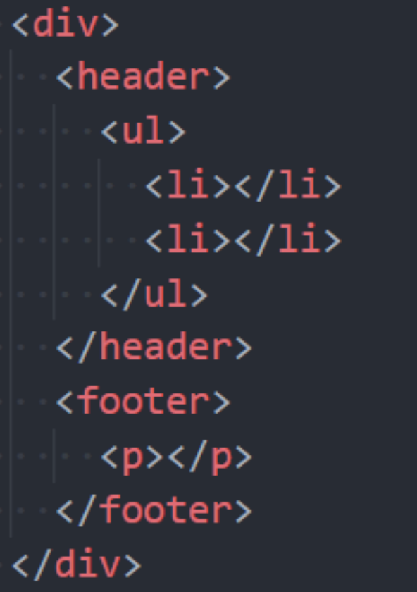

## 认识emmet语法

Emmet (前身为 Zen Coding) 是一个能大幅度提高前端开发效率的一个工具.

- 在前端开发的过程中，一大部分的工作是写 HTML、CSS 代码, 如果手动来编写效果会非常低.
- VsCode内置了**Emmet语法**,在后缀为.html/.css中输入缩写后按Tab/Enter键即会自动生成相应代码

!和html:5可以快速生成完整结构的html5代码

## \>（子代）和+（兄弟）

**div>ul>li**

**div+div>p>span+i**

**div+p+ul>li**

## *（多个）和^（上一级）

**ul>li*5** 

**div+div>p>span^h1**

**div+div>p>span^^^^h1**

## ()（分组）

**div>(header>ul>li*2>a)+footer>p**

## 属性(id属性、class属性、普通属性) {}（内容）

**div#header+div#main>.container>a[href]**

**a[href="http://www.baidu.com"]{百度一下}**

## $（数字）

**ul>li.item$*5**

## 隐式标签

**ul>.item*3**

## CSS Emmet

**w100** 

**w20+h30+m40+p50** 

**m20-30-40-50**

**dib**

**bd1#cs**

