## 标准流（Normal Flow）

默认情况下，元素都是按照normal flow（标准流、常规流、正常流、文档流【document flow】）进行排布

- 从左到右(行内级元素)、从上到下(块级元素)按顺序摆放好
- 默认情况下，互相之间不存在层叠现象

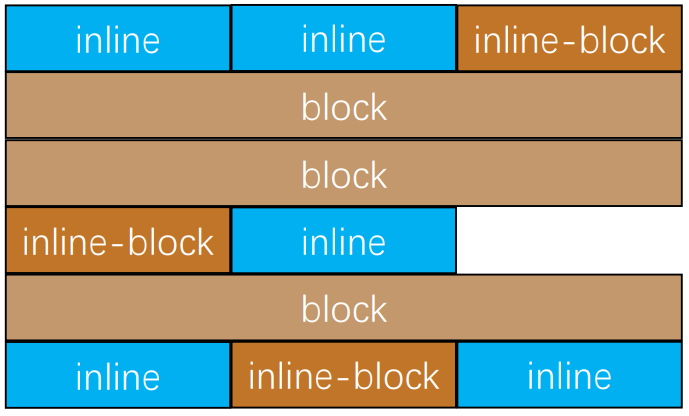

```html
<body>
    <span>span1</span>
    
    <span style="display: inline-block">span2</span>
    <div>div</div>
    <p>p</p>
    <span style="display: inline-block">span</span>
    <body>
    <strong>strong</strong>
    <h1>h1</h1>
    <span>span3</span>
    <span>span5</span>
</body>
```


## margin-padding位置调整

在标准流中，可以使用margin、padding对元素进行定位

- 其中margin还可以设置负数

比较明显的缺点是

- 设置一个元素的margin或者padding，通常会影响到标准流中其他元素的定位效果
- 不便于实现元素层叠的效果

如果我们希望一个元素可以跳出标准流,单独的对某个元素进行定位呢?

- 我们可以通过position属性来进行设置;


## 认识元素的定位

定位允许您从正常的文档流布局中取出元素，并使它们具有不同的行为:

- 例如放在另一个元素的上面;
- 或者始终保持在浏览器视窗内的同一位置;

定位在开发中非常常见:

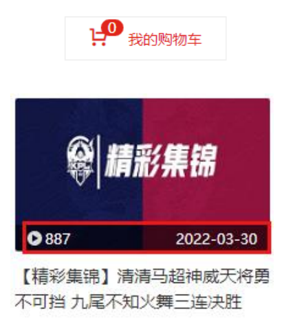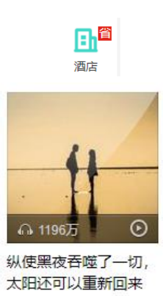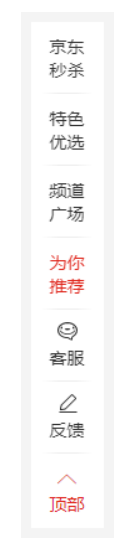


## 认识position属性

利用position可以对元素进行定位，常用取值有5个:

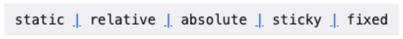


默认值:

- static：默认值, 静态定位
  - 所有的元素默认的position都是static，按照标准流排列

使用下面的值, 可以让元素变成 定位元素(positioned element)

- relative：相对定位 
- absolute：绝对定位 
- fixed：固定定位 
- sticky：粘性定位


## 静态定位 - static

position属性的默认值

- 元素按照normal flow布局
- left 、right、top、bottom没有任何作用


## 相对定位 - relative

元素按照normal flow布局

可以通过left、right、top、bottom进行定位

- 设置这些属性的话，原来的位置保留，可以通过上面这些值来调整位置

  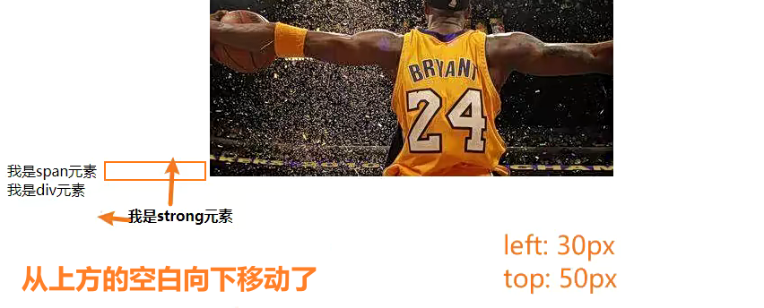

- **定位参照对象是元素自己原来的位置**

left、right、top、bottom用来设置元素的具体位置，对元素的作用如下图所示

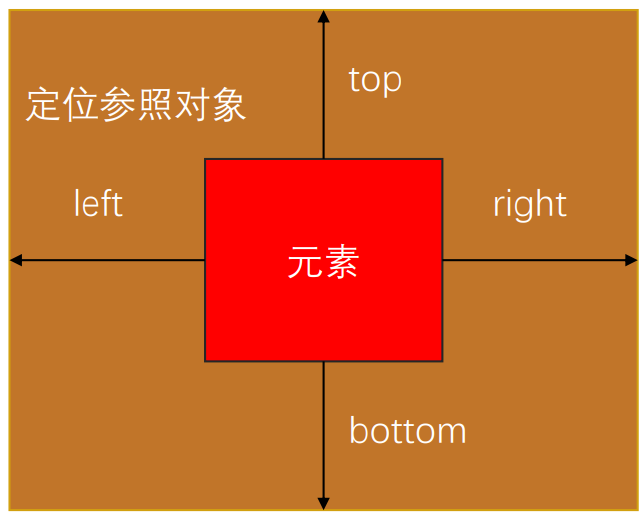


相对定位的应用场景

- 在不影响其他元素位置的前提下，对当前元素位置进行微调
- 不会影响其他元素的位置


## 相对定位练习


？有一个div元素，内部有一个img元素，怎么把img引入的图片始终在窗口正中间显示，不管是窗口变宽还是变窄

解析：

- 首先div元素是一个块级元素，它的宽度始终是窗口的宽度
- 所以让图片在窗口居中显示，也让img元素在div元素的居中显示，所以按照下面图片操作


- 第一步是图片初始的位置

- 第二步是先移动img元素的一半

  ```css
  img {
      position: relative;
  	transform: translate(-50%);	// 向左移动img的一半
  }
  ```

- 第三步是将img往右移动，移动的距离是div元素的一半（操作完第二步，img的中点已经在div元素的最左侧了）

  ```css
  img {
      margin-left: 50%;
  }
  ```

- 这样移动完了之后的话，img就能在窗口（div）居中了，但是为什么`margin-left： 50%；`就能让img元素移动的距离是div元素的一半呢？

  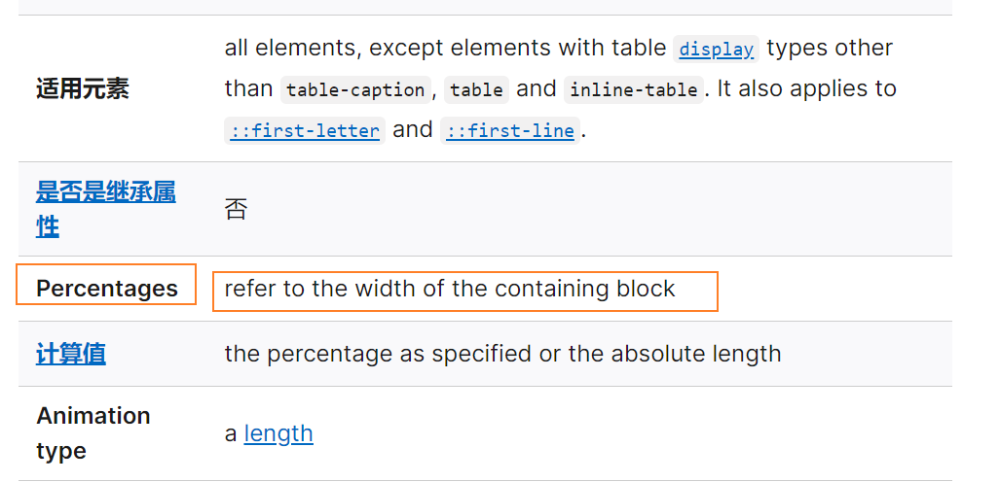

- csdn中对`margin-left`的百分比的解释是，**百分比参照的是包含块**，在这里，包含块就是div元素，所以`margin-left: 50%`移动的距离就是div的50%


背景可有可无，但是大图很重要，所以重要的图片最好用img，相对没那么重要的东西用背景来显示


## 固定定位 - fixed

元素脱离normal flow（脱离标准流、脱标）

可以通过left、right、top、bottom进行定位 

定位参照对象是视口（viewport） 

当画布滚动时，固定不动


## 画布 和 视口

视口（Viewport）

-  文档的可视区域
- 如右图红框所示

画布（Canvas）

- 用于渲染文档的区域
- 文档内容超出视口范围，可以通过滚动查看
- 如右图黑框所示

宽高对比

- 画布 >= 视口

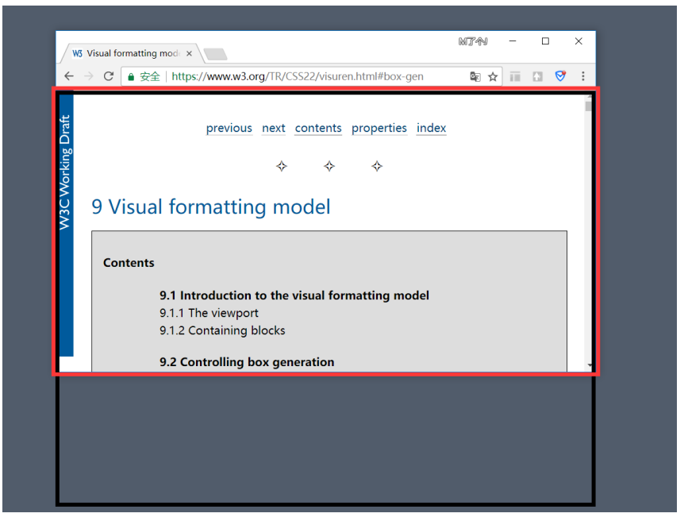


## 固定定位练习

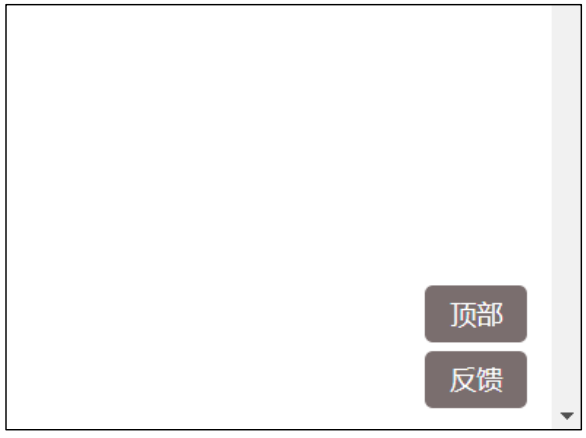


## 绝对定位 - absolute

元素脱离normal flow（脱离标准流、脱标）

可以通过left、right、top、bottom进行定位

- **定位参照对象是最邻近的定位祖先元素**
- 如果找不到这样的祖先元素，参照对象是视口

定位元素（positioned element）

- position值不为static的元素
- 也就是position值为relative、absolute、fixed的元素


## 绝对定位元素的特点

可以随意设置宽高

宽高默认由内容决定

不再受标准流的约束

- 不再严格按照从上到下、从左到右排布 
- 不再严格区分块级、行内级，块级、行内级的很多特性都会消失

不再给父元素汇报宽高数据

- 在relative的定位元素中，子元素依然会给relative的元素汇报高度

脱标元素内部默认还是按照标准流布局


## 子绝父相

在绝大数情况下，子元素的绝对定位都是相对于父元素进行定位

如果希望子元素相对于父元素进行定位，又不希望父元素脱标，常用解决方案是：

- 父元素设置position: relative（让父元素成为定位元素，而且父元素不脱离标准流）
- 子元素设置position: absolute
- 简称为“子绝父相”


## 绝对定位练习

绝对定位元素（absolutely positioned element）

- position值为absolute或者fixed的元素

  

对于绝对定位元素（absolute/fixed）来说

- 处于定位模式下的元素来说，它失去了块级元素或者行内级元素的特性，那么
  - `margin-left`的值默认为0，`margin-right`的值默认为0
  - 宽默认值是`auto`

- **定位参照对象的宽度 = left + right + margin-left + margin-right + 绝对定位元素的实际占用宽度** 

  - 设置left 为 0，right为 0；默认情况下margin-left为0，margin-right也为0，那么：

    - **父元素的宽度 = left(0) + right(0) + margin-left(0，默认值) + margin-right(0，默认值) + 子元素的宽度**
    - 因为left, right, margin-left, margin-right都为0了，所以子元素**在不设置宽度**的情况下**等于父元素的宽度**
    - 因为都设置了值，宽度只能给子元素了

  - 所以在**默认情况**下，如果一个元素是定位元素，设置left为0，right为0，**那么这个元素默认会占满父元素的宽度**

  - 这就是**定位元素**为什么设置`left: 0; right:0;`的时候能**占满父元素的宽或者高的原理**；

  - 如果有这样的情况：800(父元素) = 200(子元素) + 0(left) + 0(right) + 0(margin-left) + 0(margin-right);

    - 设置成这种情况，本来就是有问题的，因为200不可能等于800（其他都被设置成0了），但是浏览器一般会给margin-right的
    - 不要这样设置

  - 如果有这样的情况：800(父元素) = 200(子元素) + 0(left) + 0(right) + auto(margin-left) + auto(margin-right);

  - 因为800 - 200 的值会平分给margin-left和margin-right，这样定位元素就实现**水平居中**

  - 如果有这样的情况：800(父元素) = 200(子元素) + 0(top) + 0(bottom) + auto(margin-top) + auto(margin-bottom);

  - 因为800 - 200 的值会平分给margin-top和margin-bottom，这样定位元素就实现**垂直居中**

  - 注意，垂直居中**只能是绝对定位元素**，因为绝对定位元素才脱离了块级元素和行内级元素的特性，如果是相对定位元素实际上没有完全脱离块级元素和行内级元素的特性，所以他们在设置`margin: auto`的时候不能进行垂直居中

    > 注意：auto这个值是否会让元素居中，是浏览器决定的，比如，如果是这样：
    >
    > 800(父元素) = 200(子元素) + auto(left) + auto(right) + 0(margin-left) + 0(margin-right);
    >
    > 这样设置的话，子元素是不会居中的，你原来在哪里，设置left为auto，right为auto，你后来还是在哪里，但是设置margin的话是可以实现居中，这个就是浏览器决定的

    

    > 宽度的auto：
    >
    > width: auto（默认值）;
    >
    > 1. 行内级元素 -> width: 包裹内容的宽度
    > 2. 块级元素 -> width: 包含块的宽度
    > 3. 绝对定位元素 -> width: 包裹内容
  > 4. 相对定位元素 -> width: 区分行内级元素和块级元素，并且和他们非定位元素时相同
  
    
  
    > 为什么块级元素可以水平居中，不能垂直居中？
    >
    > 首先我们要理解auto的意思是什么，auto是自动填充剩余空间
    >
    > 块级元素，即便我们设置了宽度，他还是自己占一行，在css的规范中，元素他的左外边距+左边框宽度+左内边距+内容的宽度+右内边距+右边框+右外边距=包含块的宽度，如果这个时候元素的这些宽度相加不能等于包含块的宽度，他会将剩下的宽度分配给margin（一般是margin-right、右侧外边距）达到占满整行的目的，如果我们给他的左右外边距设置为auto的时候，他会实现平分剩下的距离给margin-left和margin-right，从而达到一个水平居中的效果
    >
    > 但是块级元素的高度并不会自动扩充，所以他的外部尺寸是不自动充满父元素的，也没有剩余的空间，因此margin上下设置auto不能实现垂直居中，因为块级元素的宽度默认是内容的宽度，不会占满一列


- 定位参照对象的高度 = top + bottom + margin-top + margin-bottom + 绝对定位元素的实际占用高度

如果希望绝对定位元素的宽高和定位参照对象一样，可以给绝对定位元素设置以下属性

- left: 0、right: 0、top: 0、bottom: 0、margin:0

如果希望绝对定位元素在定位参照对象中居中显示，可以给绝对定位元素设置以下属性

- left: 0、right: 0、top: 0、bottom: 0、margin: auto 

- 另外，还得**设置具体的宽高值**（宽高小于定位参照对象的宽高）

- ```css
    #division{
              width: 200px;
              height: 200px;
              background-color:steelblue;
              position: absolute;
              top: 0;
              left: 0;
              right: 0;
              bottom: 0; 
              margin:auto;
          } 
  ```

- 如果这样设置以后，ml + left + content + right + mr = 包含块的宽度，因为content的值不等于包含块的宽度，而left和right又为0，margin-left和margin-right为auto，auto交给浏览器决定，所以浏览器就将剩下的宽度平均分配给margin，让等式左侧等于等式右侧

> 注意，前面所说的元素都是定位元素，也就是说，这些元素不再属于块级元素或者行内级元素了


#### 上下左右居中方案

```css
    <style>
      .box {
        width: 800px;
        height: 500px;
        background-color: #f00;
        position: relative;
      }
      .container {
        position: absolute;
        width: 200px;
        height: 200px;
        background-color: #00f;
        left: 0;
        right: 0;
        top: 0;
        bottom: 0;
        margin: auto;
      }
    </style>
```

```html
  <body>
    <div class="box">
      <div class="container"></div>
    </div>
  </body>
```

利用上面的公式可以通过定位元素来实现上下左右居中

这种上下左右居中**不存在兼容性问题**


> 定位元素在没有设置margin的情况下，设置left: 0, right: 0, top: 0, bottom: 0,默认等于父元素的宽高
>
> 定位元素不属于块级元素，也不属于行内级元素


## 粘性定位 - sticky

另外还有一个定位的值是position: sticky，比起其他定位值要新一些.

- sticky是一个大家期待已久的属性; 
- 可以看做是相对定位和固定定位的结合体; 
- 它允许被定位的元素表现得像相对定位一样，直到它滚动到某个阈值点; 
- 当达到这个阈值点时, 就会变成固定定位;

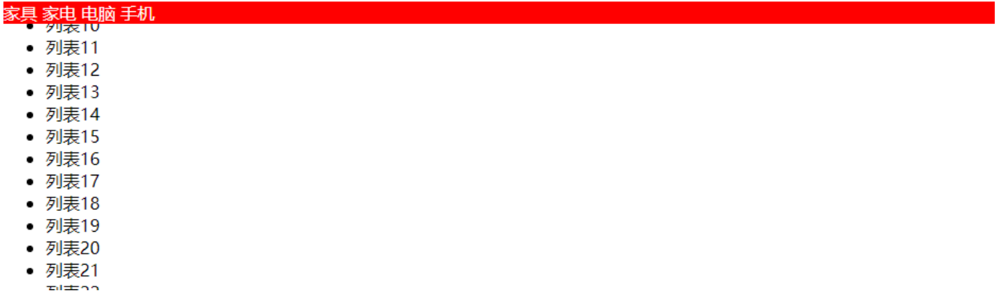

sticky是相对于最近的滚动祖先包含视口的(the nearest ancestor scroll container’s scrollport )


## position值对比

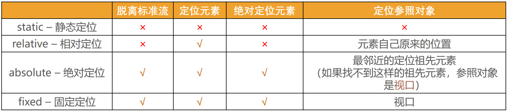


## CSS属性 - z-index

z-index属性用来设置定位元素的层叠顺序（仅对定位元素有效）

- 取值可以是正整数、负整数、0

比较原则

- 如果是兄弟关系
  - z-index越大，层叠在越上面
  - z-index相等，写在后面的那个元素层叠在上面
- 如果不是兄弟关系
  - 各自从元素自己以及祖先元素中，找出最邻近的2个定位元素进行比较
  - 而且这2个定位元素必须有设置z-index的具体数值

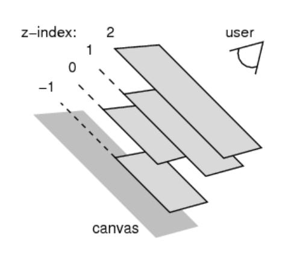