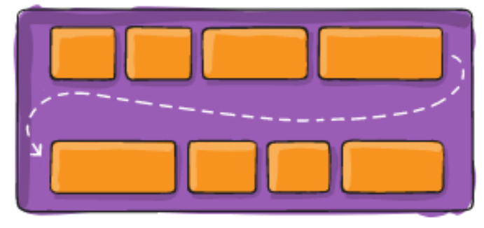

## 认识flexbox

Flexbox翻译为**弹性盒子**: 

- 弹性盒子是一种**用于按行或按列布局元素的一维布局方法** ; 
- 元素可**以膨胀以填充额外的空间**, **收缩以适应更小的空间**; 
- 通常我们使用Flexbox来进行布局的方案称之为**flex布局(flex layout)**

**flex布局**是目前web开发中使用最多的布局方案：

- **flex 布局（Flexible 布局，弹性布局）**;
- 目前特别在移动端可以说已经完全普及;
- 在PC端也几乎已经完全普及和使用, 只有非常少数的网站依然在用浮动来布局;


为什么需要flex布局呢? 

- 长久以来，CSS 布局中唯一可靠且跨浏览器兼容的布局工具只有 floats 和 positioning。
- 但是这两种方法本身存在很大的局限性, 并且他们用于布局实在是无奈之举;


## 原先的布局存在的痛点

原来的布局存在哪些痛点呢? 举例说明:

- 比如在父内容里面垂直居中一个块内容。
- 比如使容器的所有子项等分可用宽度/高度，而不管有多少宽度/高度可用。 
- 比如使多列布局中的所有列采用相同的高度，即使它们包含的内容量不同。


## flex布局的出现

所以长久以来, 大家非常期待一种真正可以用于对元素布局的方案: 于是flex布局出现了;

- Nature and nature's laws lay hid in night; God said "Let Newton be" and all was light.
- 自然与自然的法则在黑夜隐藏，于是上帝说，让牛顿出现吧！于是世界就明亮了起来.


flexbox在使用时, 我们最担心的是它的兼容性问题:

- 我们可以在caniuse上查询到具体的兼容性

  


## flex布局的重要概念

两个重要的概念：

- 开启了 flex 布局的元素叫 **flex container**
- flex container 里面的直接子元素叫做 flex item


当flex container中的子元素变成了flex item时, 具备以下特点:

- flex item的布局将受**flex container属性**的设置来进行控制和布局; 
- **flex item不再严格区分块级元素和行内级元素;** 
- flex item默认情况下是包裹内容的, 但是可以设置宽度和高度;


设置 display 属性为 flex 或者 **inline-flex** 可以成为 flex container

- **flex**： flex container 以 **block-level** 形式存在（独占一行）

  

- **inline-flex**： flex container 以 **inline-level** 形式存在（按照内容的宽度进行显示）

  


> 默认设置这两个值后如果flex item没有高度，那么flex item会默认填充父元素的高度，因为align-items（交叉轴一行内的对其方式）的默认值是normal（在这里，normal和stretch一样的表现，stretch是拉伸的）,它是会拉伸的，如果设置align-items的其他值，不会拉伸，宽度会根据内容的宽度来显示


## flex布局的模型


- main axis: 主轴
- cross axis: 交叉轴


## flex相关的属性

应用在 **flex container** 上的 CSS 属性

- flex-direction 
- flex-wrap
- flex-flow
- justify-content
- align-items
- align-content

应用在 flex items 上的 CSS 属性 

- flex-grow 
- flex-basis
- flex-shrink
- order
- align-self
- flex


## flex container属性

### flex-direction

flex items 默认都是沿着 main axis（主轴）从 main start 开始往 main end 方向排布

- flex-direction 决定了 main axis 的方向，有 4 个取值
- row（默认值）、row-reverse、column、column-reverse


### flex-wrap

flex-wrap 决定了 flex container 是**单行还是多行**

- nowrap（默认）：单行（所以就算给flex item设置宽度，宽度也会被压缩）
  - 也可以给flext item设置flex-shrink: 0
  - 表示不压缩
  - 这样就不会压缩了，并且在一行显示，但是会超出flex container
- wrap：多行
- wrap-reverse：多行（对比 wrap，cross start 与 cross end 相反）




> 元素最终展示出来的宽度和width有关系，但是没有必然性
>
> width可以设置，但是不一定会按照你设置的宽度进行展示


### flex-flow

flex-flow 属性是 flex-direction 和 flex-wrap 的简写。

- 顺序任何, 并且都可以省略;

  


### justify-content

justify-content 决定了 flex items 在 main axis 上的对齐方式

- flex-start（默 认值）：与 main start 对齐 
- flex-end：与 main end 对齐 
- center：居中对齐
- space-between：
  - flex items 之间的距离相等 
  - 与 main start、main end两端对齐
- space-around：
  - flex items 之间的距离相等 
  - flex items 与 main start、main end 之间的距离是 flex items 之间距离的一半
- space-evenly：
  - flex items 之间的距离相等 
  - flex items 与 main start、main end 之间的距离 等于 flex items 之间的距离


### align-items

align-items 决定了 flex items 在 cross axis 上的对齐方式

它指的是一行中的flex item的cross axis的对其方式

- normal：在弹性布局中，效果和stretch一样
- stretch：当 flex items 在 cross axis 方向的 size 为 auto 时，会 自动拉伸至填充 flex container
  - 如果给flex items设置了高度，他是不会拉伸的
- flex-start：与 cross start 对齐 
- flex-end：与 cross end 对齐 
- center：居中对齐 
- baseline：与基准线对齐
  - 修改基线高度可以通过修改`font-size`或者`line-height`属性来实现


这里是一行，如果有多行的情况，实际上每一行会存在一个高度，那么在每一行的高度内进行上述的对齐


### align-content

align-content 决定了**多行** flex items 在 cross axis 上的对齐方式，用法与 justify-content 类似

- stretch（默认值）：与 align-items 的 stretch 类似
  - flex item没有高度的时候才会拉伸
- flex-start：与 cross start 对齐
  - 一般在开发中比较少使用，因为一般在开发中很少设置盒子的高度，如果盒子没有高度，它默认就是自动换行的，中间不会有空隙
- flex-end：与 cross end 对齐
- center：居中对齐 
- space-between：
  - flex items 之间的距离相等
  - 与 cross start、cross end两端对齐
- space-around： 
  - flex items 之间的距离相等 
  - flex items 与 cross start、cross end 之间的距离是 flex items 之间距离的一半
- space-evenly： 
  - flex items 之间的距离相等 
  - flex items 与 cross start、cross end 之间的距离 等于 flex items 之间的距离


## flex-item属性

### order

- order 决定了 flex items 的排布顺序
  - 可以设置任意整数（正整数、负整数、0），值越小就越排在前面 
  - 默认值是 0


### flex items

flex items 可以通过 align-self **覆盖** flex container 设置的 align-items

- auto（默认值）：遵从 flex container 的 align-items 设置
- stretch、flex-start、flex-end、center、baseline，效果跟 align-items 一致


### flex-grow

flex-grow 决定了 flex items 如何扩展(拉伸/成长)

- 可以设置任意非负数字（正小数、正整数、0），默认值是 0
- 当 flex container 在 **main axis 方向**上有剩余 size 时，flex-grow 属性才会有效

如果所有 flex items 的 flex-grow 总和 sum 超过 1，每个 flex item 扩展的 size 为

- flex container 的剩余 size * flex-grow / sum
  - 也就是说flex-grow的值除以flex item的数量，表示占多少
  - 例如flex-grow为2，flex item的数量是3，那么表示要占三分之二，然后用三分之二乘以剩余的总宽度size，得到的就是flex-grow对应的值


flex items 扩展后的最终 size 不能超过 max-width\max-height，也就是说如果一个flex-item设置了max-width，如果flex-grow设置为1，但是宽度不会超过max-width;


### flex-shrink

flex-shrink 决定了 flex items 如何收缩(缩小)

- 可以设置任意非负数字（正小数、正整数、0），默认值是 1
- 当 flex items 在 main axis 方向上超过了 flex container 的 size，flex-shrink 属性才会有效

如果所有 flex items 的 flex-shrink 总和超过 1，每个 flex item 收缩的 size为

- flex items 超出 flex container 的 size * 收缩比例 / 所有 flex items 的收缩比例之和


flex items 收缩后的最终 size 不能小于 min-width\min-height


### flex-basis

flex-basis 用来设置 flex items 在 main axis 方向上的 base size

- auto（默认值）、具体的宽度数值（100px）
- 也就是设置的是flex item的宽度的，我们可以直接设置宽度，也可以用flex-basis来设置宽度

决定 flex items 最终 base size 的因素，从优先级高到低

- max-width\max-height\min-width\min-height
- flex-basis
- width\height
- 内容本身的 size


如果width和basis同时设置，他们会同时生效，只不过，basis他会扩展，但是扩展的最大程度就是width


### flex属性

flex 是 flex-grow || flex-shrink || flex-basis 的简写,flex 属性可以指定1个，2个或3个值。


单值语法: 值必须为以下其中之一:

- 一个无单位数(): 它会被当作`<flex-grow>`的值。
- 一个有效的宽度(width)值: 它会被当作`<flex-basis>`的值。
- 关键字none(`flex: 0 0 auto`)，auto(`flex: 1 1 auto`)或initial(`flex: 0 1 auto`).


双值语法: 第一个值必须为一个无单位数，并且它会被当作`<flex-basis>`的值。

- 第二个值必须为以下之一：
  - 一个无单位数：它会被当作`<flex-basis>`的值。
  - 一个有效的宽度值: 它会被当作`<flex-basis>`的值。
- 三值语法:
  - 第一个值必须为一个无单位数，并且它会被当作`<flex-grow>`的值。
  - 第二个值必须为一个无单位数，并且它会被当作`<flex-shrink>`的值。
  - 第三个值必须为一个有效的宽度值， 并且它会被当作`<flex-basic>`的值。


## 思考: 如下布局如何解决对其问提


```html
<!DOCTYPE html>
<html lang="en">
<head>
  <meta charset="UTF-8">
  <meta http-equiv="X-UA-Compatible" content="IE=edge">
  <meta name="viewport" content="width=device-width, initial-scale=1.0">
  <title>Document</title>
  <style>
    .container {
      width: 500px;
      background-color: orange;

      display: flex;
      flex-wrap: wrap;
      justify-content: space-between;
    }

    .item {
      width: 110px;
      height: 140px;

      /* margin-right: 20px; */
    }

    .container > i {
      width: 110px;
    }

    /* .item:nth-child(4n) {
      margin-right: 0;
    } */
  </style>
</head>
<body>
  
  <div class="container">
    <div class="item item1">1</div>
    <div class="item item2">2</div>
    <div class="item item3">3</div>
    <div class="item item1">1</div>
    <div class="item item2">2</div>
    <div class="item item3">3</div>
    <div class="item item1">1</div>
    <div class="item item2">2</div>
    <div class="item item3">3</div>
    <div class="item item3">3</div>
    <!-- 添加span的个数是列数减-2 -->
   <i></i><i></i>
  </div>

  <script src="./js/itemRandomColor.js"></script>
</body>
</html>
```

