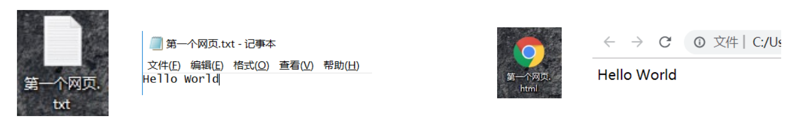
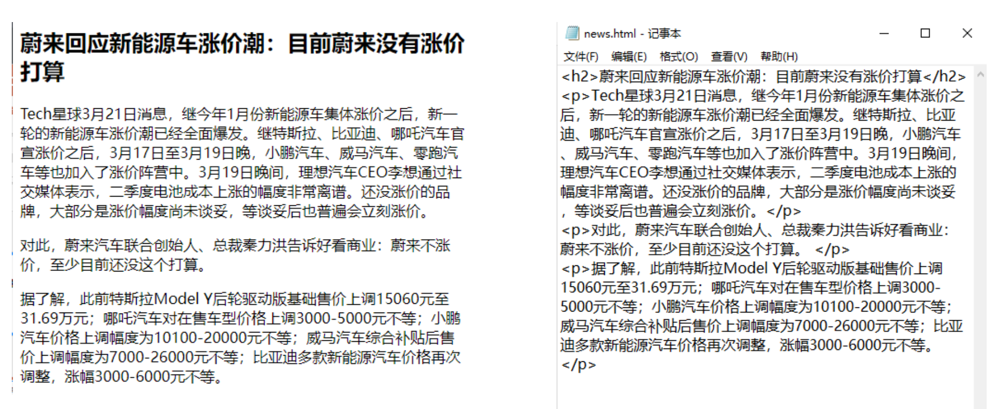

### 开发第一个网页 – 记事本

- 新建一个.txt的文件

- 在其中添加一些文字，比如Hello World

- 保存文件

- 修改文件的扩展名为.html文件

- 使用浏览器打开页面




### 这个网页有什么缺点？

只能显示一段普通的文本；

浏览器不知道是否要对这段文本加粗、放大、段落之间的间距；


### 案例:显示一条新闻



```txt
而我们编写的<h2></h2>，<p></p>就是HTML元素；
```

