## CSS属性 - transform

CSS transform属性允许对某一个元素进行某些形变, 包括旋转，缩放，倾斜或平移等。

transform是形变的意思，transformer就是变形金刚；

注意事项，并非所有的盒子都可以进行transform的转换（通常行内级元素不能进行形变）

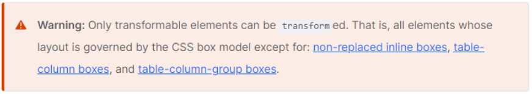

所以，transform对于行内级非替换元素是无效的；

- 比如对span、a元素等；

## transform的用法

transform属性的语法如下：

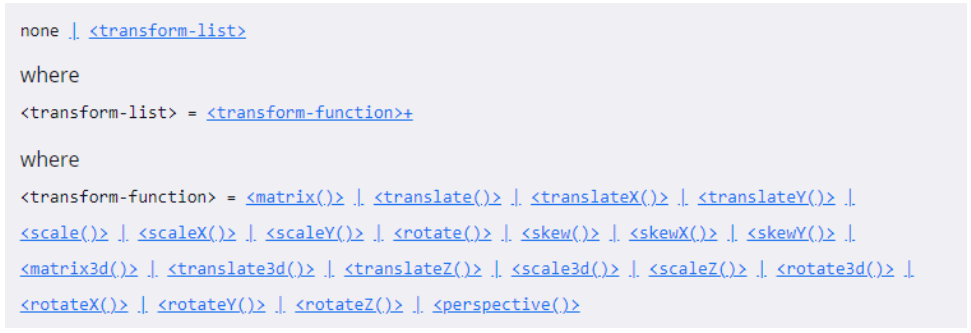

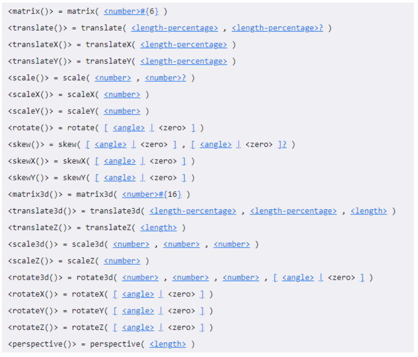

常见的函数transform function有： 

- 平移：translate(x, y) 
- 缩放：scale(x, y)
- 旋转：rotate(deg)
- 倾斜：skew(deg, deg)

通过上面的几个函数，我们可以改变某个元素的形变

## 位移 - translate

### 平移：translate(x, y)

- 这个CSS 函数用于移动元素在平面上的位置。
- translate本身可以表示翻译的意思，在物理上也可以表示平移；

值个数：

- 一个值时，设置x轴上的位移
- 二个值时，设置x轴和y轴上的位移

值类型：

- 数字：100px
- 百分比：参照元素本身（ refer to the size of bounding box ）

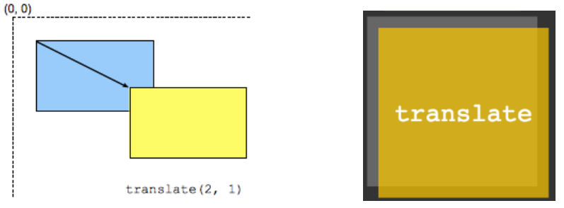

## 元素的居中

### 水平居中:

1. 行内级元素: 设置父元素的text-align: center

2. 块级元素: 设置当前块级元素(宽度) margin: 0 auto;

3. 绝对定位: 元素有宽度情况下, left0/right0+margin: 0 auto;

4. flex:  justify-content: center;

### 垂直居中:

1. 绝对定位

   元素有高度情况下, top0/bottom0+margin: auto 0;

   弊端:

   1. 必须使用定位(脱离标准流)
   2. 必须给元素设置高度

2. flex布局(直接使用flex)

   弊端:

   1. 当前flex局部中所有的元素都会被垂直居中
   2. 相对来说, 兼容性差一点点(基本可以忽略)

3. 垂直居中: top/translate(个人推荐, 不好理解)

   1. 让元素向下位移父元素的50%(position: relative; top: 50%)
   2. 让元素向上位移自身的50% (transform: translateY(-50%);)
   3. 不能使用margin，因为margin的百分比参考的是包含块的宽度

## translate的补充

补充一：translate是translateX和translateY函数的简写。

- translate3d后续了解;

补充二：translate的百分比可以完成一个元素的水平和垂直居中：

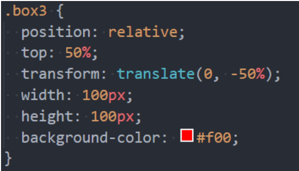

translate函数相对于flex布局的兼容性会好一点点

- 不过目前flex布局已经非常普及，直接使用flex布局即可；

## 缩放 - scale

缩放：scale(x, y)

- scale() CSS 函数可改变元素的大小。

值个数

- 一个值时，设置x轴上的缩放
- 二个值时，设置x轴和y轴上的缩放

值类型：

- 数字：
  - 1: 保持不变
  - 2: 放大一倍
  - 0.5：缩小一半
- 百分比：百分比不常用

scale函数时scaleX和scaleY的缩写：

- scale3d后续再了解；

## 旋转 - rotate

旋转：rotate() 

值个数

- 一个值时，表示旋转的角度 

值类型：

- 常用单位deg：旋转的角度（ degrees ）
- 正数为顺时针
- 负数为逆时针

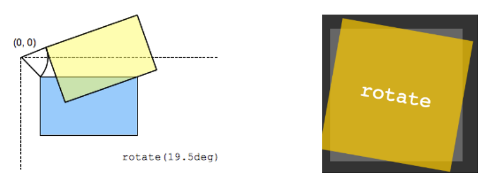

## rotate补充

补充一：rotate函数是rotateZ函数的简写写法。

- rotate3d后续再了解；

补充二：rotate的其他单位

- 事实上rotate支持的单位是很多的；
- 度（degrees）、 百分度（gradians）、弧度（radians）或圈数（turns）；

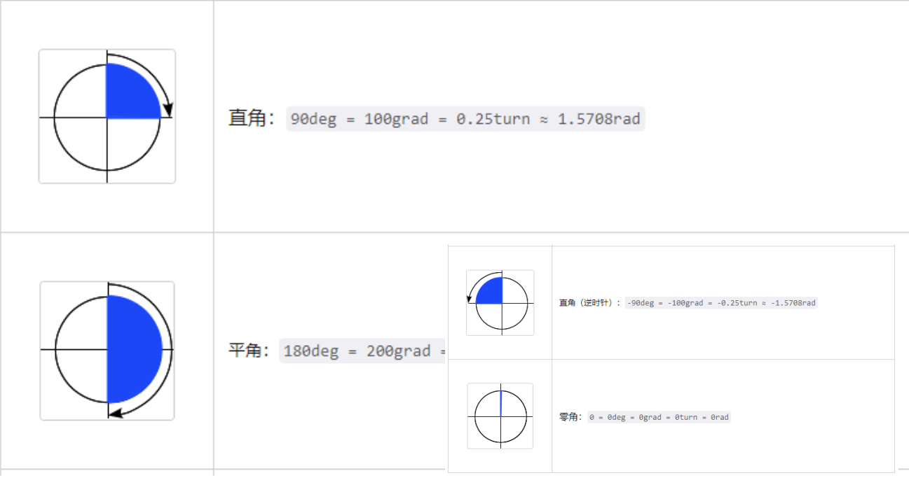

## transform-origin

transform-origin：形变的原点

- 比如在进行scale缩放或者rotate旋转时，都会有一个原点。

一个值：

- 设置x轴的原点
- y轴默认是center

两个值：

- 设置x轴和y轴的原点

默认值：

- center, center

必须是`<length>`，`<percentage>`，或 left, center, right, top, bottom关键字中的一个

- left, center, right, top, bottom关键字
- length：从左上角开始计算
- 百分比：参考**元素本身**大小

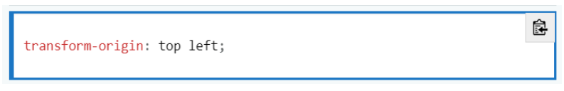

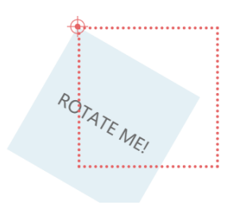

## 倾斜 - skew

倾斜：skew(x, y)

- 函数定义了一个元素在二维平面上的倾斜转换。

值个数:

- 一个值时，表示x轴上的倾斜
- 二个值时，表示x轴和y轴上的倾斜

值类型：

- deg：倾斜的角度
- 正数为顺时针
- 负数为逆时针

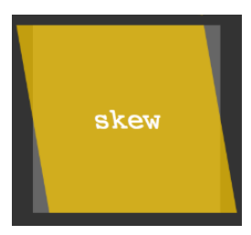

注意：倾斜的原点受transform-origin的影响

## transform设置多个值

前面我们看到了transform的语法，它是可以设置多个transform-function的：

- 那么就意味着，我们可以给transform设置多个形变的函数；

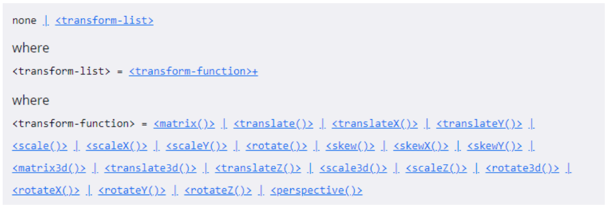

> <transform-function>+
>
> 这里的`+`表示一个或者多个，并且多个之间以空格进行分割的
>
> transform: scale() translate();
>
>  <box-shadow>#
>
> 这里的`#`表示一个或者多个，并且多个之间以逗号进行分割的
>
> box-shadow: 1px 1px 1px 1px #f00, 2px 2px 2px 2px #0f0;

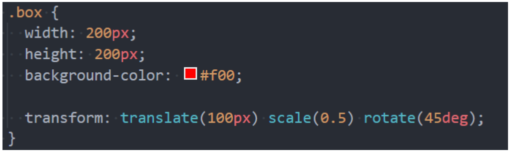

## 认识transition动画

什么是transition动画呢？

- CSS transitions 提供了一种在更改CSS属性时控制动画速度的方法。
- 可以让CSS属性变化成为一个持续一段时间的过程，而不是立即生效的；
- 比如将一个元素从一个位置移动到另外一个位置，默认在修改完CSS属性后会立即生效；
- 但是我们可以通过CSS transition，让这个过程加上一定的动画效果，包括一定的曲线速率变化；

通常将两个状态之间的过渡称为隐式过渡（implicit transitions），因为开始与结束之间的状态由浏览器决定。

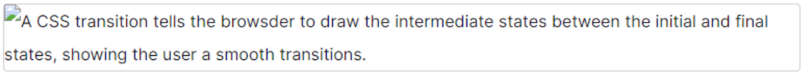

CSS transitions 可以决定

- 哪些属性发生动画效果 (明确地列出这些属性)
- 何时开始 (设置 delay）
- 持续多久 (设置 duration) 
- 如何动画 (定义timing function，比如匀速地或先快后慢)。

## 哪些CSS属性可以做动画呢？

并非所有的CSS属性都可以执行动画的，那么我们如何知道哪些属性支持动画呢？

方法一：在MDN可执行动画的CSS属性中查询

- https://developer.mozilla.org/zh-CN/docs/Web/CSS/CSS_animated_properties

方法二：阅读CSS属性的文档说明

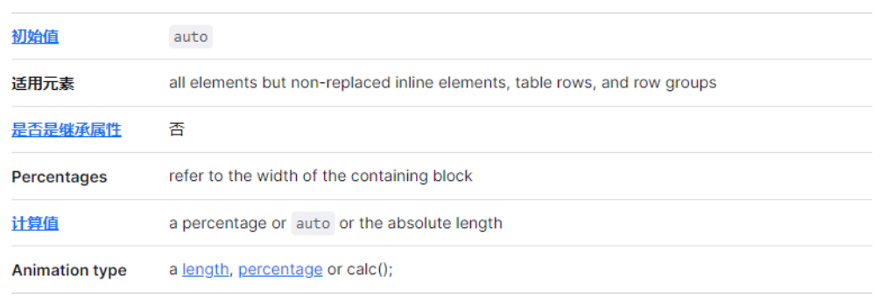

## 过渡动画 - transition

transition CSS 属性是 transition-property，transition-duration，transition-timing-function 和 transition-delay 的一个简 写属性。

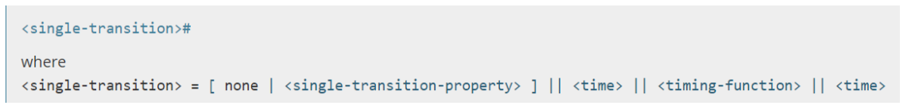

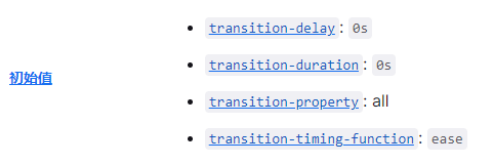

transition-property：指定应用过渡属性的名称 

- all：所有属性都执行动画；
- none：所有属性都不执行动画；
- CSS属性名称：要执行动画的CSS属性名称，比如width、left、transform等；

transition-duration：指定过渡动画所需的时间

- 单位可以是秒（s）或毫秒（ms）

transition-timing-function：指定动画的变化曲线

- https://developer.mozilla.org/zh-CN/docs/Web/CSS/transition-timing-function

transition-delay：指定过渡动画执行之前的等待时间

## 几个英语词汇的区分

transform是形变：

- 一个CSS属性，该CSS属性用于设置形变；
- 后面的值是形变的函数，比如scale、rotate、translate；

translate是其中一个transform-function

- 用于对元素进行平移；

transition是过渡的意思

- 它本身也有转变的含义，但是更多表示的是过渡的过程；

## 认识CSS Animation

之前我们学习了transition来进行过渡动画，但是过渡动画有如下的缺点：

- transition只能定义开始状态和结束状态，不能定义中间状态，也就是说只有两个状态；
- transition不能重复执行，除非一再触发动画；
- transition需要在特定状态下会触发才能执行，比如某个属性被修改了；

如果我们希望可以有更多状态的变化，我们可以使用CSS Animation。

CSS Animation的使用分成两个步骤：

- 步骤一：使用keyframes定义动画序列（每一帧动画如何执行）
- 步骤二：配置动画执行的名称、持续时间、动画曲线、延迟、执行次数、方向等等

## @keyframes规则

可以使用@keyframes来定义多个变化状态，并且使用animation-name来声明匹配：

- 关键帧使用percentage来指定动画发生的时间点；
- 0%表示动画的第一时刻，100%表示动画的最终时刻；
- 因为这两个时间点十分重要，所以还有特殊的别名：from和to；

也就是说可以使用from和to关键字：

- from相当于0%
- to相当于100%

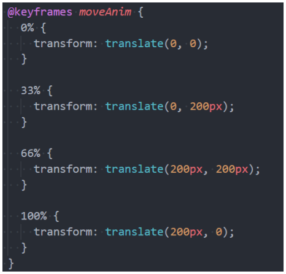

## animation属性

CSS animation 属性是 animation-name，animation-duration, animation-timing-function，animation-delay，animation-iteration-count，animation-direction，animation-fill-mode 和 animation-play-state 属性的一个简写属性形式。

- animation-name：指定执行哪一个关键帧动画 
- animation-duration：指定动画的持续时间 
- animation-timing-function：指定动画的变化曲线 
- animation-delay：指定延迟执行的时间 
- animation-iteration-count：指定动画执行的次数，执行infinite表示无限动画 
- animation-direction：指定方向，常用值normal和reverse 
- animation-fill-mode：执行动画最后保留哪一个值
  - none：回到没有执行动画的位置 
  - forwards：动画最后一帧的位置 
  - backwards：动画第一帧的位置
- animation-play-state：指定动画运行或者暂停（在JavaScript中使用，用于暂停动画）
  - paused:暂停动画

