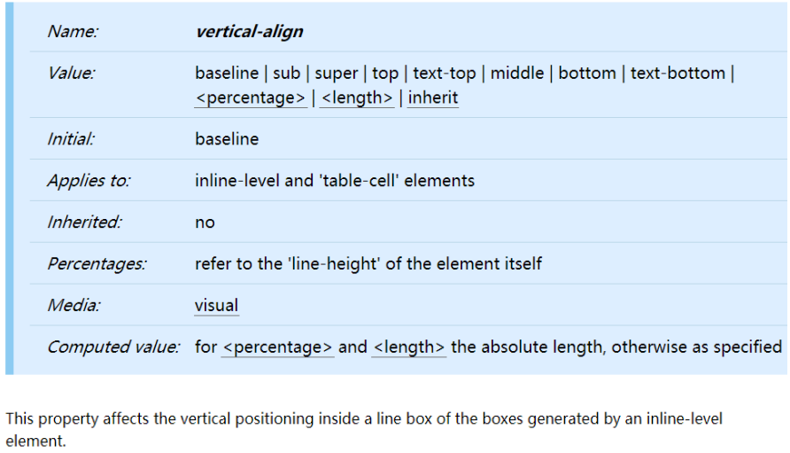
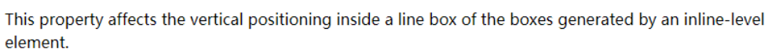
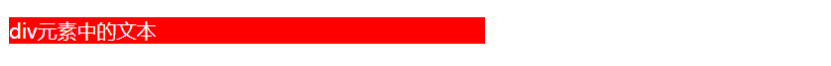
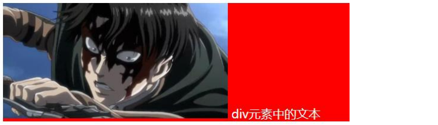
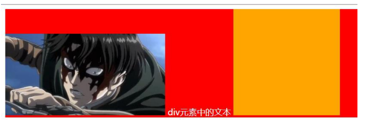
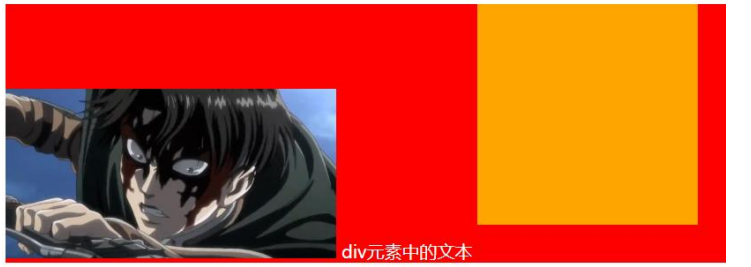
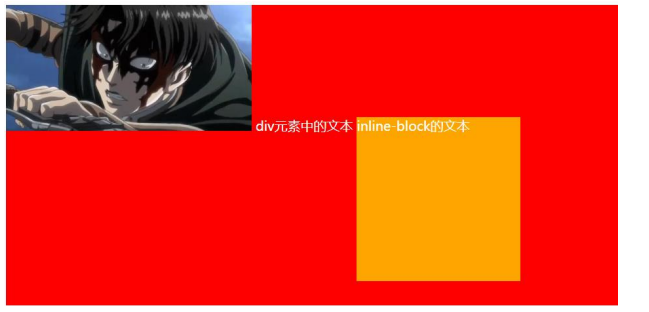
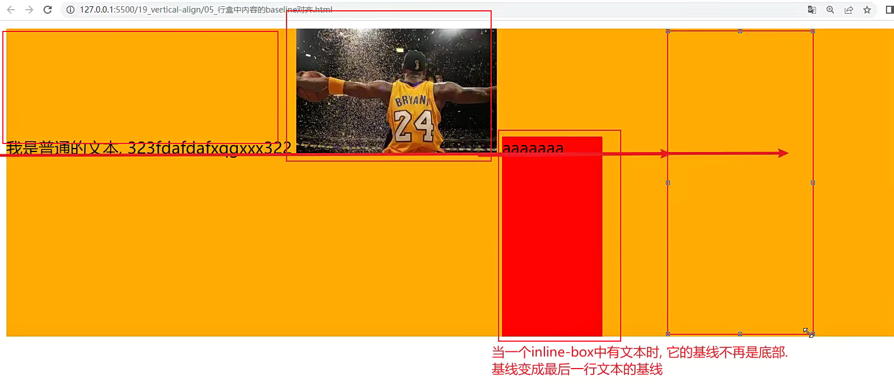
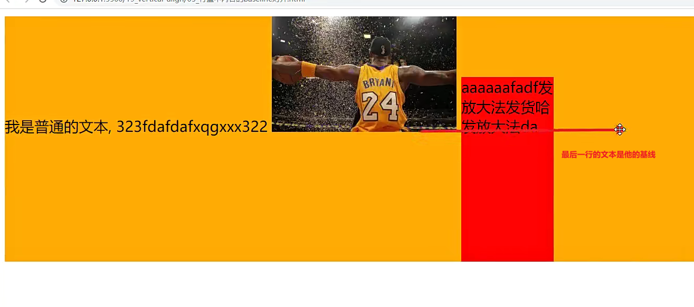
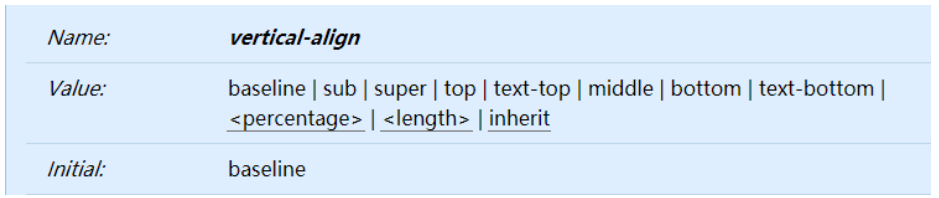

## CSS属性 - vertical-align

影响一个行盒中的元素的对齐方式

## 深入理解vertical-align – line boxes

官方文档的翻译：vertical-align会影响 行内块级元素 在一个 行盒 中垂直方向的位置

思考：一个div没有设置高度的时候，会不会有高度？

- 没有内容，没有高度
- 有内容，内容撑起来高度

但是内容撑起来高度的本质是什么呢？

- 内容有行高（line-height），撑起来了div的高度

行高为什么可以撑起div的高度？ 

- 这是因为line boxes的存在，并且line-boxes有一个特性，包裹每行的inline level
- 而其中的文字是有行高的，必须将整个行高包裹进去，才算包裹这个line-level

那么，进一步思考： 

- 如果这个div中有图片，文字，inline-block，甚至他们设置了margin这些属性呢？

## 深入理解vertical-align – 不同情况分析

情况一：只有文字时，line boxes如何包裹内容？（注意：红色是包裹的div，下面也都一样）

情况二：有图片，有文字时，line-boxes如何包裹内容？

情况三：有图片，有文字，有inline-block（比图片要大）如何包裹内容？

情况四：有图片，有文字，有inline-block（比图片要大）而且设置了margin-bottom，如何包裹内容？

情况五：有图片、文字、inline-block（比图片要大）而且设置了margin-bottom并且有文字，如何包裹内容？

## vertical-align的baseline

结论：line-boxes一定会想办法包裹住当前行中所有的内容。 

但是，但是为什么对齐方式千奇百怪呢？

- 你认为的千奇百怪，其实有它的内在规律
- 答案就是baseline对齐

我们来看官方vertical-align的默认值：没错，就是baseline

但是baseline都是谁呢？

- 文本的baseline是字母x的下方
- Inline-block默认的baseline是margin-bottom的底部（没有，就是盒子的底部）
- Inline-block有文本时，baseline是最后一行文本的x的下方

那么为什么不管是图片还是inline-block都一定要基线对其呢

首先，图片和inline或者是inline-block默认的对齐方式就是基线

其次，行盒的高度是包裹一行中所有内容的，假设，图片或者inline或者inline-block他们的基线在最底部，那么这一行如果要加y,g这些文本的时候，图片就要往上挪一下了，这样显然是不好的，所以默认初始的时候就让他们对齐好，这样就算将来假如其他文本，也不会影响，这就是底部空间的由来

一切都解释通了

## vertical-align的其他值

现在，对于不同的取值就非常容易理解了

- baseline(默认值)：基线对齐（你得先明白什么是基线）
- top：把行内级盒子的顶部跟line boxes顶部对齐
- middle：行内级盒子的中心点与父盒基线加上x-height一半的线对齐
- bottom：把行内级盒子的底部跟line box底部对齐
- `<percentage>`: 把行内级盒子提升或者下降一段距离（距离相对于line-height计算\元素高度）， 0%意味着同baseline一 样
- `<length>`: 把行内级盒子提升或者下降一段距离，0cm意味着同baseline一样

解决图片下边缘的间隙方法:

- 方法一: 设置成top/middle/bottom 
- 方法二: 将图片设置为block元素

