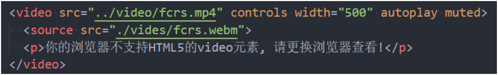
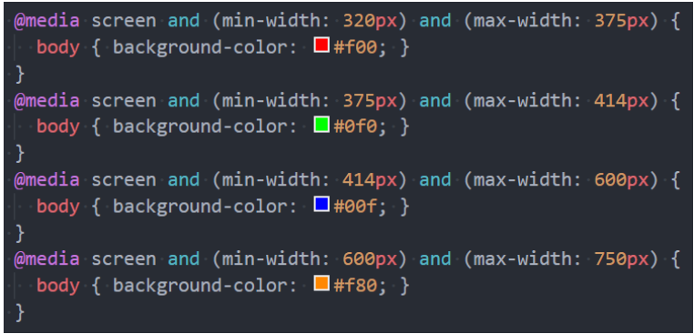

在HMTL5之前，我们的网站分布层级通常包括哪些部分呢？ 

- header、nav、main、footer

但是这样做有一个弊端：

- 我们往往过多的使用div, 通过id或class来区分元素；
- 对于浏览器来说这些元素不够语义化；
- 对于搜索引擎来说, 不利于SEO的优化；

HTML5新增了语义化的元素：

- `<header>`：头部元素
- `<nav>`：导航元素
- `<section>`：定义文档某个区域的元素
- `<article>`：内容元素（某一个评论，某一段文章）
- `<aside>`：侧边栏元素
- `<footer>`：尾部元素

## audio/video

Web端事实上一直希望可以更好的嵌入音频和视频, 特别是21世纪以来, 用户带宽的不断提高, 浏览器因为和视频变得非常容易.

- 在HTML5之前是通过flash或者其他插件实现的, 但是会有很多问题;
- 比如无法很好的支持HTML/CSS特性, 兼容性问题等等;

HTML5增加了对媒体类型的支持：

- 音频：`<audio>`
- 视频：`<video>`

Video和Audio使用方式有两个：

- 一方面我们可以直接通过元素使用video和autio；
- 另一方面我们可以通过JavaScript的API对其进行控制；

## HTML5新增元素 - video

HTML `<video>` 元素 用于在HTML或者XHTML文档中嵌入媒体播放器，用于支持文档内的视频播放

### video常见的属性:

| 常见属性 | 值的方式           | 属性作用                                                     |
| -------- | ------------------ | ------------------------------------------------------------ |
| src      | URL地址            | 视频播放的URL地址                                            |
| width    | pixels(像素)       | 设置video宽度                                                |
| height   | pixels(像素)       | 设置video高度                                                |
| controls | Boolean类型        | 是否显示控制栏,包括音量，跨帧，暂停/恢复播放。               |
| autoplay | Boolean类型        | 是否视频自动播放(某些浏览器需要添加muted, 比如Chrome)        |
| muted    | Boolean类型        | 是否静音播放                                                 |
| preload  | none/metadata/auto | 是否需要预加载视频. metadata表示预加载元数据(比如视频 时长等) |
| poster   | URL地址            | 一海报帧的URL                                                |

### video支持的视频格式

每个视频都会有自己的格式, 浏览器的video并非支持所有的视频格式

### video的兼容性写法

在`<video>`元素中间的内容，是针对浏览器不支持此元素时候的降级处理。

- 内容一：通过元素指定更多视频格式的源;
- 内容二：通过p/div等元素指定在浏览器不支持video元素的情况, 显示的内容;

## HTML5新增元素 - audio

HTML`<audio>`元素用于在文档中嵌入音频内容, 和video的用法非常类似

### 常见属性:

| 常见属性 | 值的方式           | 属性作用                                                     |
| -------- | ------------------ | ------------------------------------------------------------ |
| src      | URL地址            | 音频播放的URL地址                                            |
| controls | Boolean类型        | 是否显示控制栏,包括音量，进度，暂停/恢复播放。               |
| autoplay | Boolean类型        | 是否视频自动播放(某些浏览器需要添加muted, 比如Chrome)        |
| muted    | Boolean类型        | 是否静音播放                                                 |
| preload  | none/metadata/auto | 是否需要预加载视频. metadata表示预加载元数据(比如视频 时长等) |

### audio支持的音频格式

每个音频都会有自己的格式, 浏览器的audio并非支持所有的视频格式

具体的支持的格式可以通过下面的链接查看: 

- https://developer.mozilla.org/en-US/docs/Web/Media/Formats/Audio_codecs

在`<audio>`元素中间的内容，是针对浏览器不支持此元素时候的降级处理。

## input元素的扩展内容

HTML5对input元素也进行了扩展，在之前我们已经学习过的其中几个属性也是HTML5的特性： 

- placeholder：输入框的占位文字 
- multiple：多个值 
- autofocus：最多输入的内容

另外对于input的type值也有很多扩展： 

- date
- time
- number
- tel
- color
- email
- 等等…

查看MDN文档:

- https://developer.mozilla.org/zh-CN/docs/Web/HTML/Element/Input

## 新增全局属性 data-*

在HTML5中, 新增一种全局属性的格式 data-*, 用于自定义数据属性: 

- data设置的属性可以在JavaScript的DOM操作中通过dataset轻松获取到；
- 通常用于HTML和JavaScript数据之间的传递；

在小程序中, 就是通过data-来传递数据的, 所以该全局属性必须要掌握.

## CSS属性 - white-space

white-space用于设置空白处理和换行规则

- normal：合并所有连续的空白，允许单词超屏时自动换行
- nowrap：合并所有连续的空白，不允许单词超屏时自动换行
- pre：阻止合并所有连续的空白，不允许单词超屏时自动换行
- pre-wrap：阻止合并所有连续的空白，允许单词超屏时自动换行
- pre-line：合并所有连续的空白（但保留换行），允许单词超屏时自动换行

## CSS属性 - text-overflow

text-overflow通常用来设置文字溢出时的行为

- clip：溢出的内容直接裁剪掉（字符可能会显示不完整）
- ellipsis：溢出那行的结尾处用省略号表示

text-overflow生效的前提是overflow不为visible

常见的是将white-space、text-overflow、overflow一起使用：

## CSS中的函数

在前面我们有使用过很多个CSS函数: 

- 比如rgb/rgba/translate/rotate/scale等;
- CSS函数通常可以帮助我们更加灵活的来编写样式的值；

下面我们再学习几个非常好用的CSS函数:

- var: 使用CSS定义的变量;
- calc: 计算CSS值, 通常用于计算元素的大小或位置;
- blur: 毛玻璃(高斯模糊)效果;
- gradient：颜色渐变函数；

### CSS函数 - var

CSS中可以自定义属性

- 属性名需要以两个减号（--）开始;
- 属性值则可以是任何有效的CSS值;

我们可以通过var函数来使用:

规则集定义的选择器, 是自定义属性的可见作用域(只在选择器内部有效)

- 所以推荐将自定义属性定义在html中，也可以使用 :root 选择器;

### CSS函数 -calc

calc() 函数允许在声明 CSS 属性值时执行一些计算。

- 计算支持加减乘除的运算；
  - \+ 和 - 运算符的两边必须要有空白字符。
- 通常用来设置一些元素的尺寸或者位置；

### CSS函数 - blur

blur() 函数将高斯模糊应用于输出图片或者元素; 

- blur(radius)
- radius, 模糊的半径, 用于定义高斯函数的偏差值, 偏差值越大, 图片越模糊;

通常会和两个属性一起使用：

- filter: 将模糊或颜色偏移等图形效果应用于元素;
- backdrop-filter: 为元素后面的区域添加模糊或者其他效果;

### CSS函数 – gradient

`<gradient>`是一种`<image>`CSS数据类型的子类型，用于表现两种或多种颜色的过渡转变。

- CSS的`<image>`数据类型描述的是2D图形；
- 比如background-image、list-style-image、border-image、content等；
-  `<image>`常见的方式是通过url来引入一个图片资源；
- 它也可以通过CSS的`<gradient>`函数来设置颜色的渐变；

`<gradient>`常见的函数实现有下面几种：

- linear-gradient()：创建一个表示两种或多种颜色线性渐变的图片；
- radial-gradient()：创建了一个图像，该图像是由从原点发出的两种或者多种颜色之间的逐步过渡组成；
- repeating-linear-gradient()：创建一个由重复线性渐变组成的`<image>`；
- repeating-radial-gradient()：创建一个重复的原点触发渐变组成的`<image>`；
- 等等；

### linear-gradient的使用

linear-gradient：创建一个表示两种或多种颜色线性渐变的图片；

 radial-gradient：创建了一个图像，该图像是由从原点发出的两种或者多种颜色之间的逐步过渡组成；

### 浏览器前缀

有时候可能会看到有些CSS属性名前面带有：-o-、-xv-、-ms-、mso-、-moz-、-webkit-

官方文档专业术语叫做：vendor-specific extensions（供应商特定扩展）

为什么需要浏览器前缀了？

- CSS属性刚开始并没有成为标准，浏览器为了防止后续会修改名字给新的属性添加了浏览器前缀；

上述前缀叫做浏览器私有前缀，只有对应的浏览器才能解析使用

- -o-、-xv-：Opera等
- -ms-、mso-：IE等
- -moz-：Firefox等
- -webkit-：Safari、Chrome等

注意：不需要手动添加，后面学习了模块化打包工具会自动添加浏览器前缀

## FC – Formatting Context

什么是FC呢？

FC的全称是Formatting Context，元素在标准流里面都是属于一个FC的；

块级元素的布局属于Block Formatting Context（BFC）

- 也就是block level box都是在BFC中布局的；

行内级元素的布局属于Inline Formatting Context（IFC）

- 而inline level box都是在IFC中布局的；

## BFC – Block Formatting Context

block level box都是在BFC中布局的，那么这个BFC在哪里呢？拿出来给我看看。

MDN上有整理出在哪些具体的情况下会创建BFC：

- 根元素（`<html>`）
- 浮动元素（元素的 float 不是 none）
- 绝对定位元素（元素的 position 为 absolute 或 fixed）
- 行内块元素（元素的 display 为 inline-block）
- 表格单元格（元素的 display 为 table-cell，HTML表格单元格默认为该值），表格标题（元素的 display 为 table-caption，HTML表格标题默认为该值）
- 匿名表格单元格元素（元素的 display 为 table、table-row、 table-row-group、table-header-group、table-footer-group（分别是HTML table、row、tbody、thead、tfoot 的默认属性）或 inline-table）
- overflow 计算值(Computed)不为 visible 的块元素
- 弹性元素（display 为 flex 或 inline-flex 元素的直接子元素）
- 网格元素（display 为 grid 或 inline-grid 元素的直接子元素）
- display 值为 flow-root 的元素

## BFC有什么作用呢？

我们来看一下官方文档对BFC作用的描述：

简单概况如下：

- 在BFC中，box会在垂直方向上一个挨着一个的排布；
- 垂直方向的间距由margin属性决定；
- 在同一个BFC中，相邻两个box之间的margin会折叠（collapse）；
- 在BFC中，每个元素的左边缘是紧挨着包含块的左边缘的；

那么这个东西有什么用呢？

- 解决margin的折叠问题；
- 解决浮动高度塌陷问题；

## BFC的作用一：解决折叠问题（权威）

在同一个BFC中，相邻两个box之间的margin会折叠（collapse）

- 官方文档明确的有说
- The vertical distance between two sibling boxes is determined by the 'margin' properties. Vertical margins  between adjacent block-level boxes in a block formatting context collapse.
- 那么如果我们让两个box是不同的BFC呢？那么就可以解决折叠问题。

## BFC的作用二：解决浮动高度塌陷（权威）

网上有很多说法，BFC可以解决浮动高度塌陷，可以实现清除浮动的效果。

- 但是从来没有给出过BFC可以解决高度塌陷的原理或者权威的文档说明；
- 他们也压根没有办法解释，为什么可以解决浮动高度的塌陷问题，但是不能解决绝对定位元素的高度塌陷问题呢？

事实上，BFC解决高度塌陷需要满足两个条件：

- 浮动元素的父元素触发BFC，形成独立的块级格式化上下文（Block Formatting Context）；
- 浮动元素的父元素的高度是auto的；

BFC的高度是auto的情况下，是如下方法计算高度的

1. 如果只有inline-level，是行高的顶部和底部的距离；
2. 如果有block-level，是由最底层的块上边缘和最底层 块盒子的下边缘之间的距离
3. 如果有绝对定位元素，将被忽略；
4. 如果有浮动元素，那么会增加高度以包括这些浮动元 素的下边缘

## 媒体查询

媒体查询是一种提供给开发者针对不同设备需求进行定制化开发的一个接口。

你可以根据设备的类型（比如屏幕设备、打印机设备）或者特定的特性（比如屏幕的宽度）来修改你的页面。

媒体查询的使用方式主要有三种：

- 方式一：通过@media和@import使用不同的CSS规则（常用）；

  

- 方式二：使用media属性为`<style>`, `<link>`, `<source>`和其他HTML元素指定特定的媒体类型；

  

- 方式三：使用Window.matchMedia() 和MediaQueryList.addListener() 方法来测试和监控媒体状态；

比较常用的是通过@media来使用不同的CSS规则，目前掌握这个即可；

### 媒体查询 - 媒体类型（Media types）

在使用媒体查询时，你必须指定要使用的媒体类型。

- 媒体类型是可选的，并且会（隐式地）应用 all 类型。

常见的媒体类型值如下：

- all：适用于所有设备。
- print：适用于在打印预览模式下在屏幕上查看的分页材料和文档。
- screen（掌握）：主要用于屏幕。
- speech：主要用于语音合成器。

被废弃的媒体类型：

- CSS2.1 和 Media Queries 3 定义了一些额外的媒体类型(tty, tv, projection, handheld, braille, embossed, 以及 aural)；
- 但是他们在Media Queries 4 中已经被废弃，并且不应该被使用；
- aural类型被替换为具有相似效果的speech。

### 媒体查询 – 媒体特性（Media features）

媒体特性（Media features）描述了 浏览器、输出设备，或是预览环境的具体特征；

- 通常会将媒体特性描述为一个表达式；
- 每条媒体特性表达式都必须用括号括起来；

| 特征                        | 价值                               | 最小/最大 | 描述               |
| --------------------------- | ---------------------------------- | --------- | ------------------ |
| 宽度width                   | 长度                               | 是的      | 渲染表面的宽度     |
| 高度height                  | 长度                               | 是的      | 渲染表面的高度     |
| 颜色color                   | 整数                               | 是的      | 每个颜色分量的位数 |
| 设备比例device-aspect-ratio | 整数/整数                          | 是的      | 长宽比             |
| 设备高度device-width        | 长度                               | 是的      | 输出设备的高度     |
| 设备宽度device-height       | 长度                               | 是的      | 输出设备的宽度     |
| 方向orientation             | “portrait”或“landscape”            | 不是      | 屏幕方向           |
| 分辨率resolution            | 分辨率（“ dpi”，“ dpcm”或“ dppx”） | 是的      | 解析度             |

### 媒体查询 – 逻辑操作符（logical operators）

媒体查询的表达式最终会获得一个Boolean值，也就是真（true）或者假（false）。

- 如果结果为真（true），那么就会生效；
- 如果结果为假（false），那么就不会生效；

如果有多个条件，我们可以通过逻辑操作符联合复杂的媒体查询：

- and：and 操作符用于将多个媒体查询规则组合成单条媒体查询
- not：not运算符用于否定媒体查询，如果不满足这个条件则返回true，否则返回false。
- only：only运算符仅在整个查询匹配时才用于应用样式。
- , (逗号)：逗号用于将多个媒体查询合并为一个规则。

比如下面的媒体查询，表示：屏幕宽度大于500，小于700的时候，body背景颜色为红色；

## 常见的移动端设备

这里我们以iPhone为例：

| 手机机型 (iPhone)  | 屏幕尺寸 (inch) | 逻辑分辨率 (pt) | 设备分辨率 (px) | 缩放因子 (Scale Factor) |
| ------------------ | --------------- | --------------- | --------------- | ----------------------- |
| 3G(s)              | 3.5             | 320x480         | 320x480         | @1x                     |
| 4(s)               | 3.5             | 320x480         | 640x960         | @2x                     |
| 5(s/se)            | 4               | 320x568         | 640x1136        | @2x                     |
| 6(s)/7/8           | 4.7             | 375x667         | 750x1334        | @2x                     |
| X/Xs /11 Pro       | 5.8             | 375x812         | 1125x2436       | @3x                     |
| 6(s)/7/8 Plus      | 5.5             | 414x736         | 1242x2208       | @3x                     |
| Xr /11/6.1         | 6.1             | 414x896         | 828×1792        | @2x                     |
| Xs Max /11 Pro Max | 6.5             | 414x896         | 1242×2688       | @3x                     |

## CSS中的单位

前面编写的CSS中，我们经常会使用px来表示一个长度（大小），比如font-size设置为18px，width设置为100px。

px是一个长度（length）单位，事实上CSS中还有非常多的长度单位。

整体可以分成两类：

- 绝对长度单位（Absolute length units）；
- 相对长度单位（Relative length units）；

### CSS中的绝对单位（ Absolute length units ）

绝对单位：

- 它们与其他任何东西都没有关系，通常被认为总是相同的大小。
- 这些值中的大多数在用于打印时比用于屏幕输出时更有用，例如，我们通常不会在屏幕上使用cm。
- 惟一一个您经常使用的值，就是px(像素)。

| 绝对单位 | 名称         | 等价换算            |
| -------- | ------------ | ------------------- |
| cm       | 厘米         | 1cm = 96px/2.54     |
| mm       | 毫米         | 1mm = 1/10th of 1cm |
| Q        | 四分之一毫米 | 1Q = 1/40th of 1cm  |
| in       | 英寸         | 1in = 2.54cm = 96px |
| pc       | 十二点活字   | 1pc = 1/16th of 1in |
| pt       | 点           | 1pt = 1/72th of 1in |
| px       | 像素         | 1px = 1/96th of 1in |

### CSS中的相对单位（ Relative length units ）

相对长度单位

- 相对长度单位相对于其他一些东西；
- 比如父元素的字体大小，或者视图端口的大小；
- 使用相对单位的好处是，经过一些仔细的规划，您可以使文本或其他元素的大小与页面上的其他内容相对应；

em：

rem:

vw/wh:

| 相对单位 | 相对于                                                       |
| -------- | ------------------------------------------------------------ |
| em       | 在 font-size 中使用是相对于父元素的字体大小，在其 他属性中使用是相对于自身的字体大小，如 width |
| ex       | 字符“x”的高度                                                |
| ch       | 数字“0”的宽度                                                |
| rem      | 根元素的字体大小                                             |
| lh       | 元素的line-height                                            |
| vw       | 视窗宽度的1%                                                 |
| vh       | 视窗高度的1%                                                 |

​            

## 当我们聊pixel时，到底在聊些什么？

前面我们已经一直在使用px单位了，px是pixel单词的缩写，翻译为像素。

那么像素到底是什么呢？

- 像素是影响显示的基本单位。（比如屏幕上看到的画面、一幅图片）；
- pix是英语单词picture的常用简写，加上英语单词“元素”element，就得到pixel；
- “像素”表示“画像元素”之意，有时亦被称为pel（picture element）；

### 像素的不同分类（一）

但是这个100个pixel到底是多少呢？

- 我们确实可以在屏幕上看到一个大小，但是这个大小代表的真实含义是什么呢？
- 我们经常说一个电脑的分辨率、手机的分辨率，这个CSS当中的像素又是什么关系呢？

这里我们要深入到不同的像素概念中，来理解CSS中的pixel到底代表什么含义。

像素单位常见的有三种像素名称：

- 设备像素（也称之为物理像素）；
- 设备独立像素（也称之为逻辑像素）；
- CSS像素；

## 物理像素和逻辑像素

设备像素，也叫物理像素。

- 设备像素指的是显示器上的真实像素，每个像素的大小是屏幕固有的属性，屏幕出厂以后就不会改变了；
- 我们在购买显示器或者手机的时候，提到的设备分辨率就是设备像素的大小；
- 比如iPhone X的分辨率 1125x2436，指的就是设备像素；

设备独立像素，也叫逻辑像素。 

- 如果面向开发者我们使用设备像素显示一个100px的宽度，那么在不同屏幕上显示效果会是不同的；
- 开发者针对不同的屏幕很难进行较好的适配，编写程序必须了解用户的分辨率来进行开发；
- 所以在设备像素之上，操作系统为开发者进行抽象，提供了逻辑像素的概念；
- 比如你购买了一台显示器，在操作系统上是以1920x1080设置的显示分辨率，那么无论你购买的是2k、4k的显示器，对于开发者来说，都是 1920x1080的大小。

CSS像素

- CSS中我们经常使用的单位也是pixel，它在默认情况下等同于设备独立像素（也就是逻辑像素）
- 毕竟逻辑像素才是面向我们开发者的。

我们可以通过JavaScript中的screen.width和screen.height获取到电脑的逻辑分辨率：

### DPR、PPI、DPI

DPR：device pixel ratio

- 2010年，iPhone4问世，不仅仅带来了移动互联网，还带来了Retina屏幕；
- Retina屏幕翻译为视网膜显示屏，可以为用户带来更好的显示；
- 在Retina屏幕中，一个逻辑像素在长度上对应两个物理像素，这个比例称之为设备像素比（device pixel ratio）；
- 我们可以通过window.devicePixelRatio获取到当前屏幕上的DPR值；

PPI（了解）：每英寸像素（英语：Pixels Per Inch，缩写：PPI）

- 通常用来表示一个打印图像或者显示器上像素的密度；
- 前面我们提过1英寸=2.54厘米，在工业领域被广泛应用；