## CSS编写的痛点

CSS作为一种样式语言, 本身用来给HTML元素添加样式是没有问题的.

但是目前前端项目已经越来越复杂, 不再是简简单单的几行CSS就可以搞定的, 我们需要几千行甚至上万行的CSS来完成页面的美化工作.

随着代码量的增加, 必然会造成很多的编写不便：

- 比如大量的重复代码, 虽然可以用类来勉强管理和抽取, 但是使用起来依然不方便；
- 比如无法定义变量（当然目前已经支持）, 如果一个值被修改, 那么需要修改大量代码, 可维护性很差; (比如主题颜色)
- 比如没有专门的作用域和嵌套, 需要定义大量的id/class来保证选择器的准确性, 避免样式混淆;
- 等等一系列的问题；

所以有一种对CSS称呼是 “面向命名编程”;

社区为了解决CSS面临的大量问题, 出现了一系列的CSS预处理器(CSS_preprocessor)

- CSS 预处理器是一个能让你通过预处理器自己独有的语法来生成CSS的程序;
- 市面上有很多CSS预处理器可供选择，且绝大多数CSS预处理器会增加一些原生CSS不具备的特性;
- 代码最终会转化为CSS来运行, 因为对于浏览器来说只识别CSS;


## 常见的CSS预处理器

常见的预处理器有哪些呢? 目前使用较多的是三种预处理器:

Sass/Scss：

- 2007年诞生，最早也是最成熟的CSS预处理器，拥有ruby社区的支持，是属于Haml（一种模板系统）的一部分;
- 目前受LESS影响，已经进化到了全面兼容CSS的SCSS;

Less:

- 2009年出现，受SASS的影响较大，但又使用CSS的语法，让大部分开发者更容易上手;
- 比起SASS来，可编程功能不够，不过优点是使用方式简单、便捷，兼容CSS，并且已经足够使用；
- 另外反过来也影响了SASS演变到了SCSS的时代；
- 著名的Twitter Bootstrap就是采用LESS做底层语言的，也包括React的UI框架AntDesign。

Stylus:

- 2010年产生，来自Node.js社区，主要用来给Node项目进行CSS预处理支持;
- 语法偏向于Python, 使用率相对于Sass/Less少很多


## 认识Less

什么是Less呢? 我们来看一下官方的介绍:

- It's CSS, with just a little more.

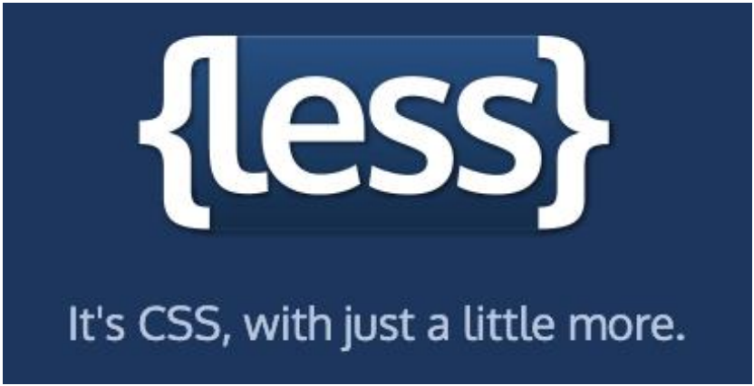


Less （Leaner Style Sheets 的缩写） 是一门CSS 扩展语言, 并且兼容CSS。

- Less增加了很多相比于CSS更好用的特性;
- 比如定义变量、混入、嵌套、计算等等；
- Less最终需要被编译成CSS运行于浏览器中（包括部署到服务器中）；


## 编写Less代码

我们可以编写如下的Less代码：

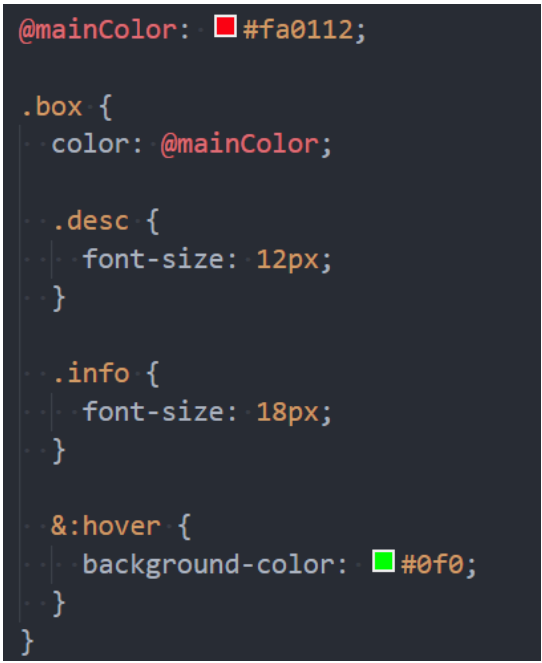


## less代码的编译

这段代码如何被编译成CSS代码运行呢？

- 方式一：下载Node环境，通过npm包管理下载less工具，使用less工具对代码进行编译；

  - 因为目前我们还没有学习过Node，更没有学习过npm工具；
  - 所以先阶段不推荐大家使用less本地工具来管理；
  - 后续我们学习了webpack其实可以自动完成这些操作的；

- 方法二：通过VSCode插件来编译成CSS或者在线编译

  - https://lesscss.org/less-preview/

- 方式三：引入CDN的less编译代码，对less进行实时的处理；

  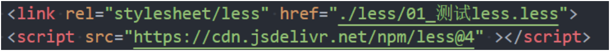

  ```HTML
  <script src="https://cdn.jsdelivr.net/npm/less@4" ></script>
  ```

- 方式四：将less编译的js代码下载到本地，执行js代码对less进行编译；


## Less语法一：Less兼容CSS

Less语法一：Less是兼容CSS的

- 所以我们可以在Less文件中编写所有的CSS代码；
- 只是将css的扩展名改成了.less结尾而已；

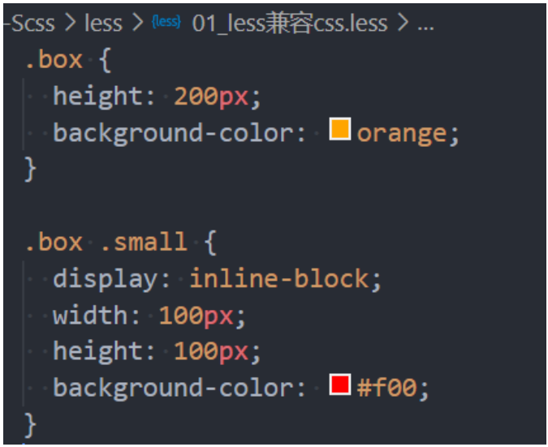


## Less语法二 – 变量（Variables）

在一个大型的网页项目中，我们CSS使用到的某几种属性值往往是特定的

- 比如我们使用到的主题颜色值，那么每次编写类似于#f3c258格式的语法；
- 一方面是记忆不太方便，需要重新编写或者拷贝样式；
- 另一方面如果有一天主题颜色改变，我们需要修改大量的代码；
- 所以，我们可以将常见的颜色或者字体等定义为变量来使用；

在Less中使用如下的格式来定义变量；

- @变量名: 变量值;

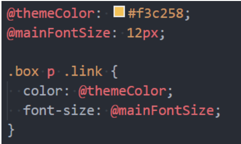


## Less语法三 – 嵌套（Nesting）

在之前的项目中，当我们需要找到一个内层的元素时，往往需要嵌套很多层的选择器

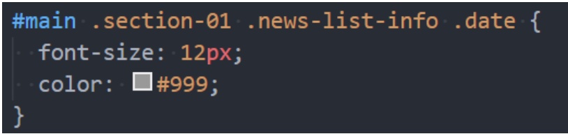

Less提供了选择器的嵌套

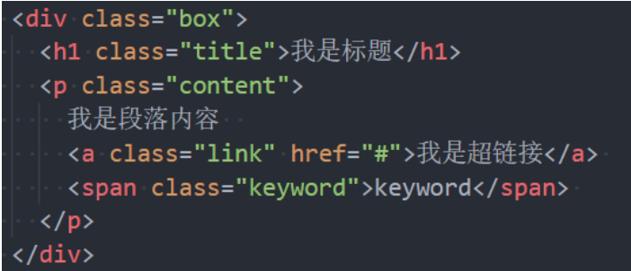

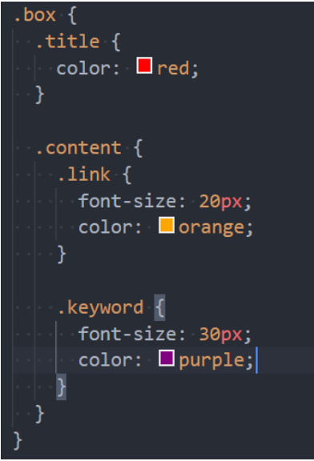


特殊符号：& 表示当前选择器的父级


## Less语法四 – 运算（Operations）

在Less中，算术运算符 +、-、 * 、/ 可以对任何数字、颜色或变量进行运算。

- 算术运算符在加、减或比较之前会进行单位换算，计算的结果以最左侧操作数的单位类型为准；
- 如果单位换算无效或失去意义，则忽略单位；

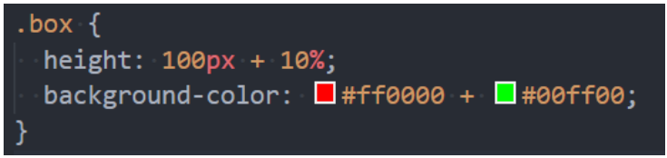


## Less语法五 – 混合（Mixins）

在原来的CSS编写过程中，多个选择器中可能会有大量相同的代码

- 我们希望可以将这些代码进行抽取到一个独立的地方，任何选择器都可以进行复用；
- 在less中提供了混入（Mixins）来帮助我们完成这样的操作；


混合（Mixin）是一种将一组属性从一个规则集（或混入）到另一个规则集的方法。

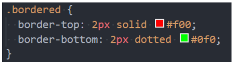

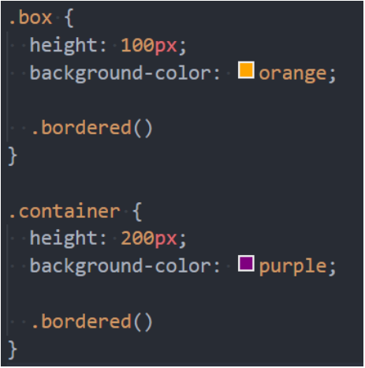

注意：混入在没有参数的情况下，小括号可以省略，但是不建议这样使用；


## Less语法五 – 混合（Mixins）

混入也可以传入变量（暂时了解）

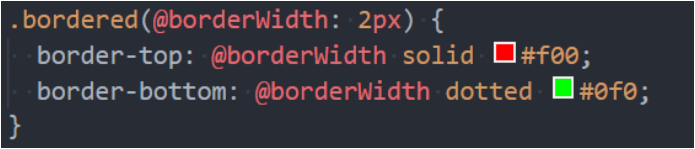

Less语法六：映射（Maps）

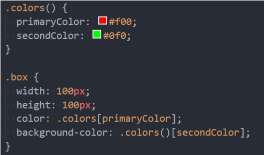

混入和映射结合：混入也可以当做一个自定义函数来使用（暂时了解）

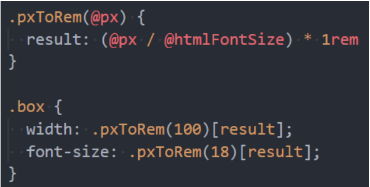


## less其他语法补充

Less语法七：extend继承

- 和mixins作用类似，用于复用代码；
- 和mixins相比，继承代码最终会转化成并集选择器；

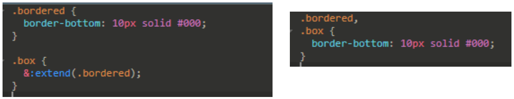

Less语法八：Less内置函数

- Less 内置了多种函数用于转换颜色、处理字符串、算术运算等。
- 内置函数手册：https://less.bootcss.com/functions/

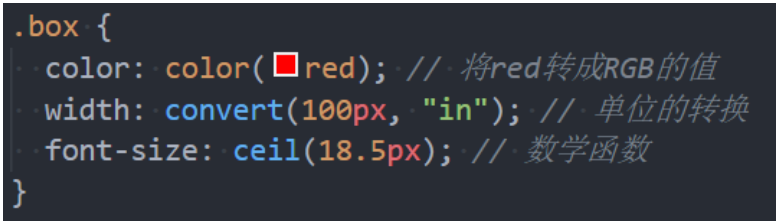


## less其他语法补充

Less语法九：作用域（Scope）

- 在查找一个变量时，首先在本地查找变量和混合（mixins）；
- 如果找不到，则从“父”级作用域继承；

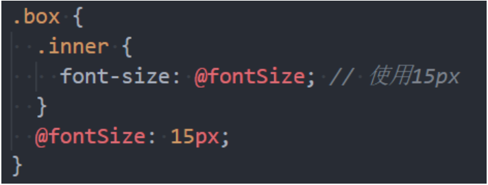

Less语法十：注释（Comments）

- 在Less中，块注释和行注释都可以使用；

Less语法十一：导入（Importing）

- 导入的方式和CSS的用法是一致的；
- 导入一个 .less 文件，此文件中的所有变量就可以全部使用了；
- 如果导入的文件是 .less 扩展名，则可以将扩展名省略掉；


## 认识Sass和Scss

事实上，最初Sass 是Haml的一部分，Haml 是一种模板系统，由 Ruby 开发者设计和开发。

所以，Sass的语法使用的是类似于Ruby的语法，没有花括号，没有分号，具有严格的缩进；

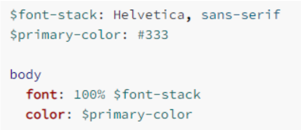

我们会发现它的语法和CSS区别很大，后来官方推出了全新的语法SCSS，意思是Sassy CSS，他是完全兼容CSS的。

目前在前端学习SCSS直接学习SCSS即可：

- SCSS的语法也包括变量、嵌套、混入、函数、操作符、作用域等；
- 通常也包括更为强大的控制语句、更灵活的函数、插值语法等；
- 大家可以根据之前学习的less语法来学习一些SCS语法；
- https://sass-lang.com/guide


