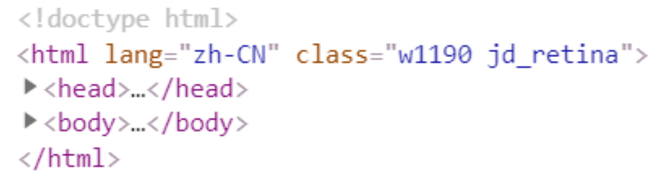
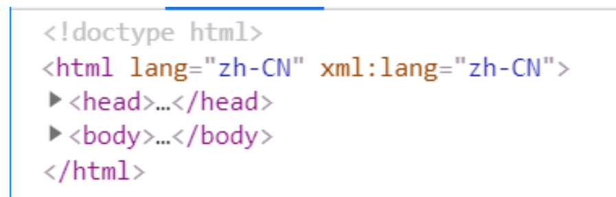
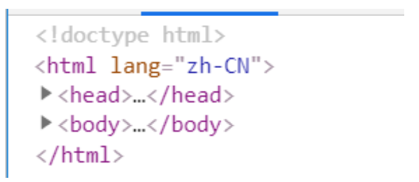
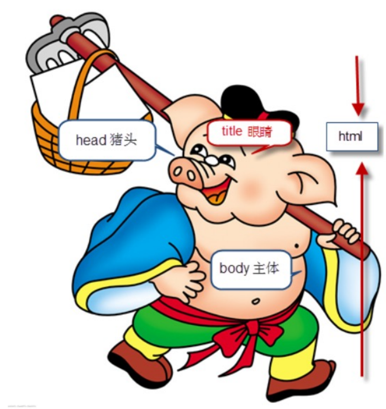
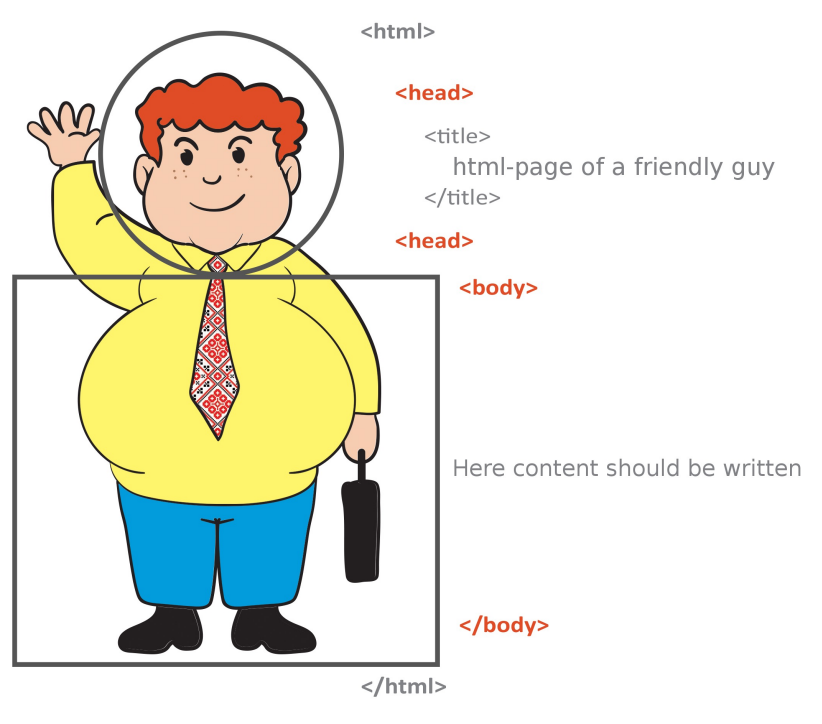

### 认识HTML

**超文本标记语言**（英语：**HyperText Markup Language**，简称：HTML）是一种用于创建网页的**标准标记语言**。

- **HTML元素**是构建网站的基石；


什么是**标记语言（markup language ）**？

- 由无数个标记（标签、tag)组成；
- 是对**某些内容**进行特殊的**标记**，以供其他解释器识别处理；
- 比如使用`<h2></h2>`标记的文本会被识别为“标题”进行加粗、文字放大显示；
- 由**标签和内容**组成的称为**元素（element）**	例如：`<h1>hello world</h1>`


什么是**超文本（ HyperText ）**呢？

- 表示不仅仅可以插入**普通的文本（Text）**，还可以插入图片、音频、视频等内容； 

- 还可以表示**超链接（HyperLink）**，从一个网页跳转到另一个网页；


### HTML文件的特点 – 扩展名（后缀名）

HTML文件的拓展名是`.htm`

- 因历史遗留问题，Win95\Win98系统的文件拓展名不能超过3字符，所以使用`.htm`
- 现在统一使用` .html`


### HTML文件的特点 – 结构

 JD官方




小米官方




英雄联盟官网










### 改进自己的网页

修改自己的网页代码，让自己的网页也具备正确的结构：

```html
<html>
    <head>
    </head>
    <body>
        content...
    </body>
</html>
```

运行效果是一样的，但是我们现在的网站也有正确的结构了


### 开发工具选择

记事本可以开发一个网页吗？可以。但是有很多的缺点：

- 创建和管理文件不方便；
- 没有颜色标识/没有智能提示/无法调试程序；


专业的前端开发工具

- WebStorm、Sublime Text、Visual Studio Code、Atom、HBuilder、IntelliJ IDEA、Dreamweaver
- 智能提示、高亮识别、语法检测、集成环境、开发效率高


推荐开发工具：

Webstorm

- 优点：集成开发工具，包罗万象 
- 缺点：重（占用系统资源多），收费 

VSCode（上课使用） 

- 优点：轻（相当于一个编辑器），免费 
- 缺点：需要安装一些插件来辅助开


### VSCode工具安装

VSCode编辑器下载-安装：https://code.visualstudio.com/ 


安装插件（增加功能）：右侧图标最后一项，Extensions，查找需要的插件（联网） 

- 中文插件：Chinese 
- 颜色主题：atom one dark 
- 文件夹图标：VSCode Great Icons 
- 在浏览器中打开网页：open in browser、Live Sever 
- 自动重命名标签：auto rename tag 

VSCode的配置： 

- Auto Save 自动保存 
- Font Size 修改代码字体大小 
- Word Wrap 代码自动换行 
- Render Whitespace 空格的渲染方式(个人推荐) 
- Tab Size 代码缩进 
- **推荐2个空格**（公司开发项目基本都是2个空格）