## 认识元素

我们会发现HTML本质上是由一系列的**元素（Element）**构成的；


什么是**元素（Element）**呢？

- 元素是网页的一部分；
- 一个元素可以包含一个**数据项**，或是一块**文本**，或是一张**照片**，亦或是什么也不包含；

那么HTML有哪些元素呢?

- https://developer.mozilla.org/zh-CN/docs/Web/HTML/Element

我们会发现元素非常非常的多，这么多能记得住吗？

- 常用的，用的多自然就记住了；
- 不常用的，知道在哪里查找即可；


## 元素的组成

剖析一个HTML元素的组成：

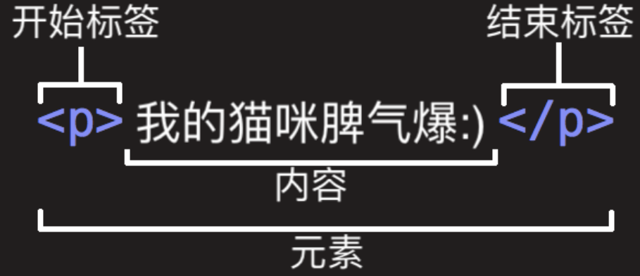


这个元素的主要部分有：

- **开始标签（Opening tag）**：包含**元素的名称**（本例为 p），被左、右尖括号所包围。
  - 表示元素从这里开始或者开始起作用 —— 在本例中即段落由此开始。
- **结束标签（Closing tag）**：与开始标签相似，只是其在元素名之前包含了一个斜杠。
  - 这表示着**元素的结尾** —— 在本例中即段落在此结束。
  - 初学者常常会犯忘记包含结束标签的错误，这可能会产生一些奇怪的结果。
- **内容（Content）**：**元素的内容**，本例中就是所输入的文本本身。


**元素（Element）**：开始标签、结束标签与内容相结合，便是一个**完整的元素**。


## 单标签元素 – 双标签元素

**双标签元素**：我们会发现前面大部分看到的元素都是**双标签**的；

- html、body、head、h2、p、a元素；

**单标签元素**：也有一些元素是只有一个标签；

- br、img、hr、meta、input；

- br、hr现在用的比较少了

- 单标签有人会这样写，``，这是因为过去写xhtml的时候要求必须在后面加上/，但是现在不需要加这个了


注意事项：

- HTML元素不区分大小写，但是推荐小写

  ```txt
  <INPUT> //这样写浏览器也是可以解析的，但是不建议这样写，建议写成 <input>
  ```


## 元素的属性（Attribute）

元素也可以拥有**属性（Attribute）**

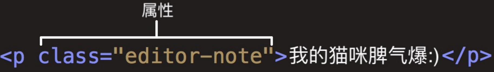

**属性**包含**元素的额外信息**，这些信息不会出现在实际的内容中


一个属性必须包含**如下内容**：

- **一个空格**，在属性和元素名称之间。(如果已经有一个或多个属性，就与前一个属性之间有一个空格。)

- **属性名称**，后面跟着一个等于号。

- **一个属性值**，由一对引号“ ”引起来。

- ```html
  <!-- <h1 属性名=“属性值”>我是标题</h1> -->
  <h1 class="title">我是标题</h1>
  ```


创建一个**超链接元素**`a`：

```html
<a href="www.baidu.com">百度一下</a>
```

这个**超链接元素**的属性遵循**属性名=属性值**的规则


## 属性的分类

有些属性是公共的，每一个元素都可以设置

- 比如class、id、title属性

有些属性是元素特有的，不是每一个元素都可以设置

- 比如meta元素的charset属性、img元素的alt属性等


## 元素的结构总结

元素的结构回顾：

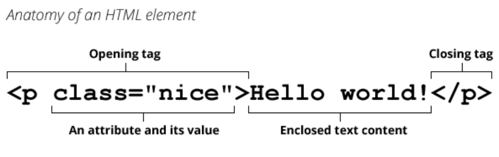


## 元素的嵌套关系

某些元素的内容除了可以是文本之外，还可以去其他元素，这样就形成了**元素的嵌套**。

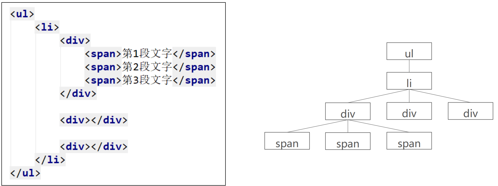

- 三个`span`元素之间的关系是**兄弟关系（兄弟元素）**
- 三个`div`元素之间的关系也是**兄弟关系**
- 第一个`div`和所有的`span`之间是**父子关系、后代关系（父子元素、后代元素）**
- `ul`和`span`之间是**后代关系（后代元素）**
- **后代元素**和**父子关系**有相同，也有不同


## HTML的注释

### 为什么需要注释？

程序员才懂的冷笑话:

- 在我写这段代码的时候, 只有我和上帝知道这段代码是什么意思. 
- 一段时间之后, 只有上帝知道是什么意思了.

为什么会出现这样的情况呢?

- 随着学习的深入, 你的一个程序不再是几行代码就可以搞定的了. 
- 可能我们需要写出有上千行, 甚至上万行的程序. 
- 某些代码完成某个功能后, 你写的时候思路很清晰, 但是过段时间会出现忘记为什 么这样写的情况, 这很正常

协同开发 

- 在实际工作中, 一个项目通常是多人协作完成的. 可能是几个或者十几个等等. 
- 这个时候, 你可能需要使用别人写出的代码功能, 别人也可能使用你的代码功能. 
- 如果你的代码自己都看不懂了, 更何况你的同事呢?


### 注释的介绍

简单来说，注释就是一段代码说明

```html
<!-- 注释内容 -->
```

注释是只给开发者看的，浏览器并不会把注释显示给用户看

注释的意义:

- 帮助我们自己理清代码的思路, 方便以后进行查阅. 
- 与别人合作开发时, 添加注释, 可以减少沟通成本.(同事之间分模块开发) 
- 开发自己的框架时, 加入适当的注释, 方便别人使用和学习.(开源精神) 
- 可以临时注释掉一段代码, 方便调试.

注释快捷键：`ctrl + /`


## 完整的HTML结构

一个完整的HTML结构包括哪几部分呢？

- 文档声明
- html元素
  - head元素
  - body元素

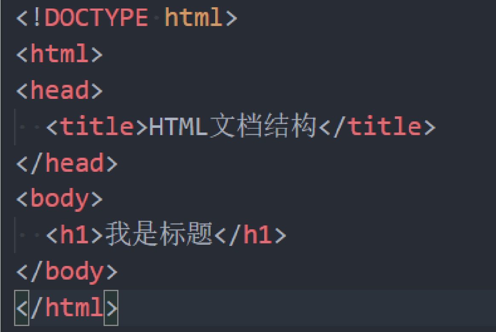


总结：

- 一个完整的HTML结构首行是**文档声明**
- 然后是**html元素**
- **html元素**中包含的是`head`和`body`
- `head`里面包含的是`title`，
- `body`中包含我们写的**其他元素**


## 文档声明

HTML最上方的一段文本我们称之为 文档类型声明，用于**声明文档类型**

```html
<!DOCTYPE html>
```

HTML文档声明，告诉**浏览器**当前页面是HTML5页面；

让浏览器用**HTML5的标准**去解析识别内容；

必须放在HTML文档的**最前面**，**不能省略**，省略了会出现兼容性问题；

`HTML5`的**文档声明**比`HTML 4.01`、`XHTML 1.0`简洁非常多(了解即可)

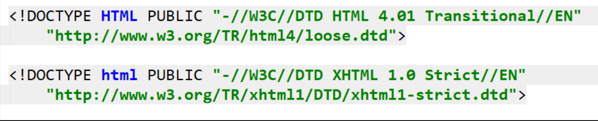


## html元素

注意：我们说的**HTML元素**指的是**所有的元素**都可以统称为**HTML元素**，但是如果说**html元素**，那么说的就是**根元素html元素**

元素： 表示一个 **HTML 文档的根（顶级元素）**，所以它也被称为**根元素**。

所有其他元素必须是此元素的后代。

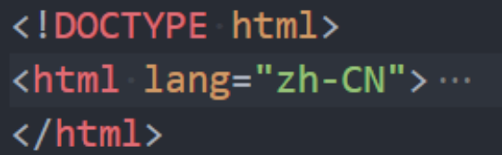


**W3C标准**建议为**html元素**增加一个**lang属性**，作用是

- 帮助语音合成工具确定要使用的发音;
- 帮助翻译工具确定要使用的翻译规则;

比如常用的规则：

- lang=“en”表示这个HTML文档的语言是英文；

- lang=“zh-CN”表示这个HTML文档的语言是中文；

  - zh表示所有的中文，包括简体，繁体，**加上CN**表示简体中文


## head元素

HTML的**head 元素**规定文档相关的**配置信息（也称之为元数据）**，包括**文档的标题**，**引用的文档样式和脚本**等

- 什么是**元数据（meta data）**，是**描述数据的数据**；
  - 例如：*描述html的数据，或者说html文档的配置，编写文档的配置信息*
  - 在这里我们可以理解成对整个页面的配置：

常见的设置一般会至少包含如下2个设置：

- 网页的标题：title元素

```html
<title>网页的标题</title>
```


- 网页的编码：meta元素

```html
<meta charset="utf-8">
```

`meta`当前设置的是**编码格式**，为什么要设置编码格式呢？

- 可以用于设置网页的**字符编码**，让浏览器更精准地显示每一个文字，不设置或者设置错误会导致乱码；
- 一般都使用**utf-8编码**，涵盖了世界上几乎所有的文字；


```txt
写完的代码都是需要通过编码后存到计算机的
计算机将代码转换为为0101这样的二进制代码存储到计算机的硬盘中
从内存中获取这些二进制的代码
这些二进制的代码我们是无法直接使用

必须对这些二进制的代码进行解码
通过什么方式解码

html代码的解码方式就是通过meta元素来告诉计算机
meta标签设置charset就是来告诉计算机编码格式是什么
所以也需要使用这种格式来解码
```


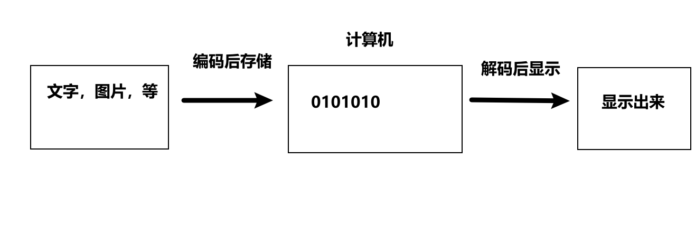


## body元素

body元素里面的内容将是你在浏览器窗口中看到的东西，也就是网页的具体内容和结构。

- 之后学习的大部分HTML元素都是在body中编写呈现的；

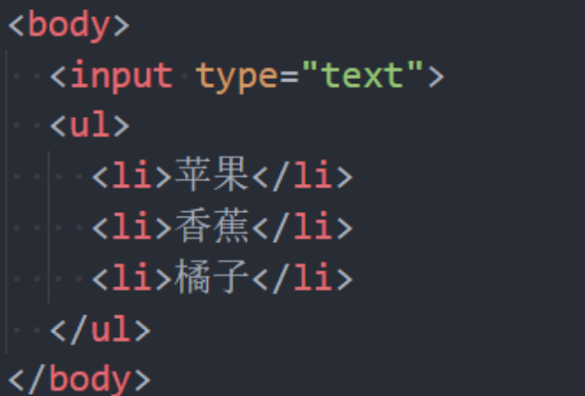


## HTML元素

HTML元素本身很多，但是常用的元素就是那么几个。

- https://developer.mozilla.org/zh-CN/docs/Web/HTML/Element
- 我们只需要记住常用的，不常用的学会查看文档即可；

常用的元素（暂时掌握下面几个就够了，90%时间都在写这几个）：

- p元素、h元素；
- img元素、a元素、iframe元素；
- div元素、span元素；

下阶段学习的元素：

- ul、ol、li元素；
- button元素、input元素；
- table、thead、tbody、thead、th、tr、td；

HTML5新增元素（后续学习）


## 案例分析 - 使用什么元素

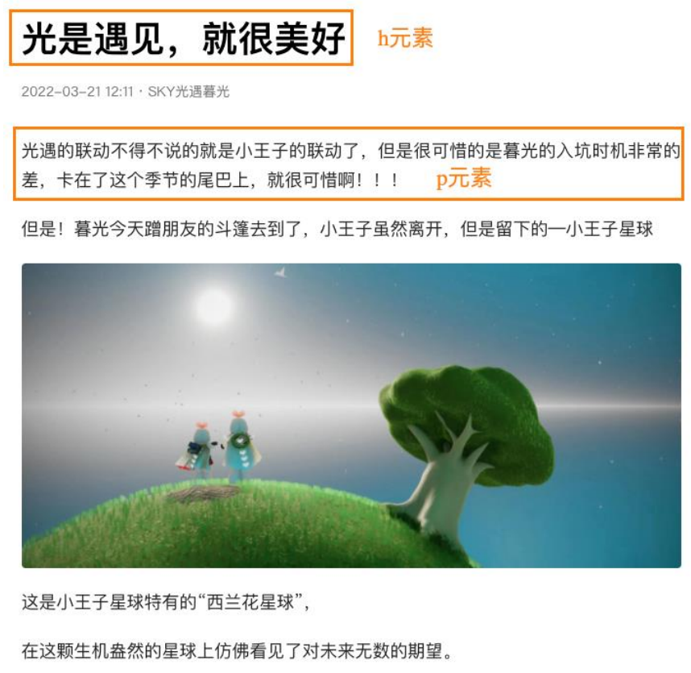

新闻地址：https://www.toutiao.com/article/7075122482247664128


## 常见元素 - h元素

在一个页面中通常会有一些比较重要的文字作为标题，这个时候我们可以使用h元素。

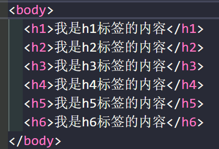

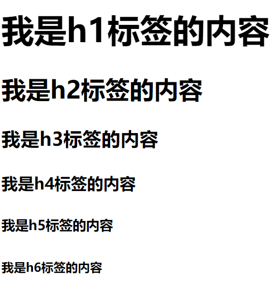

```txt
 <h1>–<h6>标题 (Heading) 元素呈现了六个不同的级别的标题
 Heading是头部的意思，通常会用来做标题
 <h1> 级别最高，而 <h6> 级别最低。
```

浏览器是通过什么来呈现h1-h6的显示呢？也就是说，凭什么h1的标题更大，h6的标题更小呢？

- 他给h1-h6加了不同的样式而已

  > h1加的样式

  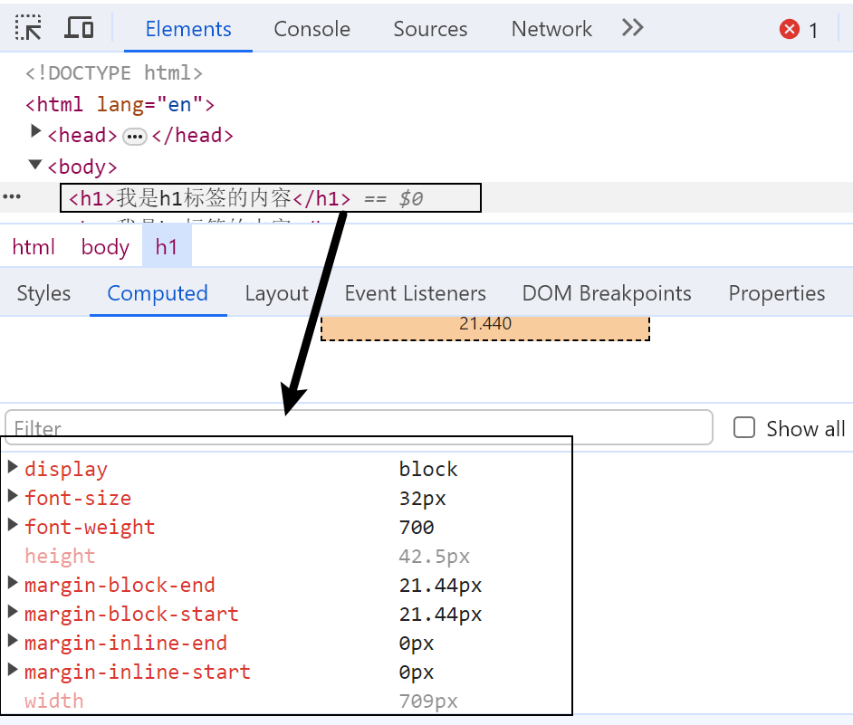

  

  > h6标签加的样式

  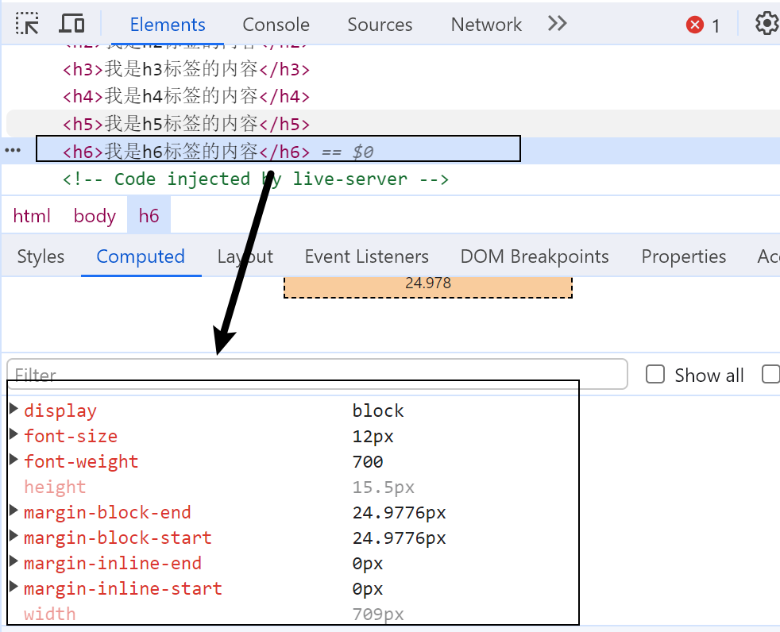

> 解释
>
> 他们两个标签加的样式不同，h1的CSS把文字设置的大一些，h6的CSS把文字设置的小一些，就导致在页面呈现的是现在这个样子
>
> 所以，其实**所有的元素的原理都是一样的，不同的元素呈现的显示样式不同，原理就是CSS设置的不同的样式**，所以呈现的不同
>
> 注意：h元素通常和SEO优化有关系（什么是SEO，后续再介绍）


## 常见元素 - p元素

如果我们想表示一个段落，这个时候可以使用p元素。

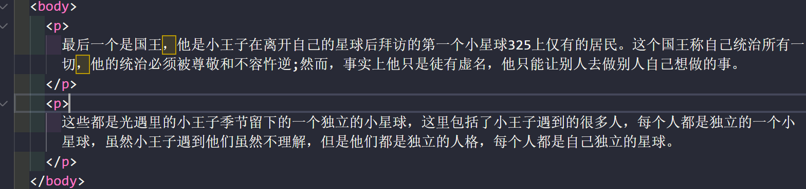


> HTML的<p>元素（或者说 HTML 段落元素）表示文本的一个段落。
> p元素是paragraph单词的缩写，是段落、分段的意思；
> p元素多个段落之间会有一定的间距（也是因为它增加了css）；


**p标签和内容**连在一起会不会有区别呢？

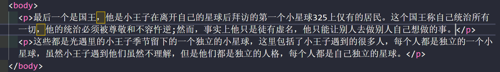

基本上没有区别，但是还是有区别的（会有个空格）


常见元素 - img元素

我们应该如何告诉浏览器来显示一张图片呢？使用**img元素**。

> HTML  元素将一份图像嵌入文档。
> img是image单词的缩写，是图像、图像的意思；
> 事实上img是一个**可替换元素（ replaced element ）**；


**可替换元素**

我们在写一个**img元素**的时候，他没有把`img`显示到页面上，而是通过src请求一个资源，然后把这个资源下载到本地，然后把请求的资源放到img占据的位置上，也就是把资源**替换掉img所在的位置**，**这种元素就叫可替换元素**。

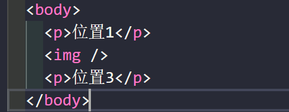     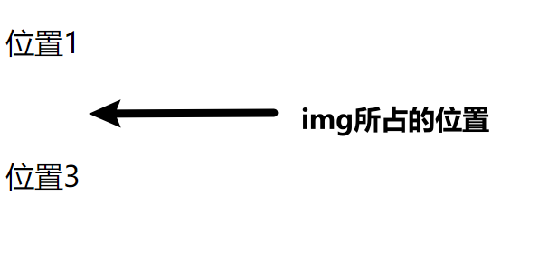

> img没有任何内容，但是他是占据位置的，如果我们给img的src增加一个资源地址的话，这个资源就会替换掉这个img的位置


**替换位置**

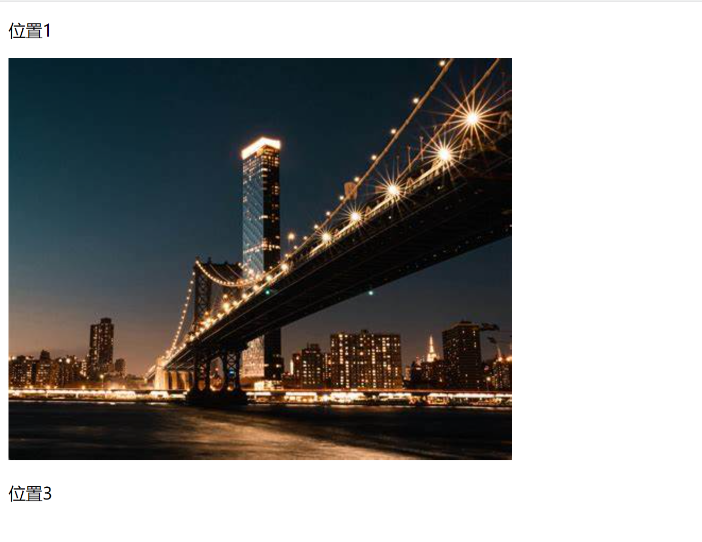

img的位置被替换掉了，所以img被称为**可替换元素**


`img`有两个常见的属性：

- **src属性**：source单词的缩写，表示**源**
  - 是必须的，它包含了你想嵌入的图片的文件路径。
- alt属性：不是强制性的，有两个作用
  - 作用一：当图片加载不成功（错误的地址或者图片资源不存在），那么会显示这段文本；
  - 作用二：屏幕阅读器会将这些描述读给需要使用阅读器的使用者听，让他们知道图像的含义；

某些其他属性目前已经不再使用：比如width、height、border；因为我们要把结构和样式分离的


## 常见元素 - img元素


### img元素 - 图片的路径

设置img的src时，需要给图片**设置路径**：

-  **网络图片**：一个URL地址（后续会专门讲URL）；
  - 网络图片的设置非常简单，给一个地址即可；
-  **本地图片**：本地电脑上的图片，后续会和html一起部署到服务；

本地图片的路径有两种方式：

- 方式一：**绝对路径 - absolute**（几乎不用）；
  - 从电脑的根目录开始一直找到资源的路径；

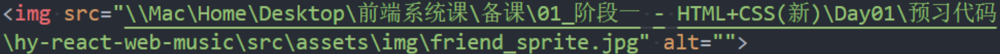

- 方式二：**相对路径 - relative**（常用）；
  - 相当于当前文件的一个路径；
  - . 代表当前文件夹（1个.），可以省略
  - .. 代表上级文件夹（2个.）

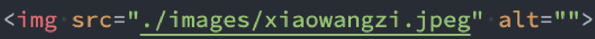

```txt
对于网页来说，不管什么操作系统（Windows、Mac、Linux），路径分隔符都是 /   而不是 \
```


### img元素 - 图片的格式

img元素支持的图片格式非常多：

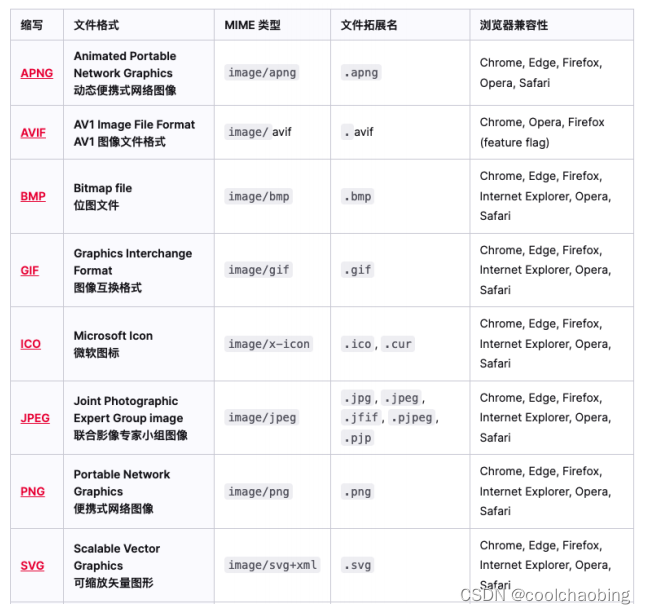


## 常见元素 - a元素

 在网页中我们经常需要跳转到另外一个链接，这个时候我们使用**a元素**；

**a元素**（或称**锚（anchor）元素**）：

- **定义超链接，用于打开新的URL；**

a元素有两个常见的属性：

- href：**Hypertext Reference**的简称 
  - 指定要打开的URL地址； 
  - 也可以是一个本地地址；
- target：该属性指定在何处显示链接的资源。 
  - _self：默认值，在当前窗口打开URL； 
  - _blank：在一个新的窗口中打开URL； 
  - 其他不常用, 后面iframe可以讲一下；


### a元素 - 跳转到一个网络地址

```html
<a href="http://www.baidu.com">百度一下</a> // 链接到这个地址的时候是下载了一个index.html的文件
```


### a元素 - 链接到本地的资源

```html
<a href="./hehe.html">本地网站</a>
```

本质上a元素访问到的地址实际上就是下载一个.html的文件，然后打开了这个文件


### a元素 - 锚点链接

锚点链接可以实现：跳转到网页中的具体位置

锚点链接有两个重要步骤：

- 在要跳到的元素上定义一个**id属性**；
- 定义a元素，并且a元素的**href指向对应的id**；

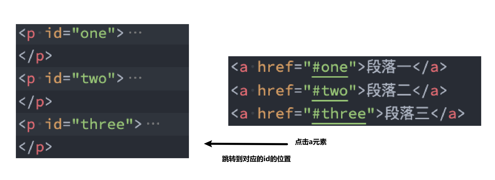


### a元素 - 图片链接

在很多网站我们会发现图片也                                                                                                                                                         是可以点击进行跳转的

- img元素跟a元素一起使用，可以实现图片链接；


实现思路：

- **a元素**中不存放文字，而是存放一个**img元素**；
- 也就是**img元素**是**a元素**的内容；

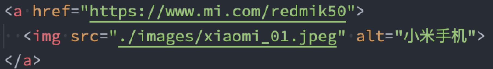


### a元素 – 其他URL地址

a元素一定是用来跳转到新网页的么？

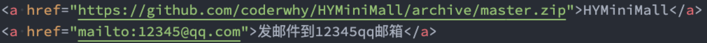

- https://github.com/coderwhy/HYMiniMall/archive/master.zip

  - 下载一个压缩包的地址

    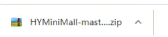

- 12345@qq.com

  - 指向其他的协议地址:mailto,这是一个协议头
  - 发送一个邮件的地址


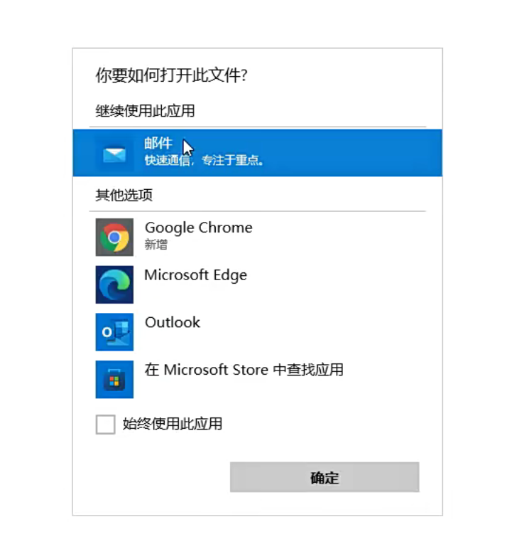

点击以后他就会弹出这个窗口让我们去发邮件

所以a元素还可以下载文件，因为我们配置的地址是下载文件，或者发送邮件的地址，那么就会执行下载或者打开邮件的操作


## iframe元素

利用iframe元素可以实现：在一个HTML文档中嵌入其他HTML文档

frameborder属性

- 用于规定是否显示边框

  - 1：显示

  - 0：不显示

    ```html
    <iframe frameborder="1"></iframe>
    ```


### iframe的使用

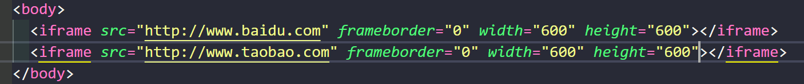


可以发现，**iframe元素**中可以链接到淘宝的地址，但是不能链接到百度的地址，这是因为

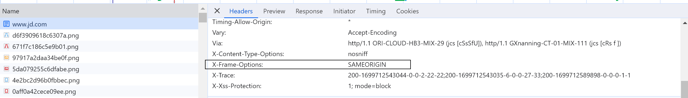

SAMEORIGIN表示同源，同源才能访问


> iframe可以嵌套
>
> iframe引入的html里面可以继续引入iframe，这样就实现了iframe嵌套


### iframe元素和a元素的结合

**a元素target的其他值**:

- _parent：在父窗口中打开URL
- _top：在顶层窗口中打开URL

多层iframe嵌套的时候，每一个iframe内的a元素设置的target的值不同，代表着不同情况

1. 设置为`_self`表示当前**iframe元素**页面打开对应**a元素**链接的网站
2. 设置为`_parent`,表示上一级的**iframe元素**页面打开对应**a元素**链接的网站
3. 设置为`_top`表示最外层（浏览器标签页）页面打开对应a元素链接的网站

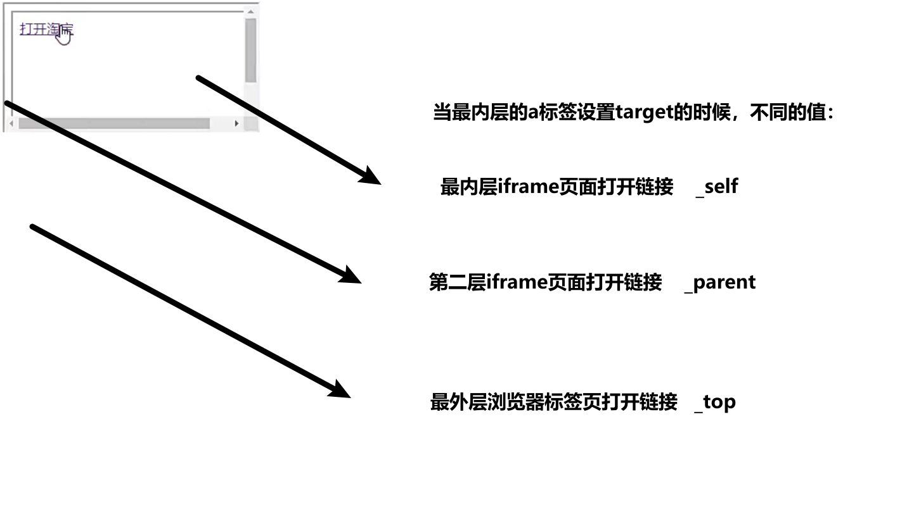


### div元素、span元素的历史

在HTML中有两个特殊的元素**div元素**、**span元素**：

- **div元素(division)**：分开、分配的意思；
- **span元素**：跨域、涵盖的意思；

这两个元素在什么情况下使用？**无所用、无所不用**。

> 产生的历史：
>
> 1. html基本元素
>
>    网页的发展早期是没有css，只有html的一些基本元素，比如p元素，a元素等最基本的标签。
>
> 2. 添加各种包含样式的html元素
>
>    只有p元素，a元素无法满足使用，因为只有这些元素展示出来的网页很单一，如果我们想添加一些样式，我们必须通过语义化元素来告知浏览器一段文字如何显示，后来就出现了strong元素，i元素, del元素等来美化页面，这些标签自带样式的，
>
> 3. 搭建结构，并添加样式
>
>    增加了这些样式元素之后发现，虽然这些新增的元素可以增加样式，但是随着需要，越来越多的样式元素被增加进来，不仅难以维护这些样式元素，开发者也难以记忆这样带有样式的元素（太多了）
>
> 4. CSS的出现
>
>    为了解决上面的问题，出现了很多种解决方案，最终CSS这种HTML结构和CSS样式分离脱颖而出
>
>    既然你CSS能做任何事，那h1元素的事是不是你也能做，h1也是字体加粗，加大啊，所以是不是这些事情也都可以让CSS来做
>
> 5. div、span元素、
>
>    既然所有的事情CSS都能做，那我给你两个标签，你是不是就能把所有的样式的事情做了呢，你不需要带有样式的标签来做样式相关的事，用CSS即可，这个时候结构和样式需要分离，这个时候html只需要负责结构即可；
>
> 6. 所以很长一段时间的开发模式就变成了了div + css
>
> 7. 但是这样太极端了
>
> 8. 元素语义化
>
>    目前遵循的是元素语义化，如果是标题就用h1，如果是段落就用p，而不是所有的都是用div**元素**


所以，理论上来说：

- 我们的页面可以没有div、span；
- 我们的页面也可以全部都是div、span；


## div元素、span元素的区别

这个时候有一个问题：我出现一个不就可以了吗？

**div元素和span元素都是“纯粹的” 容器**，也可以把他们理解成**“盒子”**，它们都是用来**包裹内容**的；

div元素：

- 多个**div元素**包裹的内容会在**不同的行**显示；
- 一般作为**其他元素的父容器**，把其他元素包住，**代表一个整体**
- 用于把网页分割为**多个独立的部分**

span元素：

- 多个**span元素**包裹的内容会在**同一行显示**；
- 默认情况下，跟普通文本几乎没差别

- 用于**区分特殊文本和普通文本**，比如用来显示一些关键字


## 不常用元素

strong元素：

- 内容加粗、强调；
- 通常加粗会使用css样式来完成；

- 开发中很偶尔会使用一下；

 i元素：

- 内容倾斜；
- 通常斜体会使用css样式来完成；

- 开发中偶尔会用它来做字体图标（因为看起来像是icon的缩写）；

code元素：

- 用于显示代码
- 偶尔会用来显示等宽字体；

br元素：

- 换行元素
- 开发中已经不使用；

更多元素详解，查看MDN文档：

- https://developer.mozilla.org/zh-CN/docs/Web/HTML/Element


## HTML全局属性

我们发现某些属性只能设置在特定的元素中：

-  比如**img元素的src、a元素的href**；

也有一些属性是所有HTML都可以设置和拥有的，这样的属性我们称之为 “**全局属性（Global Attributes）**”

- 全局属性有很多：https://developer.mozilla.org/zh-CN/docs/Web/HTML/Global_attributes

常见的全局属性如下：

- id：定义**唯一标识符（ID）**，该标识符在整个文档中必须是唯一的。其目的是在**链接（使用片段标识符），脚本（JavaScript）或样式（使用 CSS）时标识元素**。 

- class：一个以空格分隔的元素的**类名（classes ）列表**，它允许 CSS 和 Javascript **通过类选择器或者DOM方法**来选择和访问特定的元素；  

- style：**给元素添加内联样式**； 

- title：包含**表示与其所属元素相关信息的文本**。 这些信息通常可以作为提示呈现给用户，但不是必须的。

  ```html
  <p title="coderwhy">我是段落</p>
  ```

  

  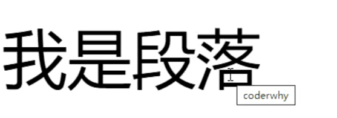


> 一个页面会被抽象成一个**对象(document);**


