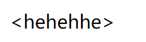
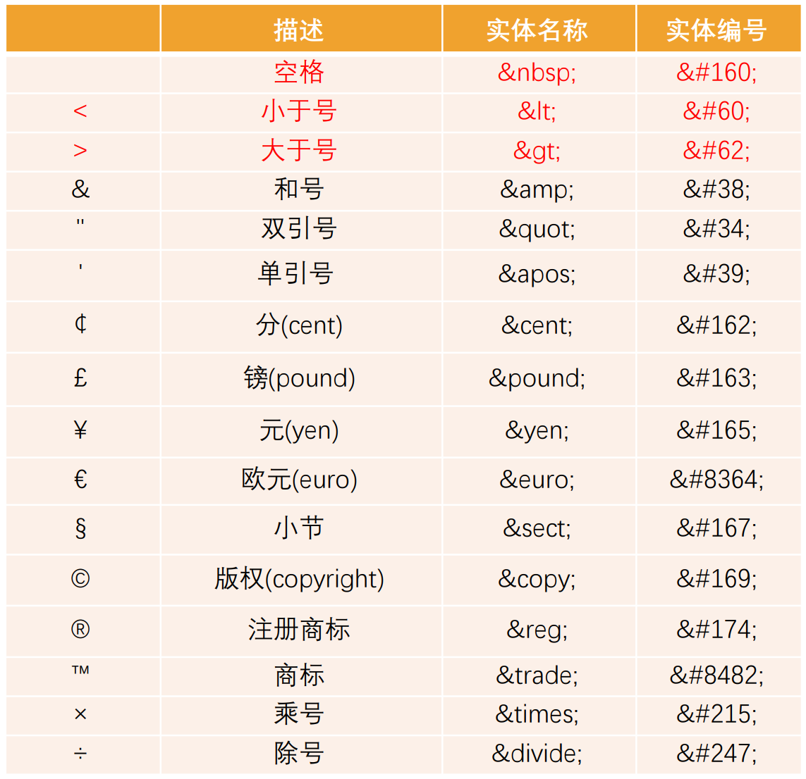
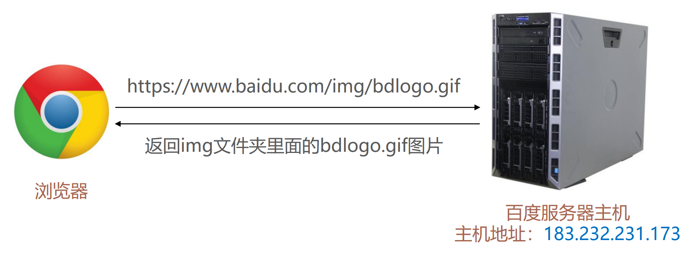
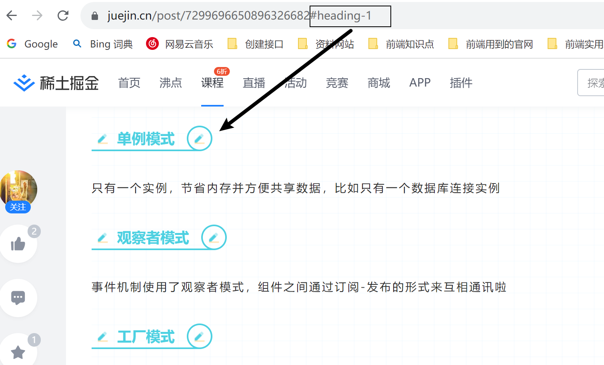
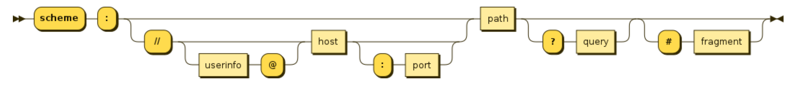
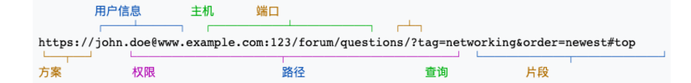

## 字符实体

思考：我们编写的HTML代码会被浏览器解析，如下代码是如何被解析的呢？ 

- 如果你使用小于号（<），浏览器会将其后的文本解析为一个tag。 

  ```html
  <span><hahaha</span>
  ```

  这样一段代码，浏览器是解析不出来的

  

- 但是某些情况下，我们确实需要编写一个小于号（<）； 

- 这个时候我们就可以使用字符实体；


HTML字符实体是一段以连字号（&）开头、以分号（;）结尾的文本（字符串）：

- 实体常常用于显示**保留字符**（这些字符会被解析为 HTML 代码）和**不可见的字符**（如“不换行空格”）； 

- 你也可以用实体来代替其他难以用标准键盘键入的字符；

  ```html
  <span>&lt;hehehhe&gt;</span>
  ```

  


## 常见的字符实体




## 认识URL

**URL 代表着是统一资源定位符（Uniform Resource Locator）**

通俗点说：`URL`无非就是一个给定的独特资源在`Web`上的地址。

- 理论上说，每个有效的`URL`都指向一个唯一的资源；
- 这个资源可以是一个 HTML 页面，一个 CSS 文档，一幅图像，等等；




## URL的格式

URL的标准格式如下：

```txt
[协议类型]://[服务器地址]:[端口号]/[文件路径][文件名]?[查询]#[片段ID]
```


片段id：



片段id就是框中的内容，当我们复制这个url的时候打开后，就能自动定位到这个锚点







有些可能不需要这个片段id，但是完整的url是有这个片段id的


## 和URI的区别

 和URI的区别： 

- URI = Uniform Resource Identifier 统一资源标志符，用于标识 Web 技术使用的逻辑或物理资源。； 
- URL = Uniform Resource Locator 统一资源定位符，俗称网络地址，相当于网络中的门牌号；

URI在某一个规则下能把一个资源独一无二的识别出来。 

- URL作为一个网络Web资源的地址，可以唯一将一个资源识别出来，所以URL是一个URI； 
- 所以URL是URI的一个子集； 
- 但是URI并不一定是URL

locators are also identifiers, so every URL is also a URI, but there are URIs which are not URLs.

例如，网络地址可以指向服务器中的一个资源，那么这个网络地址可以称为URL,也可以称为URI，但是如果在服务器中某一个资源有一个id，这个id指向的是某一个文件，那么这个id是URI，但是不是URL

