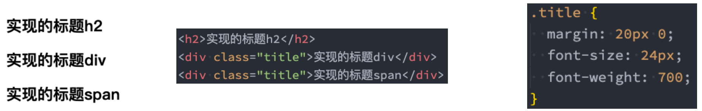
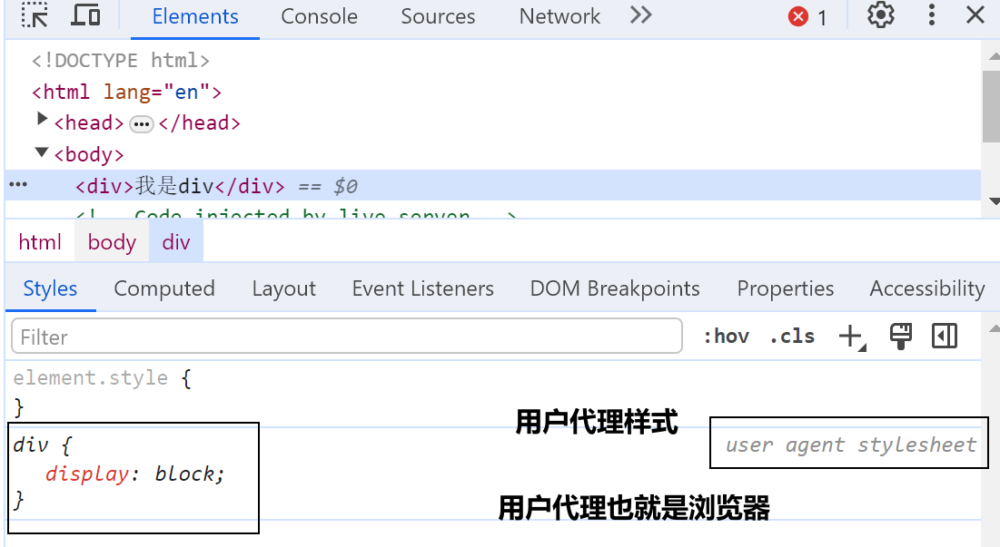
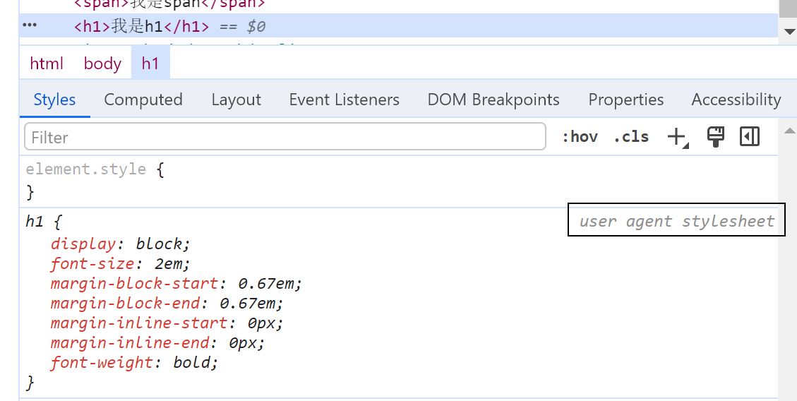
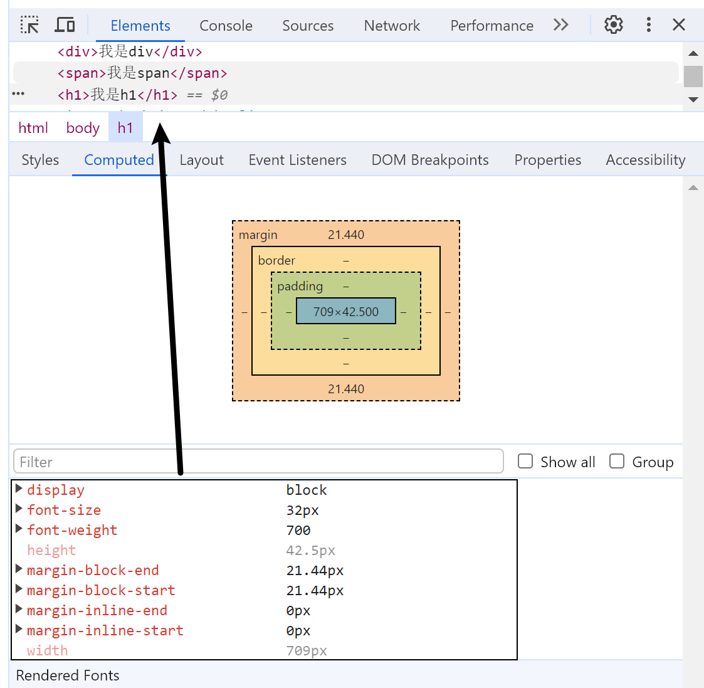
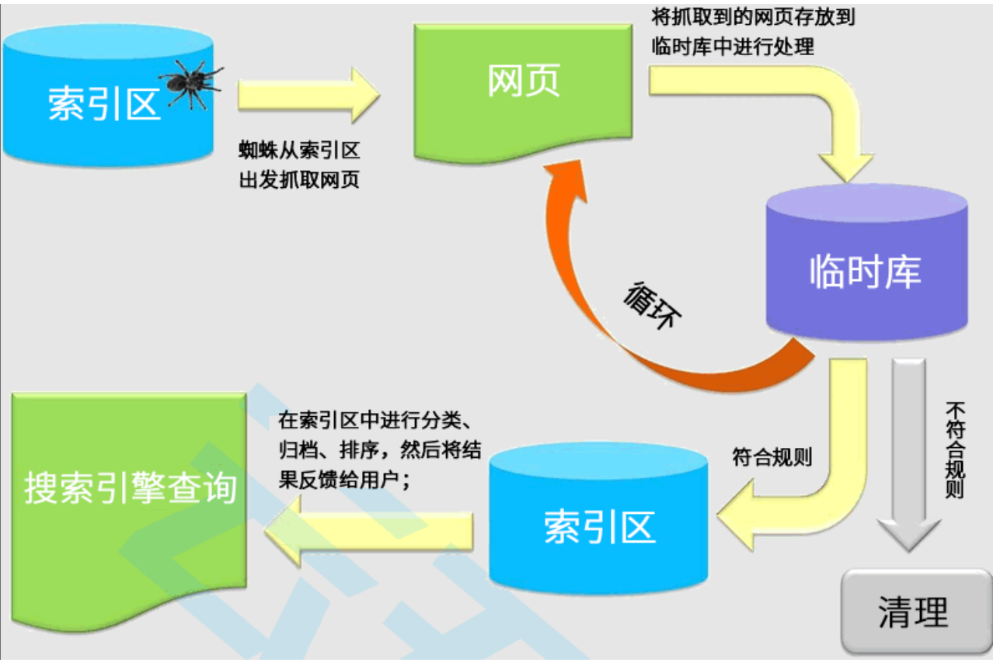

## 元素的语义化

元素的语义化：用正确的元素做正确的事情。

> 理论上来说，所有的HTML元素，我们都能实现相同的事情：
>

### 知识点一:

既然说div是**块级元素**，那么在哪里可以知道他是**块级元素**呢？

浏览器默认给**div元素**加了**block样式**，所以我们在浏览器看到的**div是块级元素**，那么**span元素**不是块级元素，所以浏览器没有给它增加这个样式

那么同理，**h1元素**有特殊样式，所以也是浏览器给它增加了特殊的样式

### 知识点二：

这里的单位是`em`，如果想看到`px`的单位，我们需要点开**computed（计算）**

这些属性都是浏览器默认给h1元素增加的属性，但是在`computed`中可以看到具体的**px值**，而不是**em单位**

### 结论：

如果给`div`或者`span`，加上这些属性之后，也是可以实现**h1元素**的效果，当然也可以实现更多的效果，比如**img元素**，**a元素**

但是最好不要这样用，我们最好使用**标签语义化**

### 标签语义化的好处

- 方便代码维护； 
- 减少让开发者之间的沟通成本； 
- 能让语音合成工具正确识别网页元素的用途，以便作出正确的反应； 
- 有利于SEO；（例如SEO会知道h标签是标题，更重要，他会爬取）
- ......

## SEO

### 什么是SEO？

**搜索引擎优化（英语：search engine optimization，缩写为SEO）**是通过了解搜索引擎的运作规则来调整网站，以及提高网站 在有关搜索引擎内排名的方式。

蛋糕网站为例:

在后续我们还会讲解SPA以及SSR相关的概念

- 它们也有SEO、首屏渲染速度有关；

## 认识字符编码

### 计算机是干什么的?

- 计算机一开始发明出来时是用来解决数字计算问题的，后来人们发现，计算机还可以做更多的事，例如文本处理。 
- 但计算机其实挺笨的，它只“认识”010110111000…这样由0和1两个数字组成的二进制数字； 
- 这是因为计算机的底层硬件实现就是用电路的开和闭两种状态来表示0和1两个数字的。 
- 因此，计算机只可以直接存储和处理二进制数字。

为了在计算机上也能表示、存储和处理像文字、符号等等之类的字符，就必须将这些字符转换成二进制数字。 

- 当然，肯定不是我们想怎么转换就怎么转换，否则就会造成同一段二进制数字在不同计算机上显示出来的字符不一样的情况， 因此必须得定一个统一的、标准的转换规则

字符编码的发展历史可以阅读我的简书一篇文章：https://www.jianshu.com/p/899e749be47c

> 字符编码：encode
>
> 字符解码：decode