## 认识CSS

CSS表示**层叠样式表（Cascading Style Sheet，简称：CSS，又称为又称串样式列表、级联样式表、串接样式表、阶层式样式表）** 是为**网页添加样式的代码**。

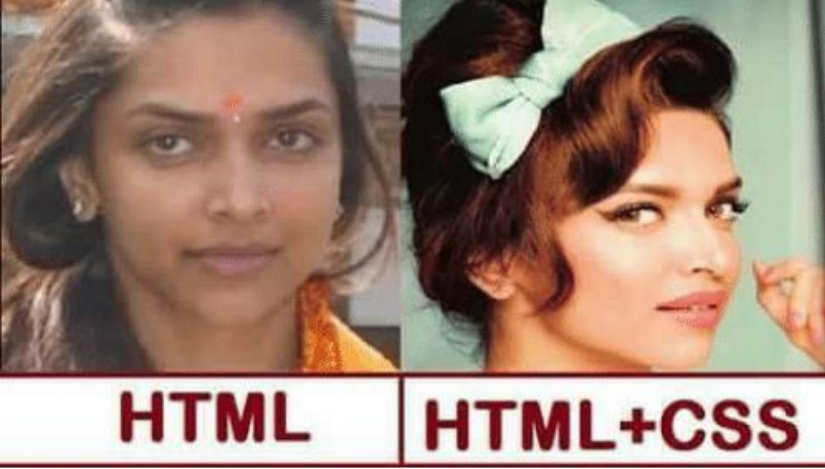


CSS是一种语言吗？(知道即可)

- MDN解释：CSS 也不是真正的编程语言，甚至不是标记语言。它是一门样式表语言；
- 维基百科解释：是一种计算机语言，但是不算是一种编程语言；


## CSS的历史

早期的网页都是通过`HTML`来编写的，但是我们希望`HTML`页面可以**更加丰富**:

- 这个时候就增加了很多具备特殊样式的元素：**比如i、strong、del等等（元素太多，臃肿）**； 
- 后来也有不同的浏览器实现各自的样式语言，但是没有统一的规划； 
- 1994年，哈肯·维姆·莱和伯特·波斯合作设计CSS，在1996年的时候发布了**CSS1**； 
- 直到1997年初，**W3C组织**才专门成立了CSS的工作组，1998年5月发布了**CSS2**； 
- 在2006~2009非常流行 **“DIV+CSS”**布局的方式来替代所有的html标签； 
- 但是这种行为显然太极端，发展到现在，更推荐的开发模式是**语义化元素**；
- 从**CSS3**开始，所有的CSS分成了**不同的模块（modules）**，每一个**“modules”**都有于**CSS2**中额外增加的功能，以及向后兼容。 
  - css里面东西很多，如果发布一个正式版，必定要发布很多**新特性**，**包括文本，文字，布局等**；
  - 如果要把所有的规范好再发布，那么就会出现一个问题
  - 例如：文本的新特性已经规定好了，但是布局的还没有规定好，那需要等布局的特性好了以后再发布，如果不等待其他的模块制定好，那就需要频繁的发布 CSS4、CSS5等，这样就太频繁了
  - 所以从CSS3开始，分模块发布了，也就是说我可能发布了**文本的模块**，但是其他的没有发布，也可能发布**颜色模块**，所以说从**CSS3**开始没有严格版本的**CSS3**了（因为有可能文本模块已经到4版本了）
- 直到2011年6月7日，**CSS 3 Color Module**终于发布为**W3C Recommendation**。


**总结：**CSS的出现是为了**美化HTML**的，并且让**结构（HTML）与样式（CSS）分离**；

- 美化方式一：为HTML添加各种各样的**样式**，比如**颜色、字体、大小、下划线**等等； 
- 美化方式二：对HTML进行**布局**，按照**某种结构显示（CSS进行布局 – 浮动、flex、grid）**；


## CSS的编写


### CSS如何编写呢？

CSS这么重要，那么它的语法规则是怎么样的呢？

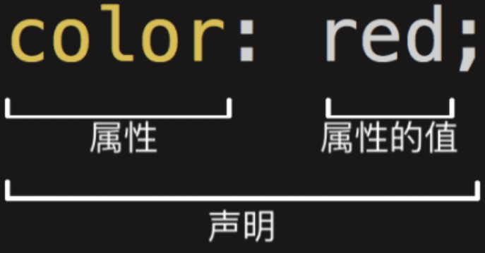


**声明（Declaration）**一个单独的CSS规则，如`color: red;`用来指定添加的**CSS样式**。

- **属性名（Property name）**：要添加的css规则的**名称**；
- **属性值（Property value）**：要添加的css规则的**值**；

但是有个问题：我们会编写了，要编写到什么位置呢？


### 如何将CSS样式应用到元素上？

CSS提供了3种方法，可以将CSS样式**应用到元素**上：

- **内联样式（inline style）**
- **内部样式表（internal style sheet）、文档样式表（document style sheet）、内嵌样式表（embed style sheet）**
- **外部样式表（external style sheet）**


疑问：**三种方式**，学好哪一个呢？

- 每一个都很重要，目前开发中不同的场景都会用到


### 内联样式（inline style）

**内联样式（inline style）**，也有人翻译成**行内样式**。

- **内联样式表**存在于**HTML元素**的**style属性**之中。

  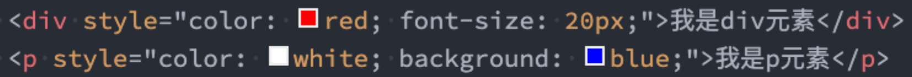

CSS样式之间用分号;隔开，建议每条CSS样式后面都加上分号;


很多资料不推荐这种写法：

- 在原生的HTML编写过程中确实这种写法是不推荐的
- **在Vue的template中某些动态的样式是会使用内联样式的**；

所以，内联样式的写法依然需要掌握。


### 内部样式表（internal style sheet）

**内部样式表（internal style sheet）**

- 将CSS放在HTML文件元素里的

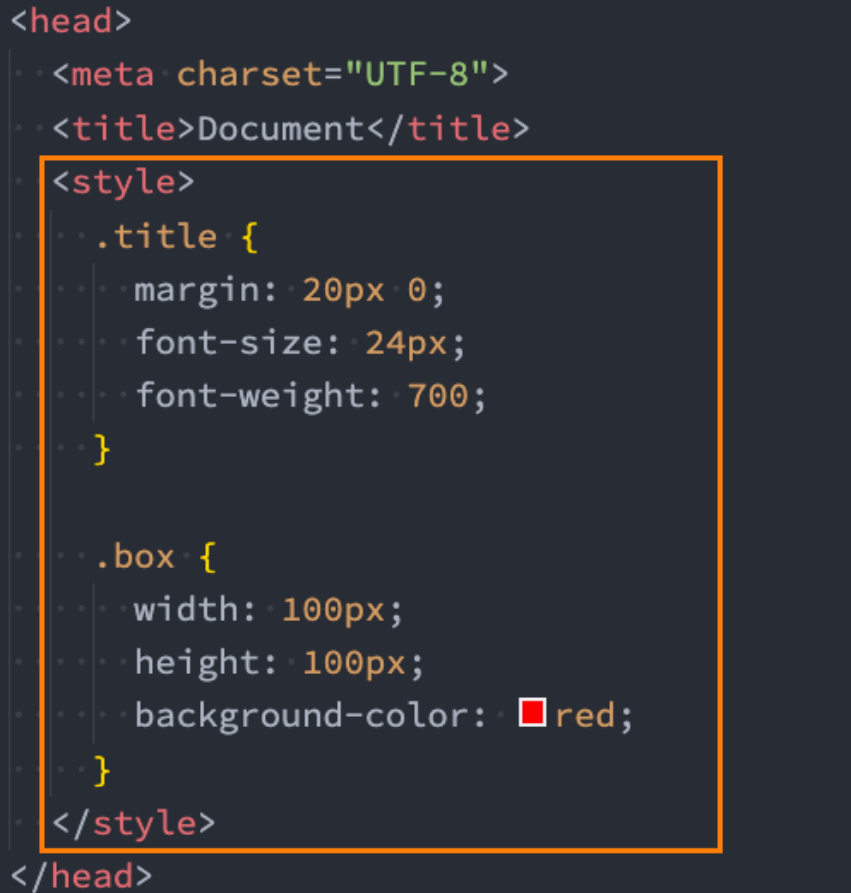


在Vue的开发过程中，每个组件也会有一个**style元素**，和内部样式表非常的相似（原理并不相同）；


### 外部样式表（external style sheet）

**外部样式表（external style sheet）** 是将css编写一个独立的文件中，并且通过元素引入进来；

使用**外部样式表**主要分成两个步骤：

- 第一步：将**css样式**在一个**独立的css文件**中编写（后缀名为.css）；
- 第二步：通过元素引入进来；

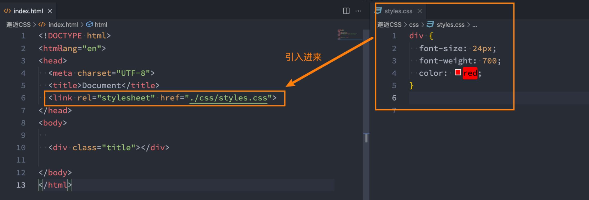


link元素的作用，后续单独讲解。


### @import

可以在**style元素**或者**CSS文件**中使用`@import`导入其他的CSS文件

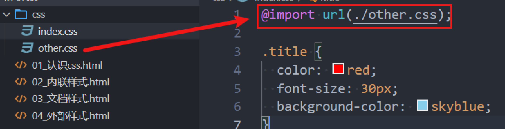

也就是说 **@import url()** 是用在css中，或者**style元素**中的

- 但是有些情况会这样写 **@import ./other.css**
- url是一个函数，但是在顶层的时候，**可以加url，也可以不加**，但是**推荐加上url**


## CSS的注释

CSS代码也可以添加注释来方便阅读：

- CSS的注释和HTML的注释是不一样的；
- /* 注释内容 */

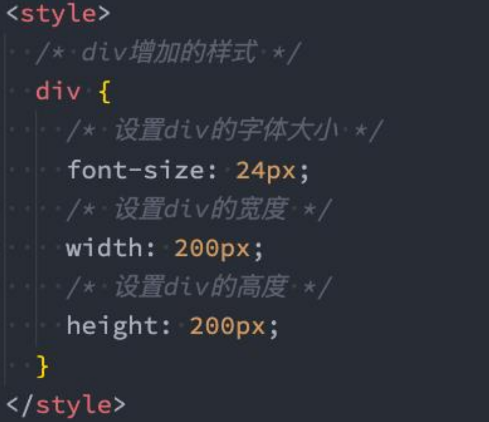


## 需要学习的css

| 字体属性（font)  | font-family：指定字体                                        |
| ---------------- | ------------------------------------------------------------ |
|                  | font-size：字体大小，要注意有绝对大小，相对大小，长度，百分比 |
|                  | font-style：正常体、斜体、倾斜体                             |
|                  | font-weight：设置粗体                                        |
|                  | font-variant：用来将所有字体都变成大写，但是原来是大写的字体呢又要比默认的要大一些 |
|                  | font：[ [<'font-style'> \|\| <font-variant-css21> \|\| <'font-weight'> \|\| <'font-stretch'>]? <'font-size'>[ / <'line-height'> ]?<'font-family'> ] |
|                  | line-height：normal/数字/长度/百分比                         |
|                  | text-align: 对齐方式，取值为：left, right, center和justify(两侧对齐) |
|                  | text-decoration：设置颜色、位置、样式。分别对应了text-decoration-color，text-decoration-line，text-decoration-style.<br />常用decoration-line的值：none \| [ underline \|\| overline \|\| line-through \|\| blink] \| spelling-error \| grammar-error |
|                  | text-indent：缩进，段落第一行文本要空多少距离，单位为长度    |
|                  | text-shadow：阴影设置，none \| <shadow-t>#                   |
|                  | text-transform：大小写转换                                   |
|                  | text-indent：缩进，段落第一行文本要空多少距离，单位为长度    |
|                  | text-overflow：文本溢出的截断 |
|                  | white-space：设置如何处理元素中的 空白，长设置属性normal/nowrap |
|                  | vertical-align: 垂直对齐方式(较复杂，听视频讲解)             |
|                  | word-spacing：word和word之间的间距                           |
|                  | letter-spacing：letter和letter之间的间距                     |
|                  | word-break：文字换行，normal、break-all/keep-all/break-word  |
|                  | color：字体颜色                                              |
|                  | opacity：不透明度（0为透明，1为不透明）                      |
|                  |                                                              |
| 《盒子》相关属性 | width：设置盒子宽度                                          |
|                  | height：设置盒子高度                                         |
|                  | max-width/max-height：最大宽度、高度                         |
|                  | min-width/min-height：最小宽度、高度                         |
|                  | margin、margin-left、margin-right、margin-top、margin-top：外边距 |
|                  | padding、padding-left、padding-right、padding-top、padding-bottom：内边距 |
|                  | border、border-width、border-style、border-color：边框       |
|                  | border-radius：边框圆角                                      |
|                  | outline：边框（不占据空间）                                  |
|                  | box-shadow：inset? && <length>{2,4} && <color>? 边框阴影     |
|                  |                                                              |
| 《背景》相关属性 | background                                                                                                                                                                       1. [ <bg-layer> , ]* <final-bg-layer>                                                                                                                       2.<bg-layer> = <bg-image> \|\| <bg-position> [ / <bg-size> ]? \|\| <repeat-style> \|\| <attachment> \|\| <box> \|\| <box>                                                                                                                               3.<final-bg-layer> = <'background-color'> \|\| <bg-image> \|\| <bg-position> [ / <bg-size> ]? \|\| <repeat-style> \|\| <attachment> \|\| <box> \|\| <box> |
|                  | background-color：背景颜色                                   |
|                  | background-image：背景图片                                   |
|                  | background-position：背景位置                                |
|                  | background-size：背景大小                                    |
|                  | background-repeat：重复次数                                  |
|                  | background-attachment：背景图片的位置是否固定                |
|                  | background-origin：背景图片属性的原点位置的相对区域border-box |
|                  | background-clip：背景是否延伸                                |
|                  |                                                              |
| 《定位》相关属性 | position：定位（static \| relative \| absolute \| sticky \| fixed) |
|                  | left、right、top、bottom：设置定位位置                       |
|                  | z-index：设定了一个定位元素及其后代元素或 flex 项目的 z-order |
|                  | float：浮动（left \| rignt)                                  |
|                  | clear：清除浮动                                              |
|                  | display：设置元素的内部、外部显示类型                        |
|                  | visibility：元素显示（visible \| hidden \| collapse)         |
|                  | overflow：超出部分的显示（visible \| hidden \| scroll \| auto) |


## CSS属性的官方文档

CSS官方文档地址

- https://www.w3.org/TR/?tag=css

CSS推荐文档地址：

- https://developer.mozilla.org/zh-CN/docs/Web/CSS/Reference#%E5%85%B3%E9%94%AE%E5%AD%97%E7%B4%A2%E5%BC%95

由于浏览器版本、CSS版本等问题，查询某些CSS是否可用：

- 可以到https://caniuse.com/查询CSS属性的可用性；
- 这个网站在后续的browserlist工具中我们再详细说明；


## 目前需要掌握的CSS属性

要想深刻理解所有**常用CSS属性**，最好先学会以下几个最基础最常用的CSS属性 


### CSS属性：font-size


**font-size：文字大小** 

一般浏览器的**最小字体是12px（当然也可以自己配置）**，所以我们在开发中字体最好不要小于**12px**

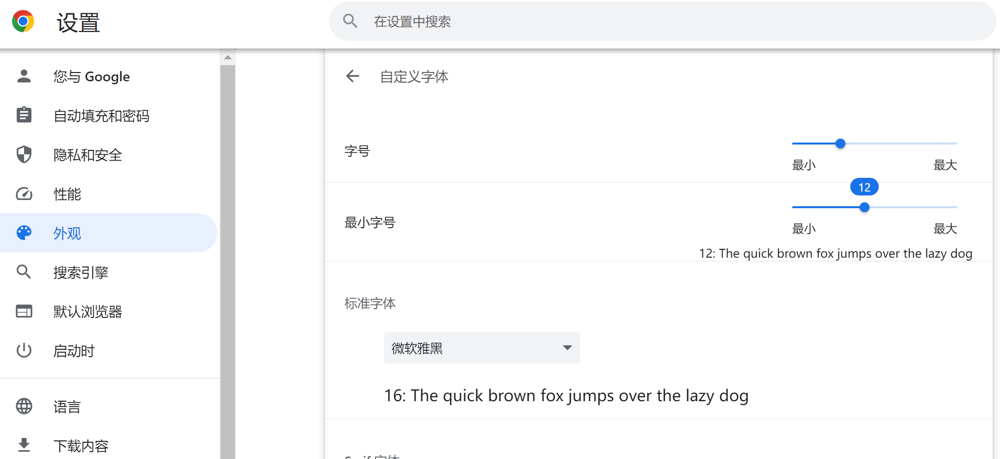


这里会有很多字体，就是如果一个字体不支持的话，就会继续查找下一个字体并使用


**TIP：**

- color：前景色（文字颜色） 

- background-color：背景色 

- width ：宽度 

- height：高度

  - `div`默认**占据整行**，高度是**内容的高度**。

  - 设置宽度后，后面的元素也不能占到这一行来

    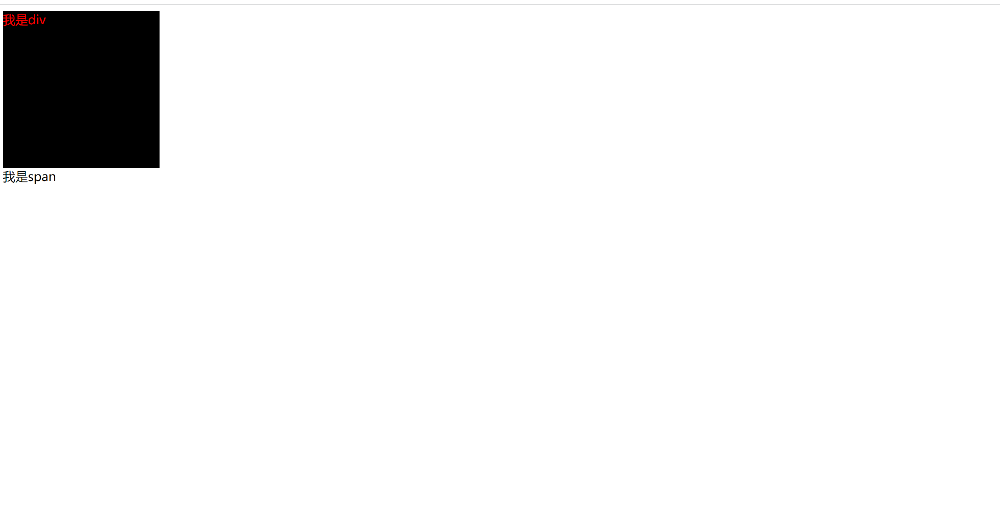


### CSS属性：background-color

**background-color**决定背景色


### CSS属性：color

**color属性**用来设置**文本内容的前景色** 

包括**文字、装饰线、边框、外轮廓**等的颜色


### 案例练习：星球介绍

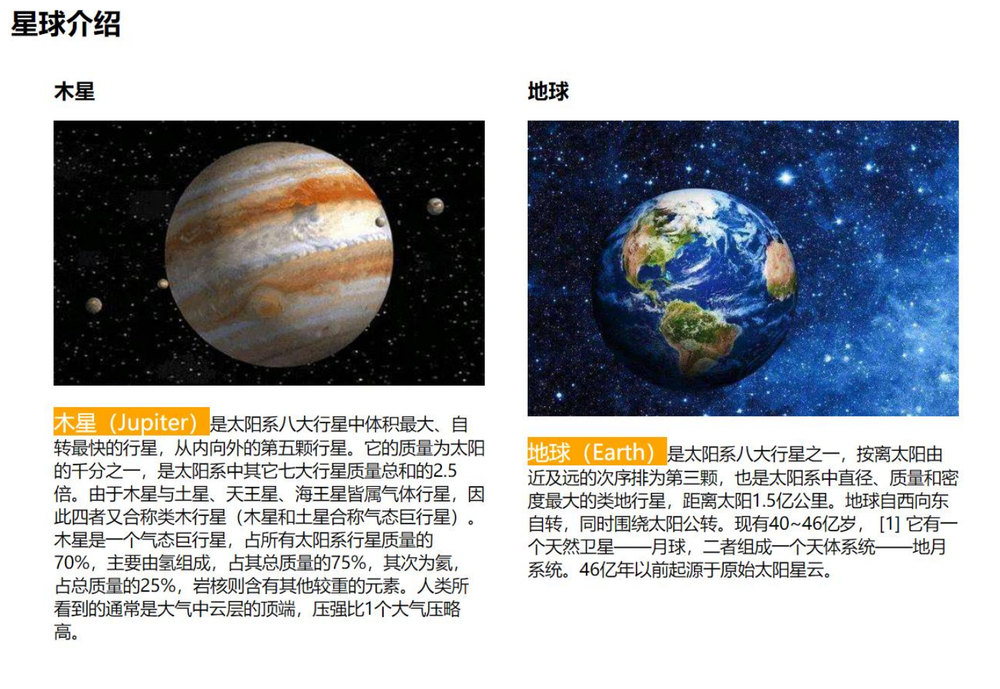


## link元素

 **link元素**是**外部资源链接元素**，规范了**文档与外部资源**的关系

- **link元素**通常是在**head元素**中

最常用的链接是**样式表（CSS）**；

- 此外也可以被用来创建**站点图标**（比如 “favicon” 图标）；


**link元素**常见的属性：

- href：此属性指定**被链接资源的URL**。 URL 可以是绝对的，也可以是相对的。
- rel：**指定链接类型**，常见的链接类型：https://developer.mozilla.org/zh-CN/docs/Web/HTML/Link_types
  - **icon**：站点图标；
  - **stylesheet**：CSS样式；
  - **dns-prefetch**：域名预解析，提前吧域名解析为ip地址（实验性特性）


## 认识进制


### 进制的概念

- 维基百科：进位制是一种记数方式，亦称进位计数法或位值计数法。
- 通俗理解：当数字达到某个值时，进一位(比如从1位变成2位)。

按照进制的概念，来理解一下十进制：

- 当数字到9的时候，用一位已经表示不了了，那么就进一位变成2位。
- 第一位+1，第二位从头开始

按照上面的来理解，二进制、八进制、十六进制

- 二进制：当数字到1的时候，用一位已经表示不了了，那么就进一位。
- 八进制：当数字到7的时候，用一位已经表示不了了，那么就进一位。
- 十六进制：等等，用一位如何表示十六个数字呢？a(10)、b(11)、c(12) 、 d(13) 、 e(14) 、 f(15)

OK，下面我们简单学习一下计算机中的二进制、八进制、十六进制。


### 人类的十进制

学习编程语言，需要了解进制的概念：

- 我们平时使用的数字都是十进制的，当我写下一个数字的时候，你会默认当做十进制来使用。
- 从发明数字的开始，人类就使用十进制，原因可能是人类正好十根手指。
- 如果人类有八根手指，现在用的可能是八进制。

```txt
所以说，十进制就是放之四海而皆准的常理吗？
并不见得，计算机就认为二进制、八进制、十六进制更符合自己的思维。
```

```txt
常识就是人到十八岁为止所累积的各种偏见。
Common sense is the collection of prejudices 
acquired by age eighteen.
阿尔伯特·爱因斯坦（Albert Einstein）
```

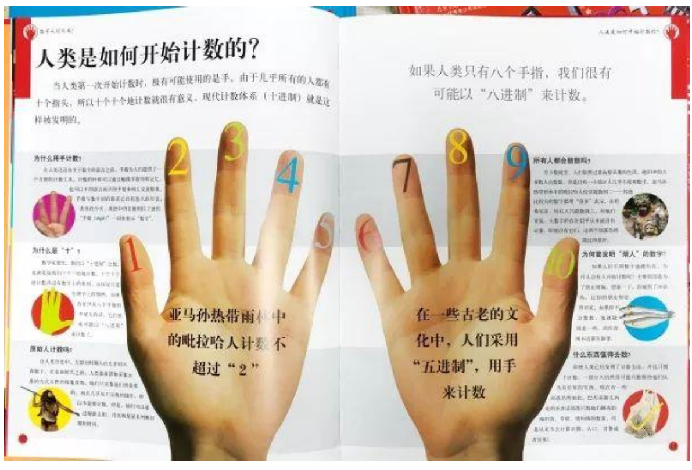


### 计算机中的进制

为什么计算机更喜欢二进制呢?

- 前面我们已经介绍过了为什么计算机更喜欢二进制了；
- 和其底层的原理有关系；

如何表示二进制、八进制、十六进制?

- 二进制（0b开头, binary）：其中的数字由0、1组成，可以回顾之前学习过的机器语言。 
- 八进制（0o开头, Octonary）：其中的数字由0~7组成。 
- 十六进制（0x开头, hexadecimal）：其中的数字由0~9和字母a-f组成（大小写都可以）

十进制 or 二进制:

- 虽然计算机更喜欢二进制, 但是编程中我们还是以十进制为主. 
- 因为高级编程语言的目的就是更加接近自然语言, 让我们人类更容易理解.


### 进制之间的转换

十进制转其他进制：

- 整除, 取余数.

其他进制转十进制：

- 比如二进制的1001转成十进制: 1 * 2³ + 0 * 2² + 0 * 2 + 1 = 9 
- 比如八进制的1234转成十进制: 1 * 8³ + 2 * 8² + 3 * 8 + 4 = 668 
- 比如十六进制的522转成十进制: 5 * 16² + 2 * 16 + 2 = 1314

二进制转八进制：

-  三位转成一位八进制

二进制转十六进制：

- 四位转成一位十六进制


如果520情人节忘记了，给大家一个建议，在522那天过，因为十六进制的522，对应的十进制是1314。


## CSS颜色的表示方法

在CSS中，颜色，有以下几种表示方法：

颜色关键字（color keywords）：

- 是不区分大小写的标识符，它表示一个具体的颜色； 
- 可以表示哪些颜色呢？ 
- https://developer.mozilla.org/zh-CN/docs/Web/CSS/color_value#%E8%AF%AD%E6%B3%95

**RGB颜色：**

- **RGB**是一种色彩空间，通过**R（red，红色）、G（green，绿色）、B（blue，蓝色）**三原色来组成了不同的颜色；
  - 也就是通过调整这三个颜色不同的比例，可以组合成其他的颜色；
- RGB各个原色的取值范围是 0~255；
- 黑色是最纯洁的颜色，因为各个原色的值都是0；

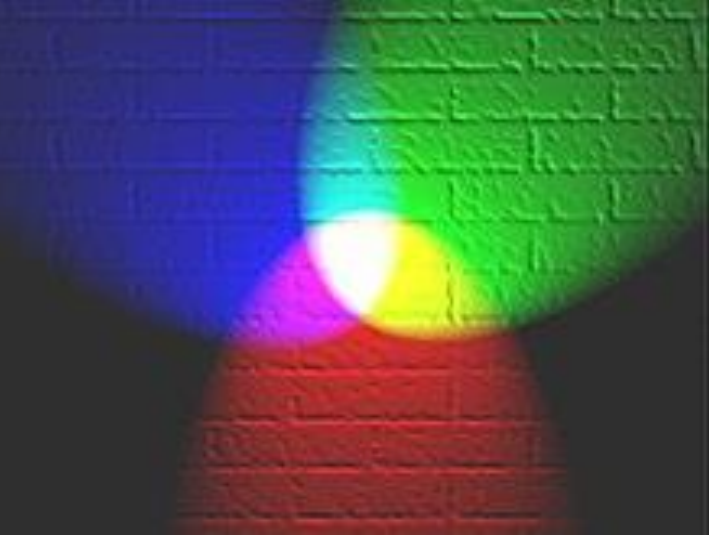


```CSS
background-color: rgb(0~255, 0~255, 0~255);
```


### RGB的表示方法

RGB颜色可以通过以#为前缀的十六进制字符和函数（rgb()、rgba()）标记表示。

```css
background-color: rgb(100, 100, 100); // 这里的100是10进制
把这三个100转成16进制是64
background-color: #646464
```

```txt
方式一：十六进制符号：#RRGGBB[AA]

- R（红）、G（绿）、B （蓝）和A （alpha）是十六进制字符（0–9、A–F）；A是可选的。
  - 比如，#ff0000等价于#ff0000ff；
```

```txt
方式二：十六进制符号：#RGB[A]

- R（红）、G（绿）、B （蓝）和A （alpha）是十六进制字符（0–9、A–F）；
- 三位数符号（#RGB）是六位数形式（#RRGGBB）的减缩版。
  - 比如，#f09和#ff0099表示同一颜色。
- 四位数符号（#RGBA）是八位数形式（#RRGGBBAA）的减缩版。
  - 比如，#0f38和#00ff3388表示相同颜色。
```

```txt
方式三：函数符： rgb[a](R, G, B[, A])

- R（红）、G（绿）、B （蓝）可以是（数字），或者（百分比），255相当于100%。
- A（alpha）可以是0到1之间的数字，或者百分比，数字1相当于100%（完全不透明）。
```

注意：上面的A是可选的，表示的是透明度


## Chrome浏览器开发者工具

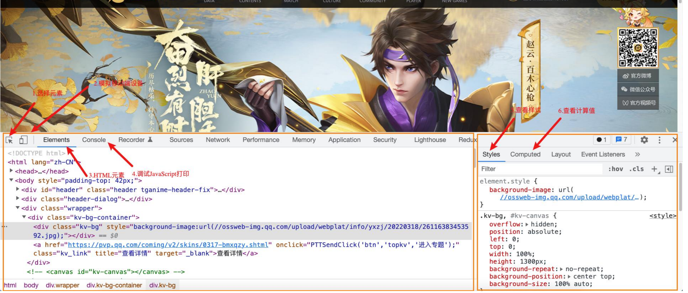


## 浏览器渲染的流程

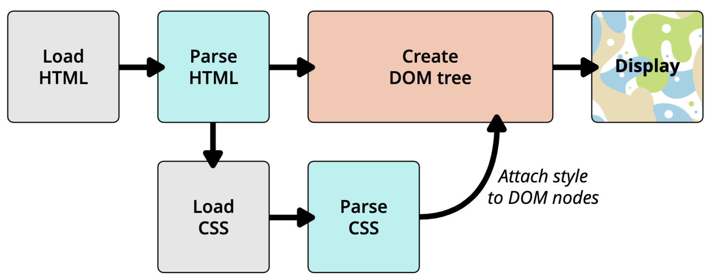

1.下载html

- 如果css是通过link引入的话，在解析到link的时候才会去下载css，所以最开始是不会加载css的

2.解析html

- 从上往下依次解析

- 解析到head的时候，解析到link了，那么就会解析link引入的css文件，就会去下载这个css，那么有个问题，这个时候是先等link的css下载完成，还是不等它下载完成，继续往后解析呢？

- 浏览器在这个时候不会等link的css下载完成，而是继续向后解析，也就是这几个时候，link会自己去下载，html的代码会继续往下解析

- 当解析到body元素的时候，假如body内有很多元素，并且存在各种嵌套，那么解析的时候，会给他解析成一个元素树，一个树结构，被称为DOM树。

  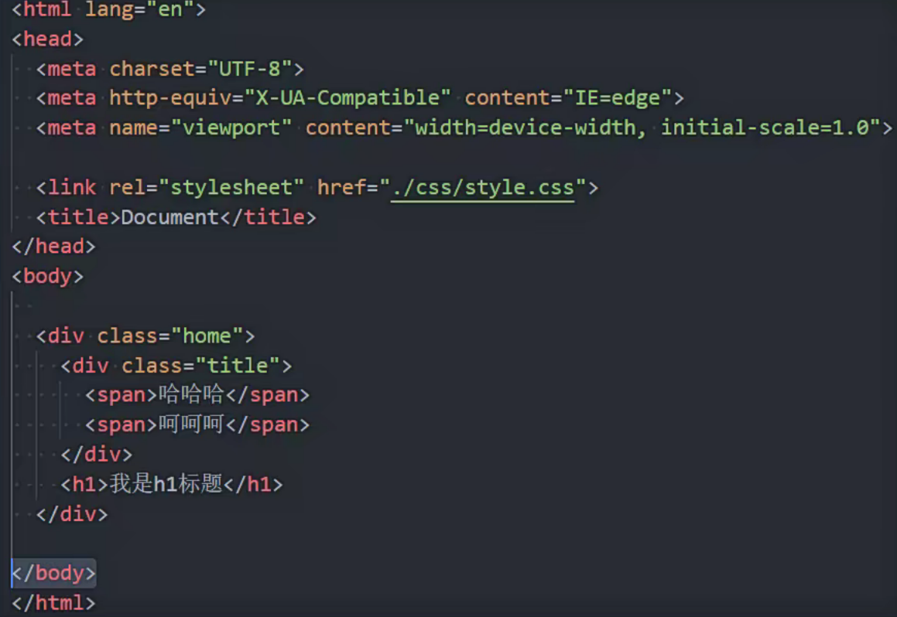

3.加载并解析css

- 他在解析html的时候，遇到了link会下载css，下载完以后，新增一个线程会解析css

3.将css附加到dom树中

- .另外一个线程在这个时候可能把CSS解析完了，那么就把css解析的结果依次附加到dom树中
- 如果css没有解析完，大多数浏览器会等的，等css解析完了，附加到html中以后，再执行后面的操作
- 等css附加完了以后会变成另外一个树结构，叫做render tree（渲染树）
- 生成渲染树以后，就展示在页面上，成为真正的页面

