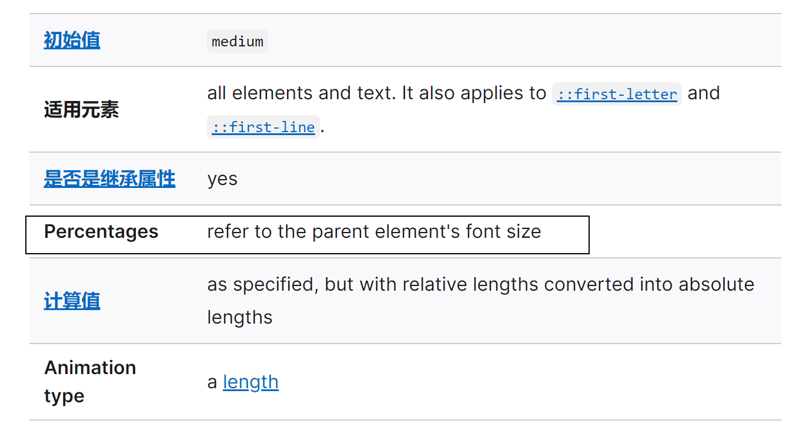
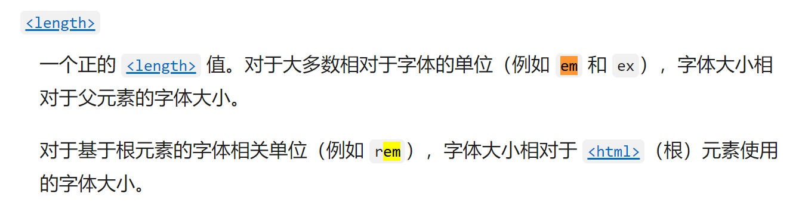

## CSS属性 – text-decoration(常用)

**text-decoration**用于设置**文字的装饰线**

- decoration是装饰/装饰品的意思;


**text-decoration**有如下**常见取值**:

- **none**：**无任何装饰线**
  - **a标签**默认有一个**下装饰线**，是**浏览器给它加的**
  - 可以去除**a元素**默认的**下划线**
  - 一般在开发项目的时候都会**初始化样式**，那么**a标签**的**下划线**一般都是会**默认去除**的
- **underline**：**下划线** 
- **overline**：**上划线**
- **line-through**：**中划线（删除线）**


## text-transform(一般）

**text-transform**用于设置**文字的大小写转换**

- **Transform**单词是**使变形/变换(形变);**

text-transform有几个常见的值:

- capitalize：(使…首字母大写, 资本化的意思)**将每个单词的首字符变为大写** 
- uppercase：(大写字母)**将每个单词的所有字符变为大写** 
- lowercase：(小写字母)**将每个单词的所有字符变为小写** 
- none：**没有任何影响**

实际开发中用JavaScript代码转化的更多.


## text-indent(一般)

**text-indent**用于设置**整个段落的第一行内容的缩进**

```css
text-indent: 10px; 缩进的距离
text-indent: 2em; 刚好是缩进2个文字
```


## text-align(重要)

**text-align**: 直接翻译过来设置**文本的对齐方式**;

MDN: 定义**行内内容**（例如文字）如何**相对它的块父元素对齐**;

但是**text-align**说的是**文本的对其方式**，但是如果**是图片、输入框**，你发现他们**也都可以用text-align进行对齐**，所以叫**text-align**是不合适的。

但是你如果放一个**div**的话，你发现它又**没有居中**，那么如果想让div也能居中的话，就需要把他**转成行内级(display: inline-block)**


常用的值

- left：左对齐 
- right：右对齐 
- center：正中间显示 
- justify：两端对齐


W3C中的解释: 


这个简写属性设置了_'text-align-all'_和_'text-align-last'_属性，并描述了如果内容没有完全填充，块的行内级（inline-level）内容如何沿着内联轴对齐


上面说了，**text-align**描述了**块级元素**的**行内级**如何沿着**块级元素**的**两端如何对其**。

**inline-level： 行内级**

这就是为什么**img、input**可以居中，但是`div`不能居中

- 这是因为`img`、`input`是属于**行内级元素**，但是`div`是**块级元素**，而`text-align`可以让**行内级元素**居中，不可以让`div`居中

为什么一个`div`中写一段文字，它默认会跑到左边去呢？

- 是因为，**默认div会有一个属性叫text-align: left**;

justiry只针对最后一行的上一行是有效的，也就是说最后一行不会两端对其，只有前面的行才会两端对齐

所以只有一行的时候，justify是没有效果的，因为，只有一行的时候它虽然是第一行，但是它也是最后一行。

那么如果想设置最后一行怎么办呢？

```css
text-align-last: justify;
```

通过这个就可以设置**最后一行的文字**


## letter-spacing、word-spacing(一般）

**letter-spacing、word-spacing**分别用于设置**字母、单词**之间的间距

- 默认是0，可以设置为负数
- letter: 字母
- word: 单词


**color设置的是前景色**

```css
.box{
    color: red;
    text-decoration: line-through;
}
```


可以发现**color设置的并不仅仅是文字的颜色**，还有**前面的删除线**，所以，不能说color设置的是**文字的颜色**，而是**前景色**，就是**非背景色**的部分

`letter-spacing: 8px`


`word-spacing: 8px;`


## font-size(重要)

**font-size决定文字的大小**

常用的设置

- **具体数值+单位**

  - 单位：px(100px)
  - 单位：em(不推荐)
    - 1em代表100%，2em代表200%，0.5em代表50%
    - 基于font-size

- **百分比**

  - 基于**父元素**的**font-size**计算，比如**50%**表示**等于父元素font-size**的一半

  - 每一个属性的百分比相对于的方式不同，可以查文档来看

  - **文档中font-size**是相当于**父元素的font-size**

    

  - 文**档中宽度**就**不是相当于父元素**，而是**相当于包含块**

    

    **width的百分比相对于包含块**，包含块可以理解为**父元素(块级父元素)**，但是也不一定是父元素（例如定位后，包含块就不再是父元素了）

- em

  - 相对于**父元素的字体大小**，如果父元素没有字体大小，相对于**浏览器的字体大小（默认16px）**，也可以说是**继承了父元素的字体大小**。
  
    


## font-family (重要, 不过一般仅设置一次)

**font-family**用于设置**文字的字体名称** 

- 可以设置1个或者多个**字体名称**; 
- 浏览器会选择列表中第一个该计算机上（操作系统）有安装的字体; 
- 或者是通过 `@font-face` 指定的可以直接下载的字体。

淘宝使用的字体:


如果一个字体是由**多个单词**组成，最好**加一个引号**


## font-weight(重要)

**font-weight**用于设置**文字的粗细（重量）**

常见的取值:

- 100 | 200 | 300 | 400 | 500 | 600 | 700 | 800 | 900 ：每一个数字表示一个重量
- **normal（默认）**：等于400
- **bold**：等于700

strong、b、h1~h6等元素的**font-weight默认是bold**


## font-style(一般)

**font-style**用于设置**文字的常规、斜体显示**

- normal：常规显示
- italic(斜体)：用字体的斜体显示(通常会有专门的字体)
- oblique(倾斜)：文本倾斜显示(仅仅是让文字倾斜)
- 区别：有些字体在设计的时候就有设计这个文字倾斜的时候怎么显示，设置**italic**就可以用设计的斜体，**oblique**就是让文字进行倾斜。


em、i、cite、address、var、dfn等元素的font-style默认就是italic


## font-variant(了解)

**font-variant**可以影响**小写字母的显示形式**

- variant是变形的意思;

可以设置的值如下

- normal：常规显示 

- small-caps：将**小写字母替换为缩小过的大写字母**（小写字母改成大写字母显示，但是占据的高度依然是小写字母的高度）

  


## line-height(常用)

**line-height**用于**设置文本的行高**

- 文本是可以**占据一定的高度**
- 前面说过文本是可以**把盒子的高度撑起来的**
- 确切的说应该是，**文本的行高把盒子撑起来**的
- 行高可以先简单理解为一行文字所占据的高度


### 为什么文本需要行高?


阅读体验好，有利于用户按照什么样的方式来阅读。


## line-height的原理

行高的严格定义是：**两行文字基线（baseline）之间的间距**

**基线（baseline）**：**与小写字母x最底部对齐的线**


如果设置一个line-height: 30px 那么这个30px指的是哪段距离呢？


如果这段距离是30px，那么这段距离也是30px


**文本占据高度和字体的大小有关系**，为什么能通过line-height来给文本居中呢？

当：

```css
line-height: 40px;
font-size: 24px;
```

1. 文本的大小会设置为24px;
2. line-height的高度是两个基线之间的距离，而两基线之间的距离等于一行文本的高度（顶线到底线的距离）
3. 那么一行文本的高度就是40px；
4. 40px - 24px = 16px
5. 16px是一行的高度减掉文本的高度，剩下的高度会分成两份，放在文本的上方和下方
6. 16px / 2 = 8px
7. 每一部分是8px
8. 这样文本就居中了，也是line-height能让文本居中的原理
9. 这样只能让文本进行居中，因为其他类型的元素不具备这样的特性


## height和line-height

注意区分**height**和**line-height**的区别 

- **height：元素的整体高度** 
- **line-height：元素中每一行文字所占据的高度**

应用实例：假设div中只有一行文字，如何让这行文字在div内部垂直居中 

- 让line-height等同于height


## font

**font**是一个**缩写属性** 

- font 属性可以用来作为 `font-style`, `font-variant`, `font-weight`, `font-size`, `line-height` 和 `font-family` 属性的简写; 
- font-style font-variant font-weight font-size/line-height font-family

规则: 

- font-style、font-variant、font-weight可以随意调换顺序，也可以省略
- /line-height可以省略，如果不省略，必须跟在font-size后面 
- font-size、font-family不可以调换顺序，不可以省


```css
line-height: 1.5;
或
font: 15px/1.5;
```


这里的1.5指的是行高，是指1.5倍的font-size，也就是1.5*15px的行高