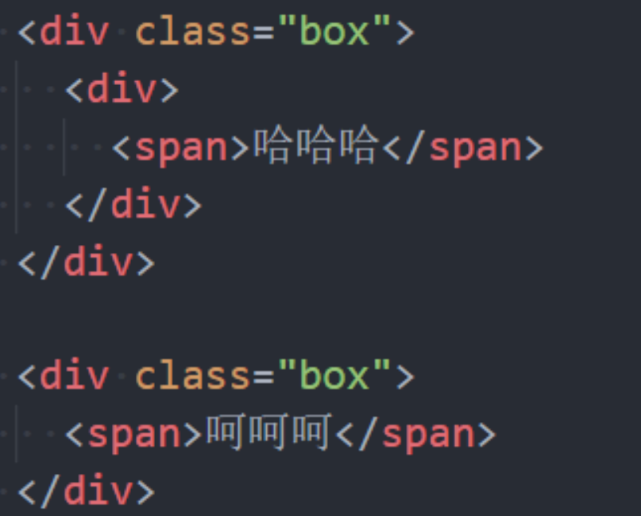

## CSS选择器（selector）

开发中经常需要找到**特定的网页元素进行设置样式**

- 思考：如何找到特定的那个元素？

什么是**CSS选择器**

- 按照一定的规则选出**符合条件的元素**，为之添加**CSS样式**

选择器的种类繁多，大概可以这么归类

- **通用选择器（universal selector）** 
- **元素选择器（type selectors）** 
- **类选择器（class selectors）** 
- **id选择器（id selectors）** 
- **属性选择器（attribute selectors）** 
- **组合（combinators）** 
- **伪类（pseudo-classes）** 
- **伪元素（pseudo-elements）**


## 通用选择器

**通用选择器（universal selector）**

- 星号

- **所有的元素都会被选中**;

  ```css
  * {
      background-color: red;
  }
  ```

  

一般用来给所有元素作一些**通用性的设置**

- 比如内边距、外边距; 
- 比如重置一些内容;

**效率比较低，尽量不要使用**;

一般很多元素有**默认样式**，例如**默认的body会有一个8px的margin**，这个时候我们**一般会去掉这8个px**，使用通配选择器可以去掉（margin: 0），但是**更好的做法是通过元素选择器来去掉这些默认样式**

```css
body, div, p {
    margin: 0
}
```


## 简单选择器

简单选择器是开发中用的最多的选择器:

- **元素选择器（type selectors）, 使用元素的名称;** 
- **类选择器（class selectors）, 使用 .类名 ;** 
- **id选择器（id selectors）, 使用 #id;**


### id注意事项

**一个HTML文档里面的id值是唯一的，不能重复** 

- id值如果由多个单词组成，单词之间可以用中划线-、下划线_连接，也可以使用驼峰标识 
- 最好不要用标签名作为id值
- 一般通用的，公共的选择器用下划线，否则用中划线

**中划线又叫连字符（hyphen）**


## 属性选择器(attribute selectors)

**拥有某一个属性 [att]**

**属性等于某个值 [att=val]**


其他了解的(不用记)

```txt
[attr*=val]: 属性值包含某一个值val;
[attr^=val]: 属性值以val开头;
[attr$=val]: 属性值以val结尾;
[attr|=val]: 属性值等于val或者以val开头后面紧跟连接符-;
[attr~=val]: 属性值包含val, 如果有其他值必须以空格和val分割;
```


## 后代选择器（descendant combinator）


DOM结构




### 后代选择器一: 所有的后代(直接/间接的后代)

选择器之间以空格分割


### 后代选择器二: 直接子代选择器(必须是直接子代)

选择器之间以 `>` 分割;


## 兄弟选择器(sibling combinator)


### 兄弟选择器一:相邻兄弟选择器

- 使用符号 + 连接
- 只会选择向下的兄弟，不会选择向上的兄弟


### 兄弟选择器二: 普遍兄弟选择器 ~

- 使用符号 ~ 连接


## 选择器组 – 交集选择器


### 交集选择器

交集选择器: **需要同时符合两个选择器条件(两个选择器紧密连接)**

- 在开发中通常为了**精准的选择某一个元素**;


### 并集选择器

并集选择器: **符合一个选择器条件即可(两个选择器以,号分割)**

- 在开发中通常为了给多个元素设置相同的样式;


## 认识伪类

什么是**伪类**呢?

- Pseudo-classes: 翻译过来是**伪类**; 
- 伪类是选择器的一种，它用于**选择处于特定状态的元素**;
  - 比如，鼠标放在这个元素上面时，它此时的状态是被鼠标放在了上面
  - 鼠标点击它时，他是被鼠标点击的状态
  - 鼠标离开时，是鼠标离开它的状态等

比如我们经常会实现的: 当手指放在一个元素上时, 显示另外一个颜色;


### 伪类(pseudo-classes)

常见的伪类有

1. **动态伪类（dynamic pseudo-classes）**

    :link、:visited、:hover、:active、:focus

2. .**目标伪类（target pseudo-classes）**

   :target

   在某些网站中（例如掘金），会有这样的地址:http://127.0.0.1:5500/index.html?query=123#theme2

   在页面中存在一个id id=theme1，那输入上面那个网址就会展示theme2这个位置，这个就是url的锚点，会跳转到当前id的位置，并且**:target**这个伪类选择器如果有样式的话，就会给id=theme2的h2元素加上样式，也就是说:target这个伪类是给和url锚点相匹配的id的元素加上样式

3. **语言伪类（language pseudo-classes）**

   :lang( )

   我们除了html元素可以设置语言（lang='en'），其实所有的元素都可已设置语言，那么如果想选择设置了英文或者中文的语言的选择器，就可以使用这个选择器 :lang(en)

4. **元素状态伪类（UI element states pseudo-classes）**

   :enabled、:disabled（选中）、:checked（元素被选中）

5. **结构伪类（structural pseudo-classes）**(后续学习)

   :nth-child( )、:nth-last-child( )、:nth-of-type( )、:nth-last-of-type( )

   :first-child、:last-child、:first-of-type、:last-of-type

   :root、:only-child、:only-of-type、:empty

6. **否定伪类（negation pseudo-classes）**(后续学习)

   :not()

   :not(.box) 表示不是.box的元素

所有的伪类：https://developer.mozilla.org/zh-CN/docs/Web/CSS/Pseudo-classes


### 动态伪类（dynamic pseudo-classes)

使用举例 

- a:link 未访问的链接（只有a元素才能用）
- a:visited 已访问的链接（只有a元素才能用） 
- a:hover 鼠标挪动到链接上(重要) 
- a:active 激活的链接（鼠标在链接上长按住未松开）


使用注意 

- :hover必须放在:link和:visited后面才能完全生效 
- :active必须放在:hover后面才能完全生效 
- 所以建议的编写顺序是 :link、:visited、:hover、:active

除了a元素，:hover、:active也能用在其他元素上


### 动态伪类 - :focus

**:focus**指**当前拥有输入焦点的元素（能接收键盘输入）**

- 文本输入框一聚焦后，背景就会变红色

- 因为**链接a元素**可以被键盘的Tab键选中聚焦，所以**:focus**也适用于**a元素**
- **:focus只会作用于可交互的元素,例如a元素，input元素**
- 利用tab键可以显示出:focus的样式


动态伪类编写顺序建议为

- :link、:visited、:focus、:hover、:active

直接给a元素设置样式，相当于给a元素的所有动态伪类都设置了

```css
a {color: red} 相当于a:link {color: red} a:visited{color: red} ...
```


## 伪元素（pseudo-elements）

 常用的伪元素有

- :first-line、::first-line
-  :first-letter、::first-letter
- :before、::before
- :after、::after


伪元素**一个冒号**和**两个冒号**都是可以的

为了**区分伪元素和伪类**，**建议伪元素使用2个冒号**，比如::first-line


### 伪元素 - ::first-line - ::first-letter(了解)

::first-line可以针**对首行文本设置属性**（首行的字数可能会发生变化，用标签包裹是没办法确定首行字数的）

::first-letter可以针对**首字母设置属性**


这里用的是**交集选择器**，**first-line选中的永远是首行**，**first-letter（字母）选中的永远是首字母**


### 伪元素 - ::before和::after(常用）

::before和::after用来**在一个元素的内容之前或之后**插入其他内容（可以是文字、图片)


在`我是div元素`前面插入一个`span`,这种写法`span`和文本之间有换行，所以效果上，他们会有空格

- 常通过 `content` 属性来为一个元素添加修饰性的内容。


这种方式是在.box元素前面和后面加上文本，这种方式**不会有空格**

注意：使用伪元素的过程中，**不能把content省略**，否则伪元素不会生效

新增的伪元素是行内级元素，遵守行内级元素的规则

